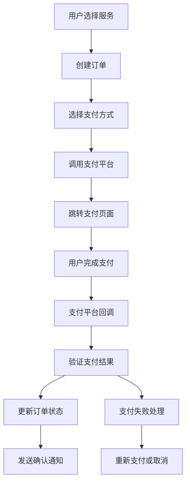

# 🏗️ PeerPortal支付功能实现计划

> **项目**: PeerPortal留学信息平台  
> **版本**: v1.0  
> **创建时间**: 2024年12月  
> **负责人**: 后端开发团队  

## 📊 现状分析

### ✅ 已有基础设施

#### 数据库架构
- **订单表**: `orders` 表已存在，包含基础订单信息
- **用户系统**: 完善的用户认证和角色权限控制
- **服务管理**: 导师发布服务，学生购买服务的完整流程
- **数据库支持**: PostgreSQL + Supabase双重架构

#### 技术栈
- **Web框架**: FastAPI + Uvicorn
- **数据验证**: Pydantic
- **认证**: JWT + OAuth2
- **数据库**: AsyncPG + Supabase
- **架构**: 三层架构（路由-CRUD-Schema）

#### 现有订单功能
```python
# 已实现的订单API
POST /api/v2/services/{service_id}/purchase  # 购买服务
GET  /api/v2/services/orders/my-orders       # 查看我的订单
GET  /api/v2/services/orders/mentor-orders   # 导师查看订单
PUT  /api/v2/services/orders/{order_id}      # 更新订单状态
```

### ❌ 缺失功能

#### 数据模型缺失
- **订单Schema**: 缺少完整的`OrderCreate`, `OrderRead`, `OrderUpdate`模型定义
- **支付记录**: 无支付记录表和相关模型
- **退款管理**: 无退款流程和数据结构

#### 支付功能缺失
- **支付流程**: 无完整的支付状态管理
- **第三方集成**: 未集成任何支付平台
- **回调处理**: 无支付结果回调机制
- **安全措施**: 缺少支付安全验证

---

## 🎯 支付功能架构设计

### 核心支付流程



### 数据库设计

基于对现有项目的深入分析，以下是针对支付宝和微信支付的完整数据模型设计：

#### 现有orders表结构分析
根据 `scripts/database/db_schema.sql` 和现有CRUD代码分析，当前orders表结构：
```sql
-- 现有orders表（已存在）
CREATE TABLE IF NOT EXISTS orders (
    id SERIAL PRIMARY KEY,
    service_id INTEGER REFERENCES services(id) ON DELETE CASCADE,
    client_id INTEGER REFERENCES users(id) ON DELETE CASCADE,     -- 学生ID
    navigator_id INTEGER REFERENCES users(id) ON DELETE CASCADE,  -- 导师ID  
    status VARCHAR(20) DEFAULT 'pending',  -- pending, confirmed, completed, cancelled
    scheduled_at TIMESTAMP,
    total_price DECIMAL(10,2),  -- 注意：现有字段名是total_price，不是total_amount
    notes TEXT,
    created_at TIMESTAMP DEFAULT CURRENT_TIMESTAMP,
    updated_at TIMESTAMP DEFAULT CURRENT_TIMESTAMP
);
```

#### 支付功能数据库扩展

##### 1. 扩展现有orders表
```sql
-- 为现有orders表添加支付相关字段
ALTER TABLE orders ADD COLUMN IF NOT EXISTS payment_status VARCHAR(20) DEFAULT 'unpaid';
-- 支付状态：unpaid(未支付), pending(支付中), paid(已支付), refunded(已退款), 
--          partially_refunded(部分退款), expired(支付过期), failed(支付失败)

ALTER TABLE orders ADD COLUMN IF NOT EXISTS payment_deadline TIMESTAMP;
-- 支付截止时间（订单创建后30分钟内支付）

ALTER TABLE orders ADD COLUMN IF NOT EXISTS payment_method VARCHAR(50);
-- 支付方式：alipay, wechat, 等

ALTER TABLE orders ADD COLUMN IF NOT EXISTS payment_completed_at TIMESTAMP;
-- 支付完成时间
```

##### 2. 支付记录表（核心支付数据）
```sql
-- 支付记录表 - 专门针对支付宝和微信支付优化
CREATE TABLE IF NOT EXISTS payments (
    id SERIAL PRIMARY KEY,
    order_id INTEGER NOT NULL REFERENCES orders(id) ON DELETE CASCADE,
    
    -- 支付方式和平台信息
    payment_method VARCHAR(20) NOT NULL, -- 'alipay' 或 'wechat'
    payment_platform VARCHAR(50), -- 'alipay_web', 'alipay_mobile', 'wechat_jsapi', 'wechat_h5' 等
    
    -- 第三方支付平台交易信息
    out_trade_no VARCHAR(64) NOT NULL UNIQUE, -- 我们系统的交易号（传给支付平台）
    trade_no VARCHAR(64), -- 支付平台返回的交易号（支付宝：trade_no，微信：transaction_id）
    prepay_id VARCHAR(64), -- 微信支付预支付交易会话标识
    
    -- 金额信息
    amount DECIMAL(10,2) NOT NULL, -- 支付金额
    currency VARCHAR(3) DEFAULT 'CNY', -- 货币类型
    
    -- 支付状态和时间
    status VARCHAR(20) DEFAULT 'pending',
    -- pending(等待支付), processing(支付处理中), completed(支付完成), 
    -- failed(支付失败), cancelled(已取消), expired(已过期), refunded(已退款)
    
    -- 支付相关URL和数据
    payment_url TEXT, -- 支付跳转URL（支付宝）
    qr_code_url TEXT, -- 二维码URL（支付宝扫码支付）
    mweb_url TEXT, -- 微信H5支付URL
    code_url TEXT, -- 微信Native支付二维码URL
    
    -- 回调和通知数据
    callback_data JSONB, -- 支付平台异步通知的原始数据
    return_url TEXT, -- 支付完成后跳转URL
    notify_url TEXT, -- 异步通知URL
    
    -- 时间信息
    paid_at TIMESTAMP, -- 实际支付完成时间
    expires_at TIMESTAMP, -- 支付链接过期时间
    created_at TIMESTAMP DEFAULT CURRENT_TIMESTAMP,
    updated_at TIMESTAMP DEFAULT CURRENT_TIMESTAMP,
    
    -- 错误信息
    failure_reason TEXT, -- 支付失败原因
    error_code VARCHAR(50), -- 错误代码
    
    -- 索引
    CONSTRAINT uk_out_trade_no UNIQUE (out_trade_no)
);
```

##### 3. 支付宝专用字段表
```sql
-- 支付宝支付扩展信息表
CREATE TABLE IF NOT EXISTS alipay_payments (
    id SERIAL PRIMARY KEY,
    payment_id INTEGER NOT NULL REFERENCES payments(id) ON DELETE CASCADE,
    
    -- 支付宝特有字段
    app_id VARCHAR(32), -- 支付宝应用ID
    seller_id VARCHAR(32), -- 卖家支付宝用户ID
    buyer_id VARCHAR(32), -- 买家支付宝用户ID
    buyer_logon_id VARCHAR(100), -- 买家支付宝账号
    total_amount DECIMAL(10,2), -- 交易金额
    receipt_amount DECIMAL(10,2), -- 实收金额
    invoice_amount DECIMAL(10,2), -- 开票金额
    point_amount DECIMAL(10,2), -- 积分支付金额
    
    -- 支付宝交易状态
    trade_status VARCHAR(32), -- WAIT_BUYER_PAY, TRADE_SUCCESS, TRADE_FINISHED, TRADE_CLOSED
    
    -- 时间字段
    gmt_create TIMESTAMP, -- 交易创建时间
    gmt_payment TIMESTAMP, -- 交易付款时间
    gmt_close TIMESTAMP, -- 交易结束时间
    
    created_at TIMESTAMP DEFAULT CURRENT_TIMESTAMP,
    updated_at TIMESTAMP DEFAULT CURRENT_TIMESTAMP
);
```

##### 4. 微信支付专用字段表
```sql
-- 微信支付扩展信息表
CREATE TABLE IF NOT EXISTS wechat_payments (
    id SERIAL PRIMARY KEY,
    payment_id INTEGER NOT NULL REFERENCES payments(id) ON DELETE CASCADE,
    
    -- 微信支付特有字段
    appid VARCHAR(32), -- 微信应用ID
    mchid VARCHAR(32), -- 商户号
    openid VARCHAR(128), -- 用户在商户appid下的唯一标识
    trade_type VARCHAR(16), -- 交易类型：JSAPI, NATIVE, APP, MWEB
    
    -- 微信交易状态
    trade_state VARCHAR(32), -- SUCCESS, REFUND, NOTPAY, CLOSED, REVOKED, USERPAYING, PAYERROR
    trade_state_desc VARCHAR(256), -- 交易状态描述
    
    -- 金额信息（微信以分为单位）
    total_fee INTEGER, -- 订单金额（分）
    cash_fee INTEGER, -- 现金支付金额（分）
    coupon_fee INTEGER, -- 代金券金额（分）
    
    -- 银行信息
    bank_type VARCHAR(32), -- 银行类型
    
    -- 时间字段（微信返回格式）
    time_end VARCHAR(14), -- 支付完成时间 yyyyMMddHHmmss
    
    created_at TIMESTAMP DEFAULT CURRENT_TIMESTAMP,
    updated_at TIMESTAMP DEFAULT CURRENT_TIMESTAMP
);
```

##### 5. 退款记录表
```sql
-- 退款记录表
CREATE TABLE IF NOT EXISTS refunds (
    id SERIAL PRIMARY KEY,
    payment_id INTEGER NOT NULL REFERENCES payments(id) ON DELETE CASCADE,
    order_id INTEGER NOT NULL REFERENCES orders(id) ON DELETE CASCADE,
    
    -- 退款基本信息
    refund_no VARCHAR(64) NOT NULL UNIQUE, -- 我们系统的退款单号
    refund_id VARCHAR(64), -- 支付平台的退款单号
    
    -- 退款金额
    refund_amount DECIMAL(10,2) NOT NULL, -- 退款金额
    total_amount DECIMAL(10,2) NOT NULL, -- 原订单金额
    currency VARCHAR(3) DEFAULT 'CNY',
    
    -- 退款原因和类型
    refund_reason VARCHAR(50) NOT NULL, -- user_request, service_cancelled, duplicate_payment, system_error
    reason_description TEXT, -- 退款原因详细描述
    refund_type VARCHAR(10) DEFAULT 'full', -- full(全额退款), partial(部分退款)
    
    -- 退款状态
    status VARCHAR(20) DEFAULT 'pending',
    -- pending(退款申请中), processing(退款处理中), completed(退款完成), 
    -- failed(退款失败), rejected(退款被拒绝)
    
    -- 处理信息
    processed_by INTEGER REFERENCES users(id), -- 处理人员ID
    processed_at TIMESTAMP, -- 处理时间
    
    -- 支付平台退款信息
    platform_refund_data JSONB, -- 支付平台返回的退款数据
    
    -- 时间信息
    refunded_at TIMESTAMP, -- 实际退款完成时间
    created_at TIMESTAMP DEFAULT CURRENT_TIMESTAMP,
    updated_at TIMESTAMP DEFAULT CURRENT_TIMESTAMP,
    
    CONSTRAINT uk_refund_no UNIQUE (refund_no)
);
```

##### 6. 支付配置表（支持多环境）
```sql
-- 支付配置表
CREATE TABLE IF NOT EXISTS payment_configs (
    id SERIAL PRIMARY KEY,
    
    -- 平台和环境
    platform VARCHAR(20) NOT NULL, -- 'alipay', 'wechat'
    environment VARCHAR(20) DEFAULT 'production', -- 'sandbox', 'production'
    config_name VARCHAR(100) NOT NULL, -- 配置名称标识
    
    -- 基础配置
    app_id VARCHAR(32), -- 应用ID
    merchant_id VARCHAR(32), -- 商户ID
    
    -- 密钥配置（加密存储）
    app_private_key TEXT, -- 应用私钥
    platform_public_key TEXT, -- 平台公钥
    api_key VARCHAR(32), -- API密钥（微信）
    
    -- API配置
    gateway_url VARCHAR(255), -- 网关地址
    notify_url VARCHAR(255), -- 异步通知地址
    return_url VARCHAR(255), -- 同步跳转地址
    
    -- 状态
    is_active BOOLEAN DEFAULT true,
    is_default BOOLEAN DEFAULT false, -- 是否为默认配置
    
    -- 限制配置
    min_amount DECIMAL(10,2) DEFAULT 0.01, -- 最小支付金额
    max_amount DECIMAL(10,2) DEFAULT 50000.00, -- 最大支付金额
    
    created_at TIMESTAMP DEFAULT CURRENT_TIMESTAMP,
    updated_at TIMESTAMP DEFAULT CURRENT_TIMESTAMP,
    
    UNIQUE(platform, environment, config_name)
);
```

##### 7. 支付日志表（用于调试和审计）
```sql
-- 支付操作日志表
CREATE TABLE IF NOT EXISTS payment_logs (
    id SERIAL PRIMARY KEY,
    payment_id INTEGER REFERENCES payments(id) ON DELETE CASCADE,
    
    -- 日志类型和级别
    log_type VARCHAR(20) NOT NULL, -- 'request', 'response', 'callback', 'error'
    log_level VARCHAR(10) DEFAULT 'info', -- 'debug', 'info', 'warning', 'error'
    
    -- 操作信息
    operation VARCHAR(50), -- 'create_payment', 'query_payment', 'handle_callback', 'refund'
    request_data JSONB, -- 请求数据
    response_data JSONB, -- 响应数据
    
    -- 错误信息
    error_code VARCHAR(50),
    error_message TEXT,
    
    -- 请求标识
    request_id VARCHAR(64), -- 请求唯一标识
    user_agent TEXT, -- 用户代理
    ip_address INET, -- 请求IP
    
    created_at TIMESTAMP DEFAULT CURRENT_TIMESTAMP
);
```

#### 索引优化
```sql
-- 支付相关索引
CREATE INDEX IF NOT EXISTS idx_payments_order_id ON payments(order_id);
CREATE INDEX IF NOT EXISTS idx_payments_transaction_id ON payments(transaction_id);
CREATE INDEX IF NOT EXISTS idx_payments_status ON payments(status);
CREATE INDEX IF NOT EXISTS idx_payments_created_at ON payments(created_at DESC);
CREATE INDEX IF NOT EXISTS idx_refunds_payment_id ON refunds(payment_id);
CREATE INDEX IF NOT EXISTS idx_refunds_status ON refunds(status);
CREATE INDEX IF NOT EXISTS idx_orders_payment_status ON orders(payment_status);
```

---

## 🔧 技术实现方案

### 第一阶段：数据模型开发 (2天)

#### 1.1 订单Schema完善（基于现有项目结构）
```python
# app/schemas/order_schema.py (新建文件)
from pydantic import BaseModel, Field, validator
from typing import Optional
from datetime import datetime
from decimal import Decimal
from enum import Enum

class OrderStatus(str, Enum):
    """订单状态枚举 - 匹配数据库orders.status字段"""
    pending = "pending"
    confirmed = "confirmed" 
    completed = "completed"
    cancelled = "cancelled"

class PaymentStatus(str, Enum):
    """支付状态枚举 - 对应新增的payment_status字段"""
    unpaid = "unpaid"
    pending = "pending"
    paid = "paid"
    refunded = "refunded"
    partially_refunded = "partially_refunded"
    expired = "expired"
    failed = "failed"

class PaymentMethod(str, Enum):
    """支付方式枚举"""
    alipay = "alipay"
    wechat = "wechat"

class OrderBase(BaseModel):
    """订单基础模型 - 匹配现有orders表结构"""
    service_id: int = Field(..., description="服务ID")
    notes: Optional[str] = Field(None, max_length=1000, description="订单备注")

class OrderCreate(OrderBase):
    """创建订单请求模型"""
    # 继承基础字段，client_id和navigator_id由系统自动设置
    pass

class OrderUpdate(BaseModel):
    """更新订单模型"""
    status: Optional[OrderStatus] = Field(None, description="订单状态")
    payment_status: Optional[PaymentStatus] = Field(None, description="支付状态")
    payment_method: Optional[PaymentMethod] = Field(None, description="支付方式")
    notes: Optional[str] = Field(None, max_length=1000, description="订单备注")
    scheduled_at: Optional[datetime] = Field(None, description="预定时间")

class OrderRead(OrderBase):
    """订单详情返回模型 - 完全匹配数据库表结构"""
    id: int
    client_id: int = Field(..., description="学生用户ID")
    navigator_id: int = Field(..., description="导师用户ID")
    status: OrderStatus = Field(default=OrderStatus.pending, description="订单状态")
    payment_status: PaymentStatus = Field(default=PaymentStatus.unpaid, description="支付状态")
    total_price: Decimal = Field(..., description="订单总金额")
    payment_method: Optional[PaymentMethod] = Field(None, description="支付方式")
    payment_deadline: Optional[datetime] = Field(None, description="支付截止时间")
    payment_completed_at: Optional[datetime] = Field(None, description="支付完成时间")
    scheduled_at: Optional[datetime] = Field(None, description="预定时间")
    created_at: datetime
    updated_at: datetime
    
    class Config:
        from_attributes = True
        use_enum_values = True

class OrderWithService(OrderRead):
    """包含服务信息的订单详情"""
    # 服务信息
    service_title: str = Field(..., description="服务标题")
    service_description: str = Field(..., description="服务描述")
    service_category: str = Field(..., description="服务分类")
    service_duration_hours: int = Field(..., description="服务时长(小时)")
    
    # 导师信息
    mentor_username: str = Field(..., description="导师用户名")
    mentor_avatar_url: Optional[str] = Field(None, description="导师头像")
    
    # 学生信息
    student_username: str = Field(..., description="学生用户名")
    student_avatar_url: Optional[str] = Field(None, description="学生头像")

class OrderSummary(BaseModel):
    """订单摘要信息（用于列表展示）"""
    id: int
    service_title: str
    total_price: Decimal
    status: OrderStatus
    payment_status: PaymentStatus
    created_at: datetime
    mentor_username: str
    student_username: str
    
    class Config:
        from_attributes = True
        use_enum_values = True

# 订单统计模型
class OrderStats(BaseModel):
    """订单统计信息"""
    total_orders: int = Field(..., description="总订单数")
    pending_orders: int = Field(..., description="待处理订单数")
    completed_orders: int = Field(..., description="已完成订单数")
    total_amount: Decimal = Field(..., description="总交易金额")
    unpaid_amount: Decimal = Field(..., description="未支付金额")
    paid_amount: Decimal = Field(..., description="已支付金额")
```

#### 1.2 支付Schema定义（专门针对支付宝和微信）
```python
# app/schemas/payment_schema.py (新建文件)
from pydantic import BaseModel, Field, validator
from typing import Optional, Dict, Any, Union
from datetime import datetime
from decimal import Decimal
from enum import Enum

class PaymentMethod(str, Enum):
    """支付方式枚举 - 仅支持支付宝和微信"""
    alipay = "alipay"
    wechat = "wechat"

class PaymentPlatform(str, Enum):
    """支付平台类型枚举"""
    # 支付宝平台类型
    alipay_web = "alipay_web"           # 支付宝网站支付
    alipay_mobile = "alipay_mobile"     # 支付宝手机网站支付
    alipay_app = "alipay_app"           # 支付宝APP支付
    alipay_qr = "alipay_qr"             # 支付宝扫码支付
    
    # 微信平台类型
    wechat_jsapi = "wechat_jsapi"       # 微信公众号支付
    wechat_native = "wechat_native"     # 微信扫码支付
    wechat_app = "wechat_app"           # 微信APP支付
    wechat_h5 = "wechat_h5"             # 微信H5支付

class PaymentStatus(str, Enum):
    """支付状态枚举"""
    pending = "pending"           # 等待支付
    processing = "processing"     # 支付处理中
    completed = "completed"       # 支付完成
    failed = "failed"            # 支付失败
    cancelled = "cancelled"       # 已取消
    expired = "expired"          # 已过期
    refunded = "refunded"        # 已退款

# ========== 支付相关Schema ==========

class PaymentCreate(BaseModel):
    """创建支付请求模型"""
    order_id: int = Field(..., description="订单ID")
    payment_method: PaymentMethod = Field(..., description="支付方式")
    payment_platform: Optional[PaymentPlatform] = Field(None, description="支付平台类型")
    return_url: Optional[str] = Field(None, description="支付完成后跳转URL")
    
    @validator('payment_platform')
    def validate_payment_platform(cls, v, values):
        """验证支付平台与支付方式的匹配"""
        if v is None:
            return v
        
        payment_method = values.get('payment_method')
        if payment_method == PaymentMethod.alipay:
            if not v.value.startswith('alipay_'):
                raise ValueError('支付宝支付方式必须选择支付宝平台类型')
        elif payment_method == PaymentMethod.wechat:
            if not v.value.startswith('wechat_'):
                raise ValueError('微信支付方式必须选择微信平台类型')
        
        return v

class PaymentRead(BaseModel):
    """支付详情返回模型"""
    id: int
    order_id: int
    
    # 支付方式信息
    payment_method: PaymentMethod = Field(..., description="支付方式")
    payment_platform: Optional[PaymentPlatform] = Field(None, description="支付平台类型")
    
    # 交易号信息
    out_trade_no: str = Field(..., description="商户订单号")
    trade_no: Optional[str] = Field(None, description="支付平台交易号")
    prepay_id: Optional[str] = Field(None, description="微信预支付ID")
    
    # 金额信息
    amount: Decimal = Field(..., description="支付金额")
    currency: str = Field(default="CNY", description="货币类型")
    
    # 支付状态
    status: PaymentStatus = Field(..., description="支付状态")
    
    # 支付URL信息
    payment_url: Optional[str] = Field(None, description="支付跳转URL")
    qr_code_url: Optional[str] = Field(None, description="二维码URL")
    mweb_url: Optional[str] = Field(None, description="微信H5支付URL")
    code_url: Optional[str] = Field(None, description="微信Native支付二维码")
    
    # 时间信息
    paid_at: Optional[datetime] = Field(None, description="支付完成时间")
    expires_at: Optional[datetime] = Field(None, description="支付过期时间")
    created_at: datetime
    updated_at: datetime
    
    # 错误信息
    failure_reason: Optional[str] = Field(None, description="支付失败原因")
    error_code: Optional[str] = Field(None, description="错误代码")
    
    class Config:
        from_attributes = True
        use_enum_values = True

class PaymentUpdate(BaseModel):
    """更新支付信息模型"""
    status: Optional[PaymentStatus] = Field(None, description="支付状态")
    trade_no: Optional[str] = Field(None, description="支付平台交易号")
    paid_at: Optional[datetime] = Field(None, description="支付完成时间")
    failure_reason: Optional[str] = Field(None, description="失败原因")

# ========== 支付回调Schema ==========

class AlipayCallback(BaseModel):
    """支付宝支付回调数据模型"""
    out_trade_no: str = Field(..., description="商户订单号")
    trade_no: str = Field(..., description="支付宝交易号")
    trade_status: str = Field(..., description="交易状态")
    total_amount: Decimal = Field(..., description="交易金额")
    buyer_id: Optional[str] = Field(None, description="买家支付宝用户ID")
    seller_id: Optional[str] = Field(None, description="卖家支付宝用户ID")
    gmt_payment: Optional[str] = Field(None, description="交易付款时间")
    
class WechatCallback(BaseModel):
    """微信支付回调数据模型"""
    out_trade_no: str = Field(..., description="商户订单号")
    transaction_id: str = Field(..., description="微信支付订单号")
    trade_state: str = Field(..., description="交易状态")
    total_fee: int = Field(..., description="订单金额(分)")
    cash_fee: int = Field(..., description="现金支付金额(分)")
    openid: Optional[str] = Field(None, description="用户标识")
    time_end: Optional[str] = Field(None, description="支付完成时间")

class PaymentCallbackData(BaseModel):
    """通用支付回调数据模型"""
    payment_method: PaymentMethod
    callback_data: Union[AlipayCallback, WechatCallback]
    raw_data: Dict[str, Any] = Field(..., description="原始回调数据")

# ========== 退款相关Schema ==========

class RefundReason(str, Enum):
    """退款原因枚举"""
    user_request = "user_request"           # 用户主动申请
    service_cancelled = "service_cancelled" # 服务取消
    duplicate_payment = "duplicate_payment" # 重复支付
    system_error = "system_error"           # 系统错误
    quality_issue = "quality_issue"         # 服务质量问题
    timeout_refund = "timeout_refund"       # 超时自动退款

class RefundType(str, Enum):
    """退款类型枚举"""
    full = "full"         # 全额退款
    partial = "partial"   # 部分退款

class RefundStatus(str, Enum):
    """退款状态枚举"""
    pending = "pending"         # 退款申请中
    processing = "processing"   # 退款处理中
    completed = "completed"     # 退款完成
    failed = "failed"          # 退款失败
    rejected = "rejected"      # 退款被拒绝

class RefundCreate(BaseModel):
    """创建退款申请模型"""
    payment_id: int = Field(..., description="支付记录ID")
    refund_amount: Optional[Decimal] = Field(None, description="退款金额，不填则全额退款")
    refund_reason: RefundReason = Field(..., description="退款原因")
    reason_description: str = Field(..., min_length=5, max_length=500, description="退款原因详细描述")
    
    @validator('refund_amount')
    def validate_refund_amount(cls, v):
        """验证退款金额"""
        if v is not None and v <= 0:
            raise ValueError('退款金额必须大于0')
        return v

class RefundRead(BaseModel):
    """退款详情返回模型"""
    id: int
    payment_id: int
    order_id: int
    
    # 退款单号信息
    refund_no: str = Field(..., description="退款单号")
    refund_id: Optional[str] = Field(None, description="支付平台退款单号")
    
    # 退款金额信息
    refund_amount: Decimal = Field(..., description="退款金额")
    total_amount: Decimal = Field(..., description="原订单金额")
    currency: str = Field(default="CNY", description="货币类型")
    
    # 退款原因和类型
    refund_reason: RefundReason = Field(..., description="退款原因")
    reason_description: str = Field(..., description="退款原因描述")
    refund_type: RefundType = Field(..., description="退款类型")
    
    # 退款状态
    status: RefundStatus = Field(..., description="退款状态")
    
    # 处理信息
    processed_by: Optional[int] = Field(None, description="处理人员ID")
    processed_at: Optional[datetime] = Field(None, description="处理时间")
    
    # 时间信息
    refunded_at: Optional[datetime] = Field(None, description="退款完成时间")
    created_at: datetime
    updated_at: datetime
    
    class Config:
        from_attributes = True
        use_enum_values = True

class RefundUpdate(BaseModel):
    """更新退款状态模型"""
    status: Optional[RefundStatus] = Field(None, description="退款状态")
    refund_id: Optional[str] = Field(None, description="支付平台退款单号")
    processed_by: Optional[int] = Field(None, description="处理人员ID")
    refunded_at: Optional[datetime] = Field(None, description="退款完成时间")

# ========== 支付统计Schema ==========

class PaymentStats(BaseModel):
    """支付统计信息模型"""
    total_payments: int = Field(..., description="总支付笔数")
    successful_payments: int = Field(..., description="成功支付笔数")
    failed_payments: int = Field(..., description="失败支付笔数")
    total_amount: Decimal = Field(..., description="总支付金额")
    alipay_amount: Decimal = Field(..., description="支付宝支付金额")
    wechat_amount: Decimal = Field(..., description="微信支付金额")
    refund_amount: Decimal = Field(..., description="退款金额")
    success_rate: float = Field(..., description="支付成功率")

# ========== 支付配置Schema ==========

class PaymentConfigCreate(BaseModel):
    """支付配置创建模型"""
    platform: PaymentMethod = Field(..., description="支付平台")
    environment: str = Field(default="production", description="环境")
    config_name: str = Field(..., description="配置名称")
    app_id: str = Field(..., description="应用ID")
    merchant_id: Optional[str] = Field(None, description="商户ID")
    is_active: bool = Field(default=True, description="是否启用")

class PaymentConfigRead(BaseModel):
    """支付配置读取模型（敏感信息脱敏）"""
    id: int
    platform: PaymentMethod
    environment: str
    config_name: str
    app_id: str
    merchant_id: Optional[str] = None
    is_active: bool
    is_default: bool
    min_amount: Decimal
    max_amount: Decimal
    created_at: datetime
    updated_at: datetime
    
    class Config:
        from_attributes = True
        use_enum_values = True
```

### 第二阶段：支付API开发 (3天)

#### 2.1 支付路由设计（基于现有项目API模式）
```python
# app/api/routers/payment_router.py (新建文件)
"""
支付相关的API路由
包括支付创建、状态查询、回调处理、退款管理等功能
专门针对支付宝和微信支付平台优化
"""
from fastapi import APIRouter, Depends, HTTPException, status, BackgroundTasks, Request, Query, Body
from fastapi.responses import JSONResponse, RedirectResponse
from typing import List, Optional, Dict, Any
from decimal import Decimal
import logging
import uuid
from datetime import datetime, timedelta

from app.api.deps import (
    get_current_user, get_db_or_supabase, require_student_role, 
    require_admin_role, get_current_user_optional
)
from app.schemas.token_schema import AuthenticatedUser
from app.schemas.payment_schema import *
from app.schemas.order_schema import OrderRead, OrderWithService
from app.crud import crud_payment, crud_service
from app.services.payment_service import PaymentService
from app.core.config import settings

router = APIRouter()
logger = logging.getLogger(__name__)

# ========== 支付创建和管理 ==========

@router.post(
    "/orders/{order_id}/pay",
    response_model=PaymentRead,
    summary="创建支付订单",
    description="""
    为指定订单创建支付，支持支付宝和微信支付
    
    **支持的支付方式：**
    - `alipay`: 支付宝支付（网站支付、手机网站支付、扫码支付）
    - `wechat`: 微信支付（JSAPI、Native、H5、APP支付）
    
    **返回数据包含：**
    - 支付链接（可直接跳转）
    - 二维码URL（用于扫码支付）
    - 支付过期时间
    """
)
async def create_payment(
    order_id: int,
    payment_data: PaymentCreate,
    background_tasks: BackgroundTasks,
    db_conn=Depends(get_db_or_supabase),
    current_user: AuthenticatedUser = Depends(get_current_user)
):
    """创建支付订单"""
    try:
        # 验证订单归属和状态
        order = await crud_service.get_order_by_id(db_conn, order_id)
        if not order:
            raise HTTPException(
                status_code=status.HTTP_404_NOT_FOUND,
                detail="订单不存在"
            )
        
        # 验证用户权限（只有订单的学生用户可以支付）
        if order['client_id'] != int(current_user.id):
            raise HTTPException(
                status_code=status.HTTP_403_FORBIDDEN,
                detail="您只能为自己的订单支付"
            )
        
        # 验证订单状态
        if order.get('payment_status') == 'paid':
            raise HTTPException(
                status_code=status.HTTP_400_BAD_REQUEST,
                detail="订单已支付，无法重复支付"
            )
        
        # 验证支付金额
        if not settings.validate_payment_amount(float(order['total_price'])):
            raise HTTPException(
                status_code=status.HTTP_400_BAD_REQUEST,
                detail=f"支付金额超出限制范围（{settings.MIN_PAYMENT_AMOUNT}-{settings.MAX_PAYMENT_AMOUNT}元）"
            )
        
        # 创建支付订单
        payment = await PaymentService.create_payment_order(
            db_conn=db_conn,
            order_id=order_id,
            payment_data=payment_data,
            user_id=int(current_user.id)
        )
        
        # 添加后台任务：支付超时检查
        background_tasks.add_task(
            PaymentService.schedule_payment_timeout_check,
            payment['id'],
            settings.PAYMENT_TIMEOUT_MINUTES
        )
        
        return payment
        
    except HTTPException:
        raise
    except Exception as e:
        logger.error(f"创建支付失败: {e}")
        raise HTTPException(
            status_code=status.HTTP_500_INTERNAL_SERVER_ERROR,
            detail=f"创建支付失败: {str(e)}"
        )

@router.get(
    "/payments/{payment_id}",
    response_model=PaymentRead,
    summary="查询支付状态",
    description="查询指定支付的详细状态，支持实时状态同步"
)
async def get_payment_status(
    payment_id: int,
    sync_status: bool = Query(False, description="是否同步第三方平台状态"),
    db_conn=Depends(get_db_or_supabase),
    current_user: AuthenticatedUser = Depends(get_current_user)
):
    """查询支付状态"""
    try:
        # 获取支付记录
        payment = await crud_payment.get_payment_by_id(db_conn, payment_id)
        if not payment:
            raise HTTPException(
                status_code=status.HTTP_404_NOT_FOUND,
                detail="支付记录不存在"
            )
        
        # 验证权限（支付相关的用户或管理员）
        order = await crud_service.get_order_by_id(db_conn, payment['order_id'])
        if (order['client_id'] != int(current_user.id) and 
            order['navigator_id'] != int(current_user.id) and 
            current_user.role != 'admin'):
            raise HTTPException(
                status_code=status.HTTP_403_FORBIDDEN,
                detail="您没有权限查看此支付记录"
            )
        
        # 可选：同步第三方平台状态
        if sync_status and payment['status'] in ['pending', 'processing']:
            updated_payment = await PaymentService.sync_payment_status(
                db_conn, payment_id
            )
            if updated_payment:
                payment = updated_payment
        
        return payment
        
    except HTTPException:
        raise
    except Exception as e:
        logger.error(f"查询支付状态失败: {e}")
        raise HTTPException(
            status_code=status.HTTP_500_INTERNAL_SERVER_ERROR,
            detail=f"查询支付状态失败: {str(e)}"
        )

@router.get(
    "/orders/{order_id}/payments",
    response_model=List[PaymentRead],
    summary="查看订单支付记录",
    description="查看指定订单的所有支付记录，包括失败的支付尝试"
)
async def get_order_payments(
    order_id: int,
    db_conn=Depends(get_db_or_supabase),
    current_user: AuthenticatedUser = Depends(get_current_user)
):
    """查看订单支付记录"""
    try:
        # 验证订单存在和权限
        order = await crud_service.get_order_by_id(db_conn, order_id)
        if not order:
            raise HTTPException(
                status_code=status.HTTP_404_NOT_FOUND,
                detail="订单不存在"
            )
        
        # 权限检查
        if (order['client_id'] != int(current_user.id) and 
            order['navigator_id'] != int(current_user.id) and 
            current_user.role != 'admin'):
            raise HTTPException(
                status_code=status.HTTP_403_FORBIDDEN,
                detail="您没有权限查看此订单的支付记录"
            )
        
        payments = await crud_payment.get_payments_by_order(db_conn, order_id)
        return payments
        
    except HTTPException:
        raise
    except Exception as e:
        logger.error(f"获取订单支付记录失败: {e}")
        raise HTTPException(
            status_code=status.HTTP_500_INTERNAL_SERVER_ERROR,
            detail=f"获取支付记录失败: {str(e)}"
        )

# ========== 支付回调处理 ==========

@router.post(
    "/callback/alipay/{payment_id}",
    summary="支付宝支付回调",
    description="支付宝异步通知接口，用于接收支付结果"
)
async def alipay_callback(
    payment_id: int,
    request: Request,
    background_tasks: BackgroundTasks,
    db_conn=Depends(get_db_or_supabase)
):
    """支付宝支付回调处理"""
    try:
        # 获取原始回调数据
        form_data = await request.form()
        callback_data = dict(form_data)
        
        logger.info(f"收到支付宝回调 - 支付ID: {payment_id}")
        
        # 验证回调来源IP（安全检查）
        client_ip = request.client.host
        if not PaymentService.validate_callback_ip(client_ip, 'alipay'):
            logger.warning(f"支付宝回调IP验证失败: {client_ip}")
            raise HTTPException(
                status_code=status.HTTP_403_FORBIDDEN,
                detail="Invalid callback source"
            )
        
        # 后台处理支付回调（避免阻塞支付平台）
        background_tasks.add_task(
            PaymentService.handle_alipay_callback,
            db_conn,
            payment_id,
            callback_data
        )
        
        # 立即返回成功（支付宝要求）
        return JSONResponse(content={"status": "success"})
        
    except HTTPException:
        raise
    except Exception as e:
        logger.error(f"支付宝回调处理失败: {e}")
        # 返回失败状态，支付宝会重试
        return JSONResponse(
            status_code=status.HTTP_500_INTERNAL_SERVER_ERROR,
            content={"status": "failed", "message": str(e)}
        )

@router.post(
    "/callback/wechat/{payment_id}",
    summary="微信支付回调",
    description="微信支付异步通知接口，用于接收支付结果"
)
async def wechat_callback(
    payment_id: int,
    request: Request,
    background_tasks: BackgroundTasks,
    db_conn=Depends(get_db_or_supabase)
):
    """微信支付回调处理"""
    try:
        # 获取原始XML数据
        body = await request.body()
        
        logger.info(f"收到微信支付回调 - 支付ID: {payment_id}")
        
        # 验证回调来源IP
        client_ip = request.client.host
        if not PaymentService.validate_callback_ip(client_ip, 'wechat'):
            logger.warning(f"微信支付回调IP验证失败: {client_ip}")
            return JSONResponse(
                content={"return_code": "FAIL", "return_msg": "Invalid source"}
            )
        
        # 后台处理微信回调
        background_tasks.add_task(
            PaymentService.handle_wechat_callback,
            db_conn,
            payment_id,
            body
        )
        
        # 微信要求的XML响应格式
        return JSONResponse(
            content={"return_code": "SUCCESS", "return_msg": "OK"},
            media_type="application/xml"
        )
        
    except Exception as e:
        logger.error(f"微信支付回调处理失败: {e}")
        return JSONResponse(
            content={"return_code": "FAIL", "return_msg": str(e)},
            media_type="application/xml"
        )

# ========== 支付跳转页面 ==========

@router.get(
    "/return/{payment_id}",
    summary="支付完成跳转",
    description="支付完成后的同步跳转页面"
)
async def payment_return(
    payment_id: int,
    request: Request,
    db_conn=Depends(get_db_or_supabase),
    current_user: Optional[AuthenticatedUser] = Depends(get_current_user_optional)
):
    """支付完成跳转处理"""
    try:
        # 获取支付记录
        payment = await crud_payment.get_payment_by_id(db_conn, payment_id)
        if not payment:
            # 跳转到错误页面
            return RedirectResponse(
                url=f"{settings.DEFAULT_CANCEL_URL}?error=payment_not_found",
                status_code=status.HTTP_302_FOUND
            )
        
        # 根据支付状态跳转到不同页面
        if payment['status'] == 'completed':
            return RedirectResponse(
                url=f"{settings.DEFAULT_RETURN_URL}?payment_id={payment_id}&status=success",
                status_code=status.HTTP_302_FOUND
            )
        elif payment['status'] in ['failed', 'cancelled']:
            return RedirectResponse(
                url=f"{settings.DEFAULT_CANCEL_URL}?payment_id={payment_id}&status={payment['status']}",
                status_code=status.HTTP_302_FOUND
            )
        else:
            # 支付中或其他状态，跳转到等待页面
            return RedirectResponse(
                url=f"{settings.DEFAULT_RETURN_URL}?payment_id={payment_id}&status=pending",
                status_code=status.HTTP_302_FOUND
            )
            
    except Exception as e:
        logger.error(f"支付跳转处理失败: {e}")
        return RedirectResponse(
            url=f"{settings.DEFAULT_CANCEL_URL}?error=system_error",
            status_code=status.HTTP_302_FOUND
        )

# ========== 退款管理 ==========

@router.post(
    "/payments/{payment_id}/refund",
    response_model=RefundRead,
    summary="申请退款",
    description="""
    申请退款，支持全额退款和部分退款
    
    **权限要求：**
    - 学生：只能为自己的订单申请退款
    - 导师：可以为自己的服务订单发起退款
    - 管理员：可以处理所有退款申请
    """
)
async def create_refund(
    payment_id: int,
    refund_data: RefundCreate,
    background_tasks: BackgroundTasks,
    db_conn=Depends(get_db_or_supabase),
    current_user: AuthenticatedUser = Depends(get_current_user)
):
    """申请退款"""
    try:
        # 验证支付记录
        payment = await crud_payment.get_payment_by_id(db_conn, payment_id)
        if not payment:
            raise HTTPException(
                status_code=status.HTTP_404_NOT_FOUND,
                detail="支付记录不存在"
            )
        
        # 验证支付状态（只有已完成的支付可以退款）
        if payment['status'] != 'completed':
            raise HTTPException(
                status_code=status.HTTP_400_BAD_REQUEST,
                detail="只有已完成的支付可以申请退款"
            )
        
        # 权限验证
        order = await crud_service.get_order_by_id(db_conn, payment['order_id'])
        user_can_refund = (
            order['client_id'] == int(current_user.id) or  # 学生
            order['navigator_id'] == int(current_user.id) or  # 导师
            current_user.role == 'admin'  # 管理员
        )
        
        if not user_can_refund:
            raise HTTPException(
                status_code=status.HTTP_403_FORBIDDEN,
                detail="您没有权限为此支付申请退款"
            )
        
        # 创建退款申请
        refund = await PaymentService.create_refund_request(
            db_conn=db_conn,
            payment_id=payment_id,
            refund_data=refund_data,
            user_id=int(current_user.id)
        )
        
        # 后台处理退款（如果是自动退款类型）
        if refund_data.refund_reason in ['system_error', 'duplicate_payment']:
            background_tasks.add_task(
                PaymentService.process_automatic_refund,
                db_conn,
                refund['id']
            )
        
        return refund
        
    except HTTPException:
        raise
    except Exception as e:
        logger.error(f"申请退款失败: {e}")
        raise HTTPException(
            status_code=status.HTTP_500_INTERNAL_SERVER_ERROR,
            detail=f"申请退款失败: {str(e)}"
        )

@router.get(
    "/refunds",
    response_model=List[RefundRead],
    summary="查看退款记录",
    description="查看退款记录，用户查看自己的，管理员查看所有"
)
async def get_refunds(
    status: Optional[RefundStatus] = Query(None, description="退款状态筛选"),
    payment_method: Optional[PaymentMethod] = Query(None, description="支付方式筛选"),
    limit: int = Query(20, ge=1, le=100, description="返回数量"),
    offset: int = Query(0, ge=0, description="偏移量"),
    db_conn=Depends(get_db_or_supabase),
    current_user: AuthenticatedUser = Depends(get_current_user)
):
    """查看退款记录"""
    try:
        # 根据用户角色获取不同范围的退款记录
        if current_user.role == 'admin':
            # 管理员查看所有退款
            refunds = await crud_payment.get_all_refunds(
                db_conn, status, payment_method, limit, offset
            )
        else:
            # 普通用户只查看自己相关的退款
            refunds = await crud_payment.get_user_refunds(
                db_conn, int(current_user.id), status, payment_method, limit, offset
            )
        
        return refunds
        
    except Exception as e:
        logger.error(f"获取退款记录失败: {e}")
        raise HTTPException(
            status_code=status.HTTP_500_INTERNAL_SERVER_ERROR,
            detail=f"获取退款记录失败: {str(e)}"
        )

@router.put(
    "/refunds/{refund_id}/process",
    response_model=RefundRead,
    summary="处理退款申请",
    description="管理员处理退款申请（批准/拒绝）"
)
async def process_refund(
    refund_id: int,
    action: str = Body(..., regex="^(approve|reject)$", description="处理动作：approve或reject"),
    reason: Optional[str] = Body(None, description="处理原因"),
    background_tasks: BackgroundTasks,
    db_conn=Depends(get_db_or_supabase),
    current_user: AuthenticatedUser = Depends(require_admin_role())
):
    """处理退款申请"""
    try:
        # 获取退款记录
        refund = await crud_payment.get_refund_by_id(db_conn, refund_id)
        if not refund:
            raise HTTPException(
                status_code=status.HTTP_404_NOT_FOUND,
                detail="退款申请不存在"
            )
        
        # 验证退款状态
        if refund['status'] != 'pending':
            raise HTTPException(
                status_code=status.HTTP_400_BAD_REQUEST,
                detail="只能处理待审核的退款申请"
            )
        
        if action == "approve":
            # 批准退款 - 后台执行实际退款操作
            background_tasks.add_task(
                PaymentService.execute_refund,
                db_conn,
                refund_id,
                int(current_user.id)
            )
            
            # 立即更新状态为处理中
            updated_refund = await crud_payment.update_refund_status(
                db_conn, refund_id, RefundStatus.processing, int(current_user.id)
            )
            
        else:  # reject
            # 拒绝退款
            updated_refund = await crud_payment.update_refund_status(
                db_conn, refund_id, RefundStatus.rejected, int(current_user.id)
            )
        
        return updated_refund
        
    except HTTPException:
        raise
    except Exception as e:
        logger.error(f"处理退款申请失败: {e}")
        raise HTTPException(
            status_code=status.HTTP_500_INTERNAL_SERVER_ERROR,
            detail=f"处理退款申请失败: {str(e)}"
        )

# ========== 支付统计和管理 ==========

@router.get(
    "/stats",
    response_model=PaymentStats,
    summary="支付统计信息",
    description="获取支付统计数据（管理员专用）"
)
async def get_payment_stats(
    start_date: Optional[datetime] = Query(None, description="开始日期"),
    end_date: Optional[datetime] = Query(None, description="结束日期"),
    payment_method: Optional[PaymentMethod] = Query(None, description="支付方式筛选"),
    db_conn=Depends(get_db_or_supabase),
    current_user: AuthenticatedUser = Depends(require_admin_role())
):
    """获取支付统计信息"""
    try:
        stats = await PaymentService.get_payment_statistics(
            db_conn, start_date, end_date, payment_method
        )
        return stats
        
    except Exception as e:
        logger.error(f"获取支付统计失败: {e}")
        raise HTTPException(
            status_code=status.HTTP_500_INTERNAL_SERVER_ERROR,
            detail=f"获取支付统计失败: {str(e)}"
        )

@router.get(
    "/my-payments",
    response_model=List[PaymentRead],
    summary="查看我的支付记录",
    description="用户查看自己的所有支付记录"
)
async def get_my_payments(
    status: Optional[PaymentStatus] = Query(None, description="支付状态筛选"),
    payment_method: Optional[PaymentMethod] = Query(None, description="支付方式筛选"),
    limit: int = Query(20, ge=1, le=100, description="返回数量"),
    offset: int = Query(0, ge=0, description="偏移量"),
    db_conn=Depends(get_db_or_supabase),
    current_user: AuthenticatedUser = Depends(get_current_user)
):
    """查看我的支付记录"""
    try:
        payments = await crud_payment.get_user_payments(
            db_conn, int(current_user.id), status, payment_method, limit, offset
        )
        return payments
        
    except Exception as e:
        logger.error(f"获取用户支付记录失败: {e}")
        raise HTTPException(
            status_code=status.HTTP_500_INTERNAL_SERVER_ERROR,
            detail=f"获取支付记录失败: {str(e)}"
        )

# ========== 支付工具接口 ==========

@router.post(
    "/payments/{payment_id}/cancel",
    response_model=PaymentRead,
    summary="取消支付",
    description="取消未完成的支付订单"
)
async def cancel_payment(
    payment_id: int,
    reason: Optional[str] = Body(None, description="取消原因"),
    db_conn=Depends(get_db_or_supabase),
    current_user: AuthenticatedUser = Depends(get_current_user)
):
    """取消支付"""
    try:
        # 验证支付记录和权限
        payment = await crud_payment.get_payment_by_id(db_conn, payment_id)
        if not payment:
            raise HTTPException(
                status_code=status.HTTP_404_NOT_FOUND,
                detail="支付记录不存在"
            )
        
        order = await crud_service.get_order_by_id(db_conn, payment['order_id'])
        if order['client_id'] != int(current_user.id):
            raise HTTPException(
                status_code=status.HTTP_403_FORBIDDEN,
                detail="您只能取消自己的支付"
            )
        
        # 验证支付状态
        if payment['status'] not in ['pending', 'processing']:
            raise HTTPException(
                status_code=status.HTTP_400_BAD_REQUEST,
                detail="只能取消未完成的支付"
            )
        
        # 取消支付
        cancelled_payment = await PaymentService.cancel_payment(
            db_conn, payment_id, reason
        )
        
        return cancelled_payment
        
    except HTTPException:
        raise
    except Exception as e:
        logger.error(f"取消支付失败: {e}")
        raise HTTPException(
            status_code=status.HTTP_500_INTERNAL_SERVER_ERROR,
            detail=f"取消支付失败: {str(e)}"
        )

@router.get(
    "/methods",
    response_model=Dict[str, Any],
    summary="获取可用支付方式",
    description="获取当前可用的支付方式和配置信息"
)
async def get_payment_methods(
    amount: Optional[Decimal] = Query(None, description="支付金额（用于筛选可用方式）")
):
    """获取可用支付方式"""
    try:
        methods = {
            "alipay": {
                "name": "支付宝",
                "platforms": [
                    {
                        "type": "alipay_web",
                        "name": "支付宝网站支付",
                        "description": "适用于PC端网站支付",
                        "min_amount": settings.MIN_PAYMENT_AMOUNT,
                        "max_amount": settings.MAX_PAYMENT_AMOUNT
                    },
                    {
                        "type": "alipay_mobile", 
                        "name": "支付宝手机网站支付",
                        "description": "适用于手机浏览器支付",
                        "min_amount": settings.MIN_PAYMENT_AMOUNT,
                        "max_amount": settings.MAX_PAYMENT_AMOUNT
                    },
                    {
                        "type": "alipay_qr",
                        "name": "支付宝扫码支付", 
                        "description": "生成二维码，用支付宝扫码支付",
                        "min_amount": settings.MIN_PAYMENT_AMOUNT,
                        "max_amount": settings.MAX_PAYMENT_AMOUNT
                    }
                ]
            },
            "wechat": {
                "name": "微信支付",
                "platforms": [
                    {
                        "type": "wechat_h5",
                        "name": "微信H5支付",
                        "description": "适用于手机浏览器内支付",
                        "min_amount": settings.MIN_PAYMENT_AMOUNT,
                        "max_amount": settings.MAX_PAYMENT_AMOUNT
                    },
                    {
                        "type": "wechat_native",
                        "name": "微信扫码支付",
                        "description": "生成二维码，用微信扫码支付",
                        "min_amount": settings.MIN_PAYMENT_AMOUNT,
                        "max_amount": settings.MAX_PAYMENT_AMOUNT
                    }
                ]
            }
        }
        
        # 如果提供了金额，过滤不可用的支付方式
        if amount:
            for method_key, method_info in methods.items():
                available_platforms = []
                for platform in method_info["platforms"]:
                    if platform["min_amount"] <= amount <= platform["max_amount"]:
                        available_platforms.append(platform)
                method_info["platforms"] = available_platforms
        
        return {
            "available_methods": methods,
            "default_timeout_minutes": settings.PAYMENT_TIMEOUT_MINUTES,
            "supported_currency": ["CNY"],
            "min_amount": settings.MIN_PAYMENT_AMOUNT,
            "max_amount": settings.MAX_PAYMENT_AMOUNT
        }
        
    except Exception as e:
        logger.error(f"获取支付方式失败: {e}")
        raise HTTPException(
            status_code=status.HTTP_500_INTERNAL_SERVER_ERROR,
            detail=f"获取支付方式失败: {str(e)}"
        )

# ========== 支付验证接口 ==========

@router.post(
    "/verify/{payment_id}",
    response_model=PaymentRead,
    summary="手动验证支付",
    description="手动同步第三方平台的支付状态（管理员功能）"
)
async def verify_payment(
    payment_id: int,
    background_tasks: BackgroundTasks,
    db_conn=Depends(get_db_or_supabase),
    current_user: AuthenticatedUser = Depends(require_admin_role())
):
    """手动验证支付状态"""
    try:
        # 获取支付记录
        payment = await crud_payment.get_payment_by_id(db_conn, payment_id)
        if not payment:
            raise HTTPException(
                status_code=status.HTTP_404_NOT_FOUND,
                detail="支付记录不存在"
            )
        
        # 后台执行状态同步
        background_tasks.add_task(
            PaymentService.force_sync_payment_status,
            db_conn,
            payment_id
        )
        
        return payment
        
    except HTTPException:
        raise
    except Exception as e:
        logger.error(f"验证支付失败: {e}")
        raise HTTPException(
            status_code=status.HTTP_500_INTERNAL_SERVER_ERROR,
            detail=f"验证支付失败: {str(e)}"
        )
```

#### 2.2 支付CRUD操作（基于现有项目CRUD模式）
```python
# app/crud/crud_payment.py (新建文件)
"""
支付相关的CRUD操作 - 兼容asyncpg和Supabase
"""
from typing import Dict, Any, Optional, List
from decimal import Decimal
from datetime import datetime, timedelta
import uuid
import logging
from supabase import Client
from app.schemas.payment_schema import *

logger = logging.getLogger(__name__)

async def create_payment(
    db_conn: Dict[str, Any], 
    order_id: int, 
    payment_data: PaymentCreate,
    user_id: int
) -> Optional[Dict]:
    """创建支付记录"""
    try:
        out_trade_no = f"PeerPortal_{order_id}_{int(datetime.now().timestamp())}_{uuid.uuid4().hex[:8]}"
        expires_at = datetime.now() + timedelta(minutes=30)
        
        if db_conn["type"] == "asyncpg":
            conn = db_conn["connection"]
            order = await conn.fetchrow("SELECT total_price FROM orders WHERE id = $1", order_id)
            if not order:
                return None
            
            result = await conn.fetchrow(
                """
                INSERT INTO payments 
                (order_id, payment_method, out_trade_no, amount, status, expires_at)
                VALUES ($1, $2, $3, $4, 'pending', $5)
                RETURNING *
                """,
                order_id, payment_data.payment_method.value, out_trade_no, 
                order['total_price'], expires_at
            )
            return dict(result) if result else None
            
        else:  # Supabase
            client: Client = db_conn["connection"]
            order_result = client.table('orders').select('total_price').eq('id', order_id).execute()
            if not order_result.data:
                return None
            
            result = client.table('payments').insert({
                'order_id': order_id,
                'payment_method': payment_data.payment_method.value,
                'out_trade_no': out_trade_no,
                'amount': float(order_result.data[0]['total_price']),
                'status': 'pending',
                'expires_at': expires_at.isoformat()
            }).execute()
            
            return result.data[0] if result.data else None
            
    except Exception as e:
        logger.error(f"创建支付记录失败: {e}")
        return None

async def get_payment_by_id(db_conn: Dict[str, Any], payment_id: int) -> Optional[Dict]:
    """根据ID获取支付记录"""
    try:
        if db_conn["type"] == "asyncpg":
            conn = db_conn["connection"]
            result = await conn.fetchrow("SELECT * FROM payments WHERE id = $1", payment_id)
            return dict(result) if result else None
        else:
            client: Client = db_conn["connection"]
            result = client.table('payments').select('*').eq('id', payment_id).execute()
            return result.data[0] if result.data else None
    except Exception as e:
        logger.error(f"获取支付记录失败: {e}")
        return None

async def update_payment_status(
    db_conn: Dict[str, Any],
    payment_id: int,
    status: PaymentStatus,
    trade_no: Optional[str] = None,
    paid_at: Optional[datetime] = None,
    callback_data: Optional[Dict] = None
) -> Optional[Dict]:
    """更新支付状态"""
    try:
        if db_conn["type"] == "asyncpg":
            conn = db_conn["connection"]
            result = await conn.fetchrow(
                """
                UPDATE payments 
                SET status = $2, trade_no = $3, paid_at = $4, 
                    callback_data = $5, updated_at = NOW()
                WHERE id = $1
                RETURNING *
                """,
                payment_id, status.value, trade_no, paid_at, callback_data
            )
            return dict(result) if result else None
        else:
            client: Client = db_conn["connection"]
            update_data = {
                'status': status.value,
                'updated_at': datetime.now().isoformat()
            }
            if trade_no:
                update_data['trade_no'] = trade_no
            if paid_at:
                update_data['paid_at'] = paid_at.isoformat()
            if callback_data:
                update_data['callback_data'] = callback_data
                
            result = client.table('payments').update(update_data).eq('id', payment_id).execute()
            return result.data[0] if result.data else None
    except Exception as e:
        logger.error(f"更新支付状态失败: {e}")
        return None

async def get_payments_by_order(db_conn: Dict[str, Any], order_id: int) -> List[Dict]:
    """获取订单的所有支付记录"""
    try:
        if db_conn["type"] == "asyncpg":
            conn = db_conn["connection"]
            results = await conn.fetch(
                "SELECT * FROM payments WHERE order_id = $1 ORDER BY created_at DESC",
                order_id
            )
            return [dict(row) for row in results]
        else:
            client: Client = db_conn["connection"]
            result = client.table('payments').select('*').eq('order_id', order_id).order('created_at', desc=True).execute()
            return result.data
    except Exception as e:
        logger.error(f"获取订单支付记录失败: {e}")
        return []

async def create_refund(
    db_conn: Dict[str, Any],
    payment_id: int,
    refund_data: RefundCreate,
    user_id: int
) -> Optional[Dict]:
    """创建退款申请"""
    try:
        refund_no = f"RF_{payment_id}_{int(datetime.now().timestamp())}_{uuid.uuid4().hex[:6]}"
        
        if db_conn["type"] == "asyncpg":
            conn = db_conn["connection"]
            payment = await conn.fetchrow("SELECT order_id, amount FROM payments WHERE id = $1", payment_id)
            if not payment:
                return None
            
            refund_amount = refund_data.refund_amount or payment['amount']
            refund_type = 'partial' if refund_amount < payment['amount'] else 'full'
            
            result = await conn.fetchrow(
                """
                INSERT INTO refunds 
                (payment_id, order_id, refund_no, refund_amount, total_amount, 
                 refund_reason, reason_description, refund_type, status)
                VALUES ($1, $2, $3, $4, $5, $6, $7, $8, 'pending')
                RETURNING *
                """,
                payment_id, payment['order_id'], refund_no, refund_amount, payment['amount'],
                refund_data.refund_reason.value, refund_data.reason_description, refund_type
            )
            return dict(result) if result else None
        else:
            client: Client = db_conn["connection"]
            payment_result = client.table('payments').select('order_id, amount').eq('id', payment_id).execute()
            if not payment_result.data:
                return None
            
            payment = payment_result.data[0]
            refund_amount = refund_data.refund_amount or payment['amount']
            
            result = client.table('refunds').insert({
                'payment_id': payment_id,
                'order_id': payment['order_id'],
                'refund_no': refund_no,
                'refund_amount': float(refund_amount),
                'total_amount': float(payment['amount']),
                'refund_reason': refund_data.refund_reason.value,
                'reason_description': refund_data.reason_description,
                'refund_type': 'partial' if refund_amount < payment['amount'] else 'full',
                'status': 'pending'
            }).execute()
            return result.data[0] if result.data else None
    except Exception as e:
        logger.error(f"创建退款申请失败: {e}")
        return None
```

### 第三阶段：第三方支付集成 (4天)

#### 3.1 支付服务抽象层（基于现有项目架构）
```python
# app/services/payment/base.py (新建文件)
"""
支付服务抽象基类
定义支付宝和微信支付的统一接口
"""
from abc import ABC, abstractmethod
from typing import Dict, Any, Optional, Union
from decimal import Decimal
from datetime import datetime
from dataclasses import dataclass
from enum import Enum

@dataclass
class PaymentResult:
    """支付创建结果"""
    success: bool
    payment_url: Optional[str] = None          # 支付跳转URL
    qr_code_url: Optional[str] = None          # 二维码URL
    mweb_url: Optional[str] = None             # 微信H5支付URL
    code_url: Optional[str] = None             # 微信Native二维码URL
    prepay_id: Optional[str] = None            # 微信预支付ID
    out_trade_no: Optional[str] = None         # 商户订单号
    platform_trade_no: Optional[str] = None   # 平台交易号
    expires_at: Optional[datetime] = None      # 过期时间
    error_message: Optional[str] = None        # 错误信息
    error_code: Optional[str] = None           # 错误代码
    extra_data: Optional[Dict[str, Any]] = None # 额外数据

@dataclass  
class PaymentQueryResult:
    """支付状态查询结果"""
    out_trade_no: str                          # 商户订单号
    platform_trade_no: Optional[str] = None   # 平台交易号
    status: str                                # success, failed, pending, closed
    amount: Optional[Decimal] = None           # 支付金额
    paid_at: Optional[datetime] = None         # 支付完成时间
    failure_reason: Optional[str] = None       # 失败原因
    buyer_info: Optional[Dict[str, str]] = None # 买家信息
    extra_data: Optional[Dict[str, Any]] = None # 额外数据

@dataclass
class RefundResult:
    """退款结果"""
    success: bool
    refund_id: Optional[str] = None            # 平台退款单号
    refund_amount: Optional[Decimal] = None    # 退款金额
    refunded_at: Optional[datetime] = None     # 退款时间
    error_message: Optional[str] = None        # 错误信息
    error_code: Optional[str] = None           # 错误代码

class PaymentProvider(ABC):
    """支付提供商抽象基类"""
    
    def __init__(self, config: Dict[str, Any]):
        """初始化支付提供商"""
        self.config = config
        self.platform_name = ""
    
    @abstractmethod
    async def create_payment(
        self, 
        out_trade_no: str,
        amount: Decimal,
        subject: str,
        return_url: str,
        notify_url: str,
        payment_platform: Optional[str] = None,
        **kwargs
    ) -> PaymentResult:
        """
        创建支付订单
        
        Args:
            out_trade_no: 商户订单号
            amount: 支付金额
            subject: 订单标题
            return_url: 支付完成跳转URL
            notify_url: 异步通知URL
            payment_platform: 支付平台类型（alipay_web, wechat_h5等）
            **kwargs: 其他平台特定参数
        """
        pass
    
    @abstractmethod
    async def verify_callback(
        self, 
        callback_data: Union[Dict[str, Any], bytes, str]
    ) -> tuple[bool, Dict[str, Any]]:
        """
        验证支付回调
        
        Returns:
            (is_valid, parsed_data): 验证结果和解析后的数据
        """
        pass
    
    @abstractmethod
    async def query_payment(
        self, 
        out_trade_no: str
    ) -> PaymentQueryResult:
        """
        查询支付状态
        
        Args:
            out_trade_no: 商户订单号
        """
        pass
    
    @abstractmethod
    async def create_refund(
        self,
        out_trade_no: str,
        refund_amount: Decimal,
        refund_reason: str,
        out_refund_no: Optional[str] = None
    ) -> RefundResult:
        """
        创建退款
        
        Args:
            out_trade_no: 原支付订单号
            refund_amount: 退款金额
            refund_reason: 退款原因
            out_refund_no: 商户退款单号
        """
        pass
    
    @abstractmethod
    async def query_refund(
        self,
        out_refund_no: str
    ) -> Dict[str, Any]:
        """查询退款状态"""
        pass
    
    def get_platform_name(self) -> str:
        """获取平台名称"""
        return self.platform_name
    
    def validate_amount(self, amount: Decimal) -> bool:
        """验证支付金额"""
        min_amount = self.config.get('min_amount', Decimal('0.01'))
        max_amount = self.config.get('max_amount', Decimal('50000.00'))
        return min_amount <= amount <= max_amount
    
    def generate_trade_no(self, prefix: str = "") -> str:
        """生成交易号"""
        import uuid
        timestamp = int(datetime.now().timestamp())
        return f"{prefix}{timestamp}_{uuid.uuid4().hex[:8]}"
```

#### 3.2 支付宝集成（2024年最新SDK）
```python
# app/services/payment/alipay.py (新建文件)
"""
支付宝支付服务提供商
基于alipay-sdk-python 3.7.1实现
支持网站支付、手机网站支付、扫码支付
"""
import json
import logging
from decimal import Decimal
from datetime import datetime, timedelta
from typing import Dict, Any, Optional, Union
from alipay import AliPay
from alipay.utils import AliPayConfig

from app.services.payment.base import PaymentProvider, PaymentResult, PaymentQueryResult, RefundResult
from app.core.config import settings

logger = logging.getLogger(__name__)

class AlipayProvider(PaymentProvider):
    """支付宝支付提供商"""
    
    def __init__(self, config: Optional[Dict[str, Any]] = None):
        """初始化支付宝支付提供商"""
        super().__init__(config or {})
        self.platform_name = "alipay"
        
        # 支付宝SDK配置
        self.alipay_config = AliPayConfig(
            appid=settings.ALIPAY_APP_ID,
            app_notify_url=settings.ALIPAY_NOTIFY_URL,
            app_private_key_string=self._get_private_key(),
            alipay_public_key_string=self._get_public_key(),
            sign_type="RSA2",
            debug=settings.ALIPAY_DEBUG
        )
        
        self.alipay = AliPay(self.alipay_config)
        
    def _get_private_key(self) -> str:
        """获取应用私钥"""
        if settings.ALIPAY_PRIVATE_KEY:
            return settings.ALIPAY_PRIVATE_KEY
        elif settings.ALIPAY_PRIVATE_KEY_PATH:
            with open(settings.ALIPAY_PRIVATE_KEY_PATH, 'r') as f:
                return f.read()
        else:
            raise ValueError("支付宝私钥配置缺失")
    
    def _get_public_key(self) -> str:
        """获取支付宝公钥"""
        if settings.ALIPAY_PUBLIC_KEY:
            return settings.ALIPAY_PUBLIC_KEY
        elif settings.ALIPAY_PUBLIC_KEY_PATH:
            with open(settings.ALIPAY_PUBLIC_KEY_PATH, 'r') as f:
                return f.read()
        else:
            raise ValueError("支付宝公钥配置缺失")
    
    async def create_payment(
        self,
        out_trade_no: str,
        amount: Decimal,
        subject: str,
        return_url: str,
        notify_url: str,
        payment_platform: Optional[str] = None,
        **kwargs
    ) -> PaymentResult:
        """创建支付宝支付"""
        try:
            # 验证金额
            if not self.validate_amount(amount):
                return PaymentResult(
                    success=False,
                    error_message=f"支付金额超出限制：{amount}",
                    error_code="AMOUNT_LIMIT_EXCEEDED"
                )
            
            # 根据支付平台类型选择不同的支付方式
            if payment_platform == "alipay_web":
                # PC网站支付
                order_string = self.alipay.api_alipay_trade_page_pay(
                    out_trade_no=out_trade_no,
                    total_amount=str(amount),
                    subject=subject,
                    return_url=return_url,
                    notify_url=notify_url,
                    product_code="FAST_INSTANT_TRADE_PAY"
                )
                payment_url = f"{settings.get_alipay_gateway()}?{order_string}"
                
            elif payment_platform == "alipay_mobile":
                # 手机网站支付
                order_string = self.alipay.api_alipay_trade_wap_pay(
                    out_trade_no=out_trade_no,
                    total_amount=str(amount),
                    subject=subject,
                    return_url=return_url,
                    notify_url=notify_url,
                    product_code="QUICK_WAP_WAY"
                )
                payment_url = f"{settings.get_alipay_gateway()}?{order_string}"
                
            elif payment_platform == "alipay_qr":
                # 扫码支付
                result = self.alipay.api_alipay_trade_precreate(
                    out_trade_no=out_trade_no,
                    total_amount=str(amount),
                    subject=subject,
                    notify_url=notify_url
                )
                
                if result.get("code") == "10000":
                    qr_code_url = result.get("qr_code")
                    return PaymentResult(
                        success=True,
                        qr_code_url=qr_code_url,
                        out_trade_no=out_trade_no,
                        expires_at=datetime.now() + timedelta(minutes=30),
                        extra_data=result
                    )
                else:
                    return PaymentResult(
                        success=False,
                        error_message=result.get("msg", "创建支付失败"),
                        error_code=result.get("code")
                    )
            else:
                # 默认使用网站支付
                order_string = self.alipay.api_alipay_trade_page_pay(
                    out_trade_no=out_trade_no,
                    total_amount=str(amount),
                    subject=subject,
                    return_url=return_url,
                    notify_url=notify_url
                )
                payment_url = f"{settings.get_alipay_gateway()}?{order_string}"
            
            return PaymentResult(
                success=True,
                payment_url=payment_url,
                out_trade_no=out_trade_no,
                expires_at=datetime.now() + timedelta(minutes=30)
            )
            
        except Exception as e:
            logger.error(f"创建支付宝支付失败: {e}")
            return PaymentResult(
                success=False,
                error_message=str(e),
                error_code="ALIPAY_CREATE_ERROR"
            )
    
    async def verify_callback(
        self, 
        callback_data: Union[Dict[str, Any], bytes, str]
    ) -> tuple[bool, Dict[str, Any]]:
        """验证支付宝回调"""
        try:
            # 如果是字典格式的数据
            if isinstance(callback_data, dict):
                data = callback_data.copy()
            else:
                # 解析表单数据
                data = dict(callback_data)
            
            # 提取签名
            signature = data.pop("sign", None)
            if not signature:
                return False, {}
            
            # 验证签名
            is_valid = self.alipay.verify(data, signature)
            
            # 验证交易状态
            trade_status = data.get("trade_status")
            is_success = trade_status == "TRADE_SUCCESS"
            
            return is_valid and is_success, data
            
        except Exception as e:
            logger.error(f"验证支付宝回调失败: {e}")
            return False, {}
    
    async def query_payment(self, out_trade_no: str) -> PaymentQueryResult:
        """查询支付宝支付状态"""
        try:
            result = self.alipay.api_alipay_trade_query(out_trade_no=out_trade_no)
            
            if result.get("code") == "10000":
                trade_status = result.get("trade_status")
                
                # 支付宝状态映射
                status_mapping = {
                    "TRADE_SUCCESS": "success",      # 交易支付成功
                    "TRADE_FINISHED": "success",     # 交易结束，不可退款
                    "TRADE_CLOSED": "failed",        # 未付款交易超时关闭
                    "WAIT_BUYER_PAY": "pending"      # 交易创建，等待买家付款
                }
                
                # 解析支付时间
                paid_at = None
                if trade_status in ["TRADE_SUCCESS", "TRADE_FINISHED"]:
                    gmt_payment = result.get("gmt_payment")
                    if gmt_payment:
                        paid_at = datetime.strptime(gmt_payment, "%Y-%m-%d %H:%M:%S")
                
                return PaymentQueryResult(
                    out_trade_no=out_trade_no,
                    platform_trade_no=result.get("trade_no"),
                    status=status_mapping.get(trade_status, "unknown"),
                    amount=Decimal(result.get("total_amount", "0")),
                    paid_at=paid_at,
                    buyer_info={
                        "buyer_id": result.get("buyer_user_id"),
                        "buyer_logon_id": result.get("buyer_logon_id")
                    },
                    extra_data=result
                )
            else:
                return PaymentQueryResult(
                    out_trade_no=out_trade_no,
                    status="error",
                    failure_reason=result.get("msg", "查询失败")
                )
                
        except Exception as e:
            logger.error(f"查询支付宝支付状态失败: {e}")
            return PaymentQueryResult(
                out_trade_no=out_trade_no,
                status="error",
                failure_reason=str(e)
            )
    
    async def create_refund(
        self,
        out_trade_no: str,
        refund_amount: Decimal,
        refund_reason: str,
        out_refund_no: Optional[str] = None
    ) -> RefundResult:
        """创建支付宝退款"""
        try:
            if not out_refund_no:
                out_refund_no = self.generate_trade_no("RF_")
            
            result = self.alipay.api_alipay_trade_refund(
                out_trade_no=out_trade_no,
                refund_amount=str(refund_amount),
                refund_reason=refund_reason,
                out_request_no=out_refund_no
            )
            
            if result.get("code") == "10000":
                # 退款成功
                return RefundResult(
                    success=True,
                    refund_id=result.get("trade_no"),
                    refund_amount=Decimal(result.get("refund_fee", "0")),
                    refunded_at=datetime.now()
                )
            else:
                return RefundResult(
                    success=False,
                    error_message=result.get("msg", "退款失败"),
                    error_code=result.get("code")
                )
                
        except Exception as e:
            logger.error(f"支付宝退款失败: {e}")
            return RefundResult(
                success=False,
                error_message=str(e),
                error_code="ALIPAY_REFUND_ERROR"
            )
    
    async def query_refund(self, out_refund_no: str) -> Dict[str, Any]:
        """查询支付宝退款状态"""
        try:
            result = self.alipay.api_alipay_trade_fastpay_refund_query(
                out_request_no=out_refund_no
            )
            return result
        except Exception as e:
            logger.error(f"查询支付宝退款状态失败: {e}")
            return {"code": "ERROR", "msg": str(e)}
```

#### 3.3 微信支付集成（2024年最新SDK）
```python
# app/services/payment/wechat.py (新建文件)
"""
微信支付服务提供商
基于wechatpayv3 1.2.5实现
支持H5支付、Native支付、JSAPI支付
"""
import json
import logging
import xml.etree.ElementTree as ET
from decimal import Decimal
from datetime import datetime, timedelta
from typing import Dict, Any, Optional, Union
from wechatpayv3 import WeChatPayV3, WeChatPayType

from app.services.payment.base import PaymentProvider, PaymentResult, PaymentQueryResult, RefundResult
from app.core.config import settings

logger = logging.getLogger(__name__)

class WechatProvider(PaymentProvider):
    """微信支付提供商"""
    
    def __init__(self, config: Optional[Dict[str, Any]] = None):
        """初始化微信支付提供商"""
        super().__init__(config or {})
        self.platform_name = "wechat"
        
        # 微信支付SDK配置
        self.wxpay = WeChatPayV3(
            mchid=settings.WECHAT_MCHID,
            private_key=self._get_private_key(),
            cert_serial_no=settings.WECHAT_CERT_SERIAL_NO,
            api_v3_key=settings.WECHAT_API_V3_KEY,
            appid=settings.WECHAT_APP_ID
        )
    
    def _get_private_key(self) -> str:
        """获取商户私钥"""
        if settings.WECHAT_PRIVATE_KEY:
            return settings.WECHAT_PRIVATE_KEY
        elif settings.WECHAT_PRIVATE_KEY_PATH:
            with open(settings.WECHAT_PRIVATE_KEY_PATH, 'r') as f:
                return f.read()
        else:
            raise ValueError("微信支付私钥配置缺失")
    
    async def create_payment(
        self,
        out_trade_no: str,
        amount: Decimal,
        subject: str,
        return_url: str,
        notify_url: str,
        payment_platform: Optional[str] = None,
        **kwargs
    ) -> PaymentResult:
        """创建微信支付"""
        try:
            # 验证金额
            if not self.validate_amount(amount):
                return PaymentResult(
                    success=False,
                    error_message=f"支付金额超出限制：{amount}",
                    error_code="AMOUNT_LIMIT_EXCEEDED"
                )
            
            # 金额转换为分
            amount_cents = int(amount * 100)
            
            # 根据支付平台类型选择不同的支付方式
            if payment_platform == "wechat_h5":
                # H5支付
                result = self.wxpay.h5_pay(
                    out_trade_no=out_trade_no,
                    description=subject,
                    amount=amount_cents,
                    notify_url=notify_url,
                    scene_info={
                        "payer_client_ip": kwargs.get("client_ip", "127.0.0.1"),
                        "h5_info": {
                            "type": "Wap",
                            "wap_url": return_url,
                            "wap_name": "PeerPortal支付"
                        }
                    }
                )
                
                if result.get("h5_url"):
                    return PaymentResult(
                        success=True,
                        mweb_url=result["h5_url"],
                        out_trade_no=out_trade_no,
                        prepay_id=result.get("prepay_id"),
                        expires_at=datetime.now() + timedelta(minutes=30),
                        extra_data=result
                    )
                    
            elif payment_platform == "wechat_native":
                # Native扫码支付
                result = self.wxpay.native_pay(
                    out_trade_no=out_trade_no,
                    description=subject,
                    amount=amount_cents,
                    notify_url=notify_url
                )
                
                if result.get("code_url"):
                    return PaymentResult(
                        success=True,
                        code_url=result["code_url"],
                        qr_code_url=result["code_url"],  # 二维码URL
                        out_trade_no=out_trade_no,
                        expires_at=datetime.now() + timedelta(minutes=30),
                        extra_data=result
                    )
                    
            elif payment_platform == "wechat_jsapi":
                # JSAPI支付（公众号内支付）
                openid = kwargs.get("openid")
                if not openid:
                    return PaymentResult(
                        success=False,
                        error_message="JSAPI支付需要用户openid",
                        error_code="OPENID_REQUIRED"
                    )
                
                result = self.wxpay.jsapi_pay(
                    out_trade_no=out_trade_no,
                    description=subject,
                    amount=amount_cents,
                    notify_url=notify_url,
                    payer={"openid": openid}
                )
                
                if result.get("prepay_id"):
                    return PaymentResult(
                        success=True,
                        prepay_id=result["prepay_id"],
                        out_trade_no=out_trade_no,
                        expires_at=datetime.now() + timedelta(minutes=30),
                        extra_data=result
                    )
            else:
                # 默认使用H5支付
                result = self.wxpay.h5_pay(
                    out_trade_no=out_trade_no,
                    description=subject,
                    amount=amount_cents,
                    notify_url=notify_url
                )
                
                if result.get("h5_url"):
                    return PaymentResult(
                        success=True,
                        mweb_url=result["h5_url"],
                        out_trade_no=out_trade_no,
                        expires_at=datetime.now() + timedelta(minutes=30)
                    )
            
            # 如果到这里说明支付创建失败
            return PaymentResult(
                success=False,
                error_message="微信支付创建失败",
                error_code="WECHAT_CREATE_FAILED"
            )
            
        except Exception as e:
            logger.error(f"创建微信支付失败: {e}")
            return PaymentResult(
                success=False,
                error_message=str(e),
                error_code="WECHAT_CREATE_ERROR"
            )
    
    async def verify_callback(
        self, 
        callback_data: Union[Dict[str, Any], bytes, str]
    ) -> tuple[bool, Dict[str, Any]]:
        """验证微信支付回调"""
        try:
            # 微信支付回调是JSON格式
            if isinstance(callback_data, bytes):
                data = json.loads(callback_data.decode('utf-8'))
            elif isinstance(callback_data, str):
                data = json.loads(callback_data)
            else:
                data = callback_data
            
            # 验证签名
            # 注意：实际项目中需要验证微信的签名
            # 这里简化处理，实际应该使用SDK的验证方法
            
            # 获取加密数据
            resource = data.get("resource", {})
            ciphertext = resource.get("ciphertext")
            
            if ciphertext:
                # 解密回调数据
                decrypted_data = self.wxpay.decrypt_callback(
                    resource.get("associated_data", ""),
                    resource.get("nonce", ""),
                    ciphertext
                )
                
                parsed_data = json.loads(decrypted_data)
                
                # 验证交易状态
                trade_state = parsed_data.get("trade_state")
                is_success = trade_state == "SUCCESS"
                
                return True, parsed_data if is_success else {}
            
            return False, {}
            
        except Exception as e:
            logger.error(f"验证微信支付回调失败: {e}")
            return False, {}
    
    async def query_payment(self, out_trade_no: str) -> PaymentQueryResult:
        """查询微信支付状态"""
        try:
            result = self.wxpay.query_order(out_trade_no=out_trade_no)
            
            if result:
                trade_state = result.get("trade_state")
                
                # 微信支付状态映射
                status_mapping = {
                    "SUCCESS": "success",      # 支付成功
                    "REFUND": "success",       # 转入退款
                    "NOTPAY": "pending",       # 未支付
                    "CLOSED": "failed",        # 已关闭
                    "REVOKED": "failed",       # 已撤销（仅付款码支付会返回）
                    "USERPAYING": "processing", # 用户支付中（仅付款码支付会返回）
                    "PAYERROR": "failed"       # 支付失败
                }
                
                # 解析支付时间
                paid_at = None
                if trade_state == "SUCCESS":
                    success_time = result.get("success_time")
                    if success_time:
                        # 微信时间格式：2018-06-08T10:34:56+08:00
                        paid_at = datetime.fromisoformat(success_time.replace('+08:00', ''))
                
                # 金额从分转换为元
                amount = Decimal(result.get("amount", {}).get("total", 0)) / 100
                
                return PaymentQueryResult(
                    out_trade_no=out_trade_no,
                    platform_trade_no=result.get("transaction_id"),
                    status=status_mapping.get(trade_state, "unknown"),
                    amount=amount,
                    paid_at=paid_at,
                    buyer_info={
                        "openid": result.get("payer", {}).get("openid")
                    },
                    extra_data=result
                )
            else:
                return PaymentQueryResult(
                    out_trade_no=out_trade_no,
                    status="error",
                    failure_reason="查询失败"
                )
                
        except Exception as e:
            logger.error(f"查询微信支付状态失败: {e}")
            return PaymentQueryResult(
                out_trade_no=out_trade_no,
                status="error",
                failure_reason=str(e)
            )
    
    async def create_refund(
        self,
        out_trade_no: str,
        refund_amount: Decimal,
        refund_reason: str,
        out_refund_no: Optional[str] = None
    ) -> RefundResult:
        """创建微信支付退款"""
        try:
            if not out_refund_no:
                out_refund_no = self.generate_trade_no("WXR_")
            
            # 首先查询原订单获取总金额
            order_query = await self.query_payment(out_trade_no)
            if order_query.status != "success":
                return RefundResult(
                    success=False,
                    error_message="原订单查询失败或未支付成功",
                    error_code="ORDER_NOT_FOUND"
                )
            
            total_amount_cents = int(order_query.amount * 100)
            refund_amount_cents = int(refund_amount * 100)
            
            result = self.wxpay.refund(
                out_trade_no=out_trade_no,
                out_refund_no=out_refund_no,
                reason=refund_reason,
                amount={
                    "refund": refund_amount_cents,
                    "total": total_amount_cents,
                    "currency": "CNY"
                },
                notify_url=settings.WECHAT_NOTIFY_URL
            )
            
            if result.get("status") == "SUCCESS":
                return RefundResult(
                    success=True,
                    refund_id=result.get("refund_id"),
                    refund_amount=Decimal(result.get("amount", {}).get("refund", 0)) / 100,
                    refunded_at=datetime.now()
                )
            else:
                return RefundResult(
                    success=False,
                    error_message="退款申请失败",
                    error_code=result.get("status", "UNKNOWN")
                )
                
        except Exception as e:
            logger.error(f"微信支付退款失败: {e}")
            return RefundResult(
                success=False,
                error_message=str(e),
                error_code="WECHAT_REFUND_ERROR"
            )
    
    async def query_refund(self, out_refund_no: str) -> Dict[str, Any]:
        """查询微信支付退款状态"""
        try:
            result = self.wxpay.query_refund(out_refund_no=out_refund_no)
            return result
        except Exception as e:
            logger.error(f"查询微信支付退款状态失败: {e}")
            return {"status": "ERROR", "message": str(e)}
```

#### 3.4 支付工厂模式（基于现有项目设计模式）
```python
# app/services/payment/factory.py (新建文件)
"""
支付提供商工厂
管理不同支付方式的提供商实例
支持单例模式和配置管理
"""
import logging
from typing import Dict, Optional
from app.services.payment.base import PaymentProvider
from app.services.payment.alipay import AlipayProvider
from app.services.payment.wechat import WechatProvider
from app.schemas.payment_schema import PaymentMethod
from app.core.config import settings

logger = logging.getLogger(__name__)

class PaymentFactory:
    """支付提供商工厂"""
    
    # 提供商类映射
    _provider_classes = {
        PaymentMethod.alipay: AlipayProvider,
        PaymentMethod.wechat: WechatProvider,
    }
    
    # 提供商实例缓存（单例模式）
    _provider_instances: Dict[PaymentMethod, PaymentProvider] = {}
    
    @classmethod
    def get_provider(cls, payment_method: PaymentMethod) -> PaymentProvider:
        """
        获取支付提供商实例（单例模式）
        
        Args:
            payment_method: 支付方式枚举
            
        Returns:
            PaymentProvider: 支付提供商实例
            
        Raises:
            ValueError: 不支持的支付方式
        """
        # 检查是否已有实例
        if payment_method in cls._provider_instances:
            return cls._provider_instances[payment_method]
        
        # 获取提供商类
        provider_class = cls._provider_classes.get(payment_method)
        if not provider_class:
            raise ValueError(f"不支持的支付方式: {payment_method.value}")
        
        try:
            # 创建提供商实例
            provider_config = cls._get_provider_config(payment_method)
            provider_instance = provider_class(provider_config)
            
            # 缓存实例
            cls._provider_instances[payment_method] = provider_instance
            
            logger.info(f"创建支付提供商实例: {payment_method.value}")
            return provider_instance
            
        except Exception as e:
            logger.error(f"创建支付提供商失败: {payment_method.value}, 错误: {e}")
            raise ValueError(f"支付提供商初始化失败: {payment_method.value}")
    
    @classmethod
    def _get_provider_config(cls, payment_method: PaymentMethod) -> Dict:
        """获取支付提供商配置"""
        if payment_method == PaymentMethod.alipay:
            return {
                "app_id": settings.ALIPAY_APP_ID,
                "debug": settings.ALIPAY_DEBUG,
                "min_amount": settings.MIN_PAYMENT_AMOUNT,
                "max_amount": settings.MAX_PAYMENT_AMOUNT,
                "timeout_minutes": settings.PAYMENT_TIMEOUT_MINUTES
            }
        elif payment_method == PaymentMethod.wechat:
            return {
                "app_id": settings.WECHAT_APP_ID,
                "mchid": settings.WECHAT_MCHID,
                "sandbox": settings.WECHAT_SANDBOX,
                "min_amount": settings.MIN_PAYMENT_AMOUNT,
                "max_amount": settings.MAX_PAYMENT_AMOUNT,
                "timeout_minutes": settings.PAYMENT_TIMEOUT_MINUTES
            }
        else:
            return {}
    
    @classmethod
    def get_available_methods(cls) -> list[PaymentMethod]:
        """获取可用的支付方式列表"""
        available_methods = []
        
        for method in cls._provider_classes.keys():
            try:
                # 尝试创建提供商实例来验证配置
                cls.get_provider(method)
                available_methods.append(method)
            except Exception as e:
                logger.warning(f"支付方式 {method.value} 不可用: {e}")
        
        return available_methods
    
    @classmethod
    def is_method_available(cls, payment_method: PaymentMethod) -> bool:
        """检查指定支付方式是否可用"""
        try:
            cls.get_provider(payment_method)
            return True
        except Exception:
            return False
    
    @classmethod
    def clear_cache(cls):
        """清空提供商实例缓存"""
        cls._provider_instances.clear()
        logger.info("支付提供商缓存已清空")
    
    @classmethod
    def get_provider_info(cls, payment_method: PaymentMethod) -> Dict:
        """获取支付提供商信息"""
        try:
            provider = cls.get_provider(payment_method)
            return {
                "name": provider.get_platform_name(),
                "available": True,
                "config": cls._get_provider_config(payment_method)
            }
        except Exception as e:
            return {
                "name": payment_method.value,
                "available": False,
                "error": str(e)
            }

# 便捷函数
def get_payment_provider(payment_method: PaymentMethod) -> PaymentProvider:
    """获取支付提供商实例的便捷函数"""
    return PaymentFactory.get_provider(payment_method)

def get_available_payment_methods() -> list[PaymentMethod]:
    """获取可用支付方式的便捷函数"""
    return PaymentFactory.get_available_methods()
```

### 第四阶段：支付业务逻辑 (3天)

#### 4.1 支付服务层
```python
# app/services/payment_service.py (新建)
from app.services.payment.factory import PaymentFactory
from app.crud import crud_payment, crud_service
from app.schemas.payment_schema import *

class PaymentService:
    """支付业务服务"""
    
    @staticmethod
    async def create_payment_order(
        db_conn: Dict[str, Any],
        order_id: int,
        payment_data: PaymentCreate,
        user_id: int
    ) -> PaymentRead:
        """创建支付订单的完整业务流程"""
        
        # 1. 验证订单
        order = await crud_service.get_order_by_id(db_conn, order_id)
        if not order or order['client_id'] != user_id:
            raise HTTPException(status_code=404, detail="订单不存在")
            
        if order['payment_status'] == 'paid':
            raise HTTPException(status_code=400, detail="订单已支付")
        
        # 2. 创建支付记录
        payment_record = await crud_payment.create_payment(
            db_conn, order_id, payment_data, user_id
        )
        
        # 3. 调用第三方支付
        provider = PaymentFactory.get_provider(payment_data.payment_method)
        payment_result = await provider.create_payment(
            order_id=str(order_id),
            amount=order['total_price'],
            subject=f"PeerPortal服务支付-订单{order_id}",
            return_url=payment_data.return_url or settings.DEFAULT_RETURN_URL,
            notify_url=f"{settings.BASE_URL}/api/v2/payments/{payment_record['id']}/callback"
        )
        
        # 4. 更新支付记录
        if payment_result.success:
            await crud_payment.update_payment_status(
                db_conn,
                payment_record['id'],
                PaymentStatus.processing,
                payment_result.transaction_id,
                {
                    "payment_url": payment_result.payment_url,
                    "qr_code_url": payment_result.qr_code_url,
                    "expires_at": payment_result.expires_at
                }
            )
        
        return await crud_payment.get_payment_by_id(db_conn, payment_record['id'])
    
    @staticmethod
    async def handle_payment_callback(
        db_conn: Dict[str, Any],
        payment_id: int,
        callback_data: Dict[str, Any]
    ) -> bool:
        """处理支付回调"""
        
        # 1. 获取支付记录
        payment = await crud_payment.get_payment_by_id(db_conn, payment_id)
        if not payment:
            return False
            
        # 2. 验证回调
        provider = PaymentFactory.get_provider(payment['payment_method'])
        if not await provider.verify_callback(callback_data):
            return False
        
        # 3. 更新支付状态
        if callback_data.get('trade_status') == 'TRADE_SUCCESS':
            await crud_payment.update_payment_status(
                db_conn, payment_id, PaymentStatus.completed,
                callback_data.get('trade_no'), callback_data
            )
            
            # 4. 更新订单状态
            await crud_service.update_order_payment_status(
                db_conn, payment['order_id'], 'paid'
            )
            
            return True
        
        return False
```

### 第五阶段：安全与监控 (2天)

#### 5.1 安全措施
```python
# app/core/security/payment_security.py (新建)
import hashlib
import hmac
from typing import Dict, Any

class PaymentSecurity:
    """支付安全工具"""
    
    @staticmethod
    def generate_payment_signature(data: Dict[str, Any], secret: str) -> str:
        """生成支付签名"""
        sorted_items = sorted(data.items())
        sign_string = "&".join([f"{k}={v}" for k, v in sorted_items if v])
        return hmac.new(
            secret.encode('utf-8'),
            sign_string.encode('utf-8'),
            hashlib.sha256
        ).hexdigest()
    
    @staticmethod
    def verify_payment_signature(
        data: Dict[str, Any], 
        signature: str, 
        secret: str
    ) -> bool:
        """验证支付签名"""
        expected_signature = PaymentSecurity.generate_payment_signature(data, secret)
        return hmac.compare_digest(signature, expected_signature)
    
    @staticmethod
    def validate_payment_amount(
        order_amount: Decimal, 
        payment_amount: Decimal,
        tolerance: Decimal = Decimal('0.01')
    ) -> bool:
        """验证支付金额"""
        return abs(order_amount - payment_amount) <= tolerance
```

#### 5.2 支付中间件
```python
# app/middleware/payment_middleware.py (新建)
from fastapi import Request, HTTPException
from app.core.security.payment_security import PaymentSecurity

async def payment_security_middleware(request: Request, call_next):
    """支付安全中间件"""
    
    # 支付回调IP白名单检查
    if request.url.path.endswith('/callback'):
        client_ip = request.client.host
        if not is_trusted_payment_ip(client_ip):
            raise HTTPException(status_code=403, detail="Forbidden")
    
    response = await call_next(request)
    return response

def is_trusted_payment_ip(ip: str) -> bool:
    """检查是否为可信的支付平台IP"""
    # 支付宝和微信支付的IP白名单
    trusted_ips = [
        # 支付宝IP段
        "110.75.143.0/24",
        "203.119.24.0/24",
        # 微信支付IP段  
        "101.226.103.0/24",
        "101.226.62.0/24",
        # 本地开发
        "127.0.0.1",
        "localhost"
    ]
    # 实际实现IP段检查逻辑
    return True  # 简化实现
```

### 第六阶段：异步任务处理 (2天)

#### 6.1 支付状态同步
```python
# app/tasks/payment_tasks.py (新建)
import asyncio
from datetime import datetime, timedelta
from app.crud import crud_payment
from app.services.payment.factory import PaymentFactory

class PaymentTasks:
    """支付相关异步任务"""
    
    @staticmethod
    async def sync_payment_status():
        """同步支付状态"""
        db_conn = await get_db_connection()
        
        # 获取处理中的支付
        processing_payments = await crud_payment.get_payments_by_status(
            db_conn, PaymentStatus.processing
        )
        
        for payment in processing_payments:
            try:
                provider = PaymentFactory.get_provider(payment['payment_method'])
                status = await provider.query_payment(payment['transaction_id'])
                
                if status.status != payment['status']:
                    await crud_payment.update_payment_status(
                        db_conn, payment['id'], status.status
                    )
            except Exception as e:
                logger.error(f"同步支付状态失败: {e}")
    
    @staticmethod
    async def handle_expired_payments():
        """处理过期支付"""
        db_conn = await get_db_connection()
        
        expired_payments = await crud_payment.get_expired_payments(db_conn)
        
        for payment in expired_payments:
            await crud_payment.update_payment_status(
                db_conn, payment['id'], PaymentStatus.expired
            )
            
            # 释放库存（如果有）
            await crud_service.release_service_quota(
                db_conn, payment['order_id']
            )

# 定时任务调度
async def start_payment_scheduler():
    """启动支付相关定时任务"""
    while True:
        try:
            # 每分钟同步一次支付状态
            await PaymentTasks.sync_payment_status()
            # 每5分钟检查一次过期支付
            await PaymentTasks.handle_expired_payments()
        except Exception as e:
            logger.error(f"支付定时任务失败: {e}")
        
        await asyncio.sleep(60)  # 1分钟执行一次
```

### 第七阶段：测试开发 (3天)

#### 7.1 单元测试
```python
# test/api/test_payment_api.py (新建)
import pytest
import httpx
from decimal import Decimal

# 测试数据共享
shared_data = {}

@pytest.mark.dependency()
async def test_register_and_login(client: httpx.AsyncClient):
    """注册用户并登录获取token"""
    # 参考 test_forum_api.py 的实现
    pass

@pytest.mark.dependency(depends=["test_register_and_login"])
async def test_create_service_and_order(client: httpx.AsyncClient):
    """创建服务和订单"""
    # 1. 创建导师服务
    # 2. 学生购买服务创建订单
    pass

@pytest.mark.dependency(depends=["test_create_service_and_order"])
async def test_create_payment(client: httpx.AsyncClient):
    """测试创建支付"""
    order_id = shared_data['order_id']
    
    response = await client.post(
        f"/api/v2/payments/orders/{order_id}/pay",
        json={
            "order_id": order_id,
            "payment_method": "alipay",
            "return_url": "http://localhost:3000/payment/success"
        },
        headers=get_auth_headers()
    )
    
    assert response.status_code == 200
    payment = response.json()
    assert payment['status'] == 'processing'
    assert 'payment_url' in payment
    shared_data['payment_id'] = payment['id']

@pytest.mark.dependency(depends=["test_create_payment"])
async def test_payment_callback(client: httpx.AsyncClient):
    """测试支付回调"""
    payment_id = shared_data['payment_id']
    
    # 模拟支付宝成功回调
    callback_data = {
        "trade_status": "TRADE_SUCCESS",
        "out_trade_no": str(shared_data['order_id']),
        "trade_no": "2024120112345678",
        "total_amount": "100.00"
    }
    
    response = await client.post(
        f"/api/v2/payments/{payment_id}/callback",
        json=callback_data
    )
    
    assert response.status_code == 200

@pytest.mark.dependency(depends=["test_payment_callback"])
async def test_refund_process(client: httpx.AsyncClient):
    """测试退款流程"""
    payment_id = shared_data['payment_id']
    
    response = await client.post(
        f"/api/v2/payments/{payment_id}/refund",
        json={
            "payment_id": payment_id,
            "refund_reason": "user_request",
            "reason_description": "用户主动申请退款"
        },
        headers=get_auth_headers()
    )
    
    assert response.status_code == 200
    refund = response.json()
    assert refund['status'] == 'pending'
```

#### 7.2 集成测试
```python
# test/integration/test_payment_integration.py (新建)
class TestPaymentIntegration:
    """支付集成测试"""
    
    async def test_alipay_sandbox():
        """测试支付宝沙箱环境"""
        pass
        
    async def test_wechat_sandbox():
        """测试微信支付测试环境"""
        pass
        
    async def test_payment_timeout_handling():
        """测试支付超时处理"""
        pass
        
    async def test_duplicate_payment_prevention():
        """测试重复支付防护"""
        pass
```

---

## 📦 依赖包更新

### requirements.txt 新增依赖（2024年最新版本）
```python
# ========== 支付相关核心依赖 ==========

# 支付宝官方SDK（2024年最新稳定版）
alipay-sdk-python==3.7.1      # 支付宝官方Python SDK
                               # 支持：网站支付、手机网站支付、APP支付、扫码支付

# 微信支付SDK（推荐使用官方或社区维护版本）
wechatpayv3==1.2.5            # 微信支付v3版本SDK（推荐）
                              # 支持：JSAPI、Native、H5、APP支付
# 或者使用
# wechatpay-python==1.2.1     # 另一个微信支付SDK选择

# 加密和安全支持
cryptography==41.0.8         # 加密库（支付签名验证必需）
pycryptodome==3.19.0         # 额外加密支持（某些场景需要）

# HTTP请求增强
httpx==0.25.2                # 现代HTTP客户端（已在项目中使用）
requests==2.31.0             # 传统HTTP客户端（备用）

# ========== 数据处理和验证 ==========

# 已有依赖（确认版本兼容性）
pydantic[email]==2.11.7      # 数据验证（已存在）
fastapi==0.116.1             # Web框架（已存在）

# JSON处理增强
orjson==3.9.10               # 高性能JSON处理（可选优化）

# ========== 任务调度和后台处理 ==========

# Redis（推荐用于支付状态缓存和任务队列）
redis[hiredis]==5.0.8        # 已在项目中（用于AI Agent缓存）

# 后台任务处理（可选，用于支付状态同步）
celery==5.3.4                # 分布式任务队列
kombu==5.3.4                 # Celery消息传输

# ========== 数据库和存储 ==========

# 已有依赖
asyncpg==0.30.0              # PostgreSQL异步驱动（已存在）
supabase==2.17.0             # Supabase客户端（已存在）

# ========== 监控和日志 ==========

# 支付监控和指标收集
prometheus-client==0.19.0    # Prometheus指标收集
structlog==23.2.0            # 结构化日志（可选）

# ========== 开发和测试 ==========

# 测试支持
pytest==8.3.4               # 测试框架（已存在）
pytest-asyncio==0.25.0      # 异步测试（已存在）
httpx==0.28.1               # 测试HTTP客户端（已存在）
pytest-mock==3.12.0         # Mock支持（新增）

# 支付测试工具
faker==20.1.0               # 生成测试数据（可选）

# ========== 环境配置说明 ==========

# 生产环境必需依赖：
# - alipay-sdk-python==3.7.1
# - wechatpayv3==1.2.5  
# - cryptography==41.0.8
# - redis[hiredis]==5.0.8

# 开发环境额外依赖：
# - pytest-mock==3.12.0
# - faker==20.1.0
# - structlog==23.2.0

# 可选性能优化：
# - orjson==3.9.10
# - celery==5.3.4（大规模部署时）
```

### Docker环境依赖优化
```dockerfile
# Dockerfile中安装支付相关系统依赖
RUN apt-get update && apt-get install -y \
    # 支付SDK编译依赖
    build-essential \
    libssl-dev \
    libffi-dev \
    # 加密库依赖
    libcrypt-dev \
    # 清理缓存
    && rm -rf /var/lib/apt/lists/*

# 安装Python依赖时使用国内镜像加速
RUN pip install --no-cache-dir \
    -i https://pypi.tuna.tsinghua.edu.cn/simple/ \
    --trusted-host pypi.tuna.tsinghua.edu.cn \
    alipay-sdk-python==3.7.1 \
    wechatpayv3==1.2.5 \
    cryptography==41.0.8
```

---

## 🔧 配置管理

### 环境变量配置（基于现有项目结构）
```python
# app/core/config.py 新增配置
from pydantic import BaseSettings, Field
from typing import Optional

class Settings(BaseSettings):
    # ... 现有配置保持不变 ...
    
    # ========== 支付宝配置 ==========
    # 基础配置
    ALIPAY_APP_ID: str = Field("", description="支付宝应用ID")
    ALIPAY_MERCHANT_ID: str = Field("", description="支付宝商户ID")
    
    # 密钥配置（生产环境建议使用文件路径）
    ALIPAY_PRIVATE_KEY: Optional[str] = Field(None, description="支付宝应用私钥内容")
    ALIPAY_PRIVATE_KEY_PATH: str = Field("", description="支付宝应用私钥文件路径")
    ALIPAY_PUBLIC_KEY: Optional[str] = Field(None, description="支付宝公钥内容")
    ALIPAY_PUBLIC_KEY_PATH: str = Field("", description="支付宝公钥文件路径")
    
    # 网关配置
    ALIPAY_GATEWAY: str = Field(
        "https://openapi.alipay.com/gateway.do",
        description="支付宝网关地址"
    )
    ALIPAY_SANDBOX_GATEWAY: str = Field(
        "https://openapi.alipaydev.com/gateway.do",
        description="支付宝沙箱网关地址"
    )
    
    # 回调配置
    ALIPAY_NOTIFY_URL: str = Field("", description="支付宝异步通知URL")
    ALIPAY_RETURN_URL: str = Field("", description="支付宝同步跳转URL")
    
    # 环境配置
    ALIPAY_DEBUG: bool = Field(True, description="是否为沙箱环境")
    ALIPAY_SIGN_TYPE: str = Field("RSA2", description="签名类型")
    
    # ========== 微信支付配置 ==========
    # 基础配置
    WECHAT_APP_ID: str = Field("", description="微信应用ID")
    WECHAT_MCHID: str = Field("", description="微信商户号")
    WECHAT_SUB_MCHID: Optional[str] = Field(None, description="微信子商户号（服务商模式）")
    
    # 密钥配置
    WECHAT_PRIVATE_KEY: Optional[str] = Field(None, description="微信商户私钥内容")
    WECHAT_PRIVATE_KEY_PATH: str = Field("", description="微信商户私钥文件路径")
    WECHAT_CERT_SERIAL_NO: str = Field("", description="微信商户证书序列号")
    WECHAT_API_V3_KEY: str = Field("", description="微信APIv3密钥")
    
    # 回调配置
    WECHAT_NOTIFY_URL: str = Field("", description="微信支付异步通知URL")
    
    # 环境配置
    WECHAT_SANDBOX: bool = Field(True, description="是否为沙箱环境")
    
    # ========== 支付通用配置 ==========
    # 超时设置
    PAYMENT_TIMEOUT_MINUTES: int = Field(30, description="支付超时时间（分钟）")
    PAYMENT_QUERY_TIMEOUT_SECONDS: int = Field(10, description="支付查询超时时间（秒）")
    
    # 回调安全
    PAYMENT_CALLBACK_SECRET: str = Field("", description="支付回调验证密钥")
    PAYMENT_CALLBACK_IP_WHITELIST: list = Field(
        ["127.0.0.1", "localhost"], 
        description="支付回调IP白名单"
    )
    
    # 默认URL配置
    BASE_URL: str = Field("http://localhost:8000", description="应用基础URL")
    DEFAULT_RETURN_URL: str = Field(
        "http://localhost:3000/payment/result", 
        description="默认支付完成跳转URL"
    )
    DEFAULT_CANCEL_URL: str = Field(
        "http://localhost:3000/payment/cancel",
        description="默认支付取消跳转URL"
    )
    
    # 金额限制
    MIN_PAYMENT_AMOUNT: float = Field(0.01, description="最小支付金额")
    MAX_PAYMENT_AMOUNT: float = Field(50000.00, description="最大支付金额")
    
    # 重试配置
    PAYMENT_RETRY_MAX_ATTEMPTS: int = Field(3, description="支付重试最大次数")
    PAYMENT_RETRY_DELAY_SECONDS: int = Field(5, description="支付重试延迟时间（秒）")
    
    # 日志配置
    PAYMENT_LOG_LEVEL: str = Field("INFO", description="支付日志级别")
    PAYMENT_LOG_SENSITIVE_DATA: bool = Field(False, description="是否记录敏感数据")
    
    # ========== 数据库配置扩展 ==========
    # 支付相关表前缀（可选）
    PAYMENT_TABLE_PREFIX: str = Field("", description="支付表前缀")
    
    # ========== Redis配置（支付缓存） ==========
    # 复用现有Redis配置，添加支付专用配置
    PAYMENT_CACHE_TTL: int = Field(1800, description="支付缓存过期时间（秒）")
    PAYMENT_LOCK_TTL: int = Field(300, description="支付锁定时间（秒）")
    
    class Config:
        env_file = ".env"
        env_file_encoding = "utf-8"
        case_sensitive = True
        
    # ========== 配置验证方法 ==========
    def get_alipay_gateway(self) -> str:
        """获取支付宝网关地址"""
        return self.ALIPAY_SANDBOX_GATEWAY if self.ALIPAY_DEBUG else self.ALIPAY_GATEWAY
    
    def get_payment_notify_url(self, payment_method: str, payment_id: int) -> str:
        """生成支付异步通知URL"""
        return f"{self.BASE_URL}/api/v2/payments/{payment_id}/callback/{payment_method}"
    
    def get_payment_return_url(self, payment_id: int) -> str:
        """生成支付完成跳转URL"""
        return f"{self.DEFAULT_RETURN_URL}?payment_id={payment_id}"
    
    def validate_payment_amount(self, amount: float) -> bool:
        """验证支付金额是否在允许范围内"""
        return self.MIN_PAYMENT_AMOUNT <= amount <= self.MAX_PAYMENT_AMOUNT
    
    def is_production_environment(self) -> bool:
        """判断是否为生产环境"""
        return not (self.ALIPAY_DEBUG or self.WECHAT_SANDBOX)

# 创建全局配置实例
settings = Settings()
```

### Docker环境变量
```bash
# docker-env-example.txt 新增
# 支付配置
ALIPAY_APP_ID=your_alipay_app_id
ALIPAY_PRIVATE_KEY_PATH=/app/configs/alipay_private_key.pem
ALIPAY_PUBLIC_KEY_PATH=/app/configs/alipay_public_key.pem
WECHAT_APP_ID=your_wechat_app_id
WECHAT_MCHID=your_merchant_id
PAYMENT_CALLBACK_SECRET=your_callback_secret
```

---

## 🔧 第四阶段：高级支付集成特性

### 4.1 结合项目现有架构的支付异常处理

基于项目现有的 `app/agents/v2/core_infrastructure/error/exceptions.py` 异常系统，为支付功能定制专用异常：

```python
# app/core/payment_exceptions.py (新建文件)
from app.agents.v2.core_infrastructure.error.exceptions import PlatformException, ErrorCode
from enum import Enum
from typing import Optional, Dict, Any

class PaymentErrorCode(str, Enum):
    """支付专用错误代码"""
    # 支付创建错误
    PAYMENT_CREATION_ERROR = "PAYMENT_CREATION_ERROR"
    PAYMENT_AMOUNT_ERROR = "PAYMENT_AMOUNT_ERROR"
    PAYMENT_METHOD_ERROR = "PAYMENT_METHOD_ERROR"
    
    # 支付平台错误
    ALIPAY_API_ERROR = "ALIPAY_API_ERROR"
    WECHAT_API_ERROR = "WECHAT_API_ERROR"
    PAYMENT_SIGNATURE_ERROR = "PAYMENT_SIGNATURE_ERROR"
    
    # 支付状态错误
    PAYMENT_STATUS_ERROR = "PAYMENT_STATUS_ERROR"
    PAYMENT_TIMEOUT_ERROR = "PAYMENT_TIMEOUT_ERROR"
    PAYMENT_DUPLICATE_ERROR = "PAYMENT_DUPLICATE_ERROR"
    
    # 退款错误
    REFUND_AMOUNT_ERROR = "REFUND_AMOUNT_ERROR"
    REFUND_STATUS_ERROR = "REFUND_STATUS_ERROR"
    REFUND_PLATFORM_ERROR = "REFUND_PLATFORM_ERROR"
    
    # 回调错误
    CALLBACK_VERIFICATION_ERROR = "CALLBACK_VERIFICATION_ERROR"
    CALLBACK_PROCESSING_ERROR = "CALLBACK_PROCESSING_ERROR"
    
    # 配置错误
    PAYMENT_CONFIG_ERROR = "PAYMENT_CONFIG_ERROR"
    PAYMENT_CERTIFICATE_ERROR = "PAYMENT_CERTIFICATE_ERROR"

class PaymentException(PlatformException):
    """支付业务异常基类"""
    
    def __init__(
        self, 
        error_code: PaymentErrorCode, 
        message: str,
        payment_id: Optional[int] = None,
        order_id: Optional[int] = None,
        user_id: Optional[int] = None,
        platform_error: Optional[Dict[str, Any]] = None,
        **kwargs
    ):
        # 构建详细信息
        details = {
            "payment_id": payment_id,
            "order_id": order_id,
            "user_id": user_id,
            "platform_error": platform_error,
            **kwargs
        }
        
        super().__init__(
            error_code=error_code,
            message=message,
            tenant_id=f"user_{user_id}" if user_id else None,
            details=details
        )

class AlipayException(PaymentException):
    """支付宝专用异常"""
    
    def __init__(self, message: str, alipay_error_code: Optional[str] = None, **kwargs):
        platform_error = {"alipay_error_code": alipay_error_code} if alipay_error_code else None
        super().__init__(
            error_code=PaymentErrorCode.ALIPAY_API_ERROR,
            message=f"支付宝API错误: {message}",
            platform_error=platform_error,
            **kwargs
        )

class WechatException(PaymentException):
    """微信支付专用异常"""
    
    def __init__(self, message: str, wechat_error_code: Optional[str] = None, **kwargs):
        platform_error = {"wechat_error_code": wechat_error_code} if wechat_error_code else None
        super().__init__(
            error_code=PaymentErrorCode.WECHAT_API_ERROR,
            message=f"微信支付API错误: {message}",
            platform_error=platform_error,
            **kwargs
        )

# 支付异常处理装饰器
def handle_payment_exceptions(default_return=None):
    """支付业务异常处理装饰器"""
    def decorator(func):
        async def wrapper(*args, **kwargs):
            try:
                return await func(*args, **kwargs)
            except PaymentException:
                # 重新抛出支付异常
                raise
            except Exception as e:
                # 将其他异常包装为支付异常
                raise PaymentException(
                    error_code=PaymentErrorCode.PAYMENT_CREATION_ERROR,
                    message=f"支付操作异常: {str(e)}",
                    cause=e
                )
        return wrapper
    return decorator
```

### 4.2 集成项目重试机制的支付服务

结合 `app/agents/v2/core_infrastructure/utils/helpers.py` 的重试机制：

```python
# app/services/payment/retry_service.py (新建文件)
from app.agents.v2.core_infrastructure.utils.helpers import async_retry_with_backoff
from app.core.payment_exceptions import PaymentException, PaymentErrorCode
import asyncio
import logging
from typing import Optional, Callable, Any

logger = logging.getLogger(__name__)

class PaymentRetryService:
    """支付重试服务 - 集成项目现有重试机制"""
    
    @staticmethod
    async def retry_payment_api_call(
        api_func: Callable,
        max_retries: int = 3,
        backoff_factor: float = 2.0,
        payment_id: Optional[int] = None,
        **kwargs
    ) -> Any:
        """
        重试支付API调用
        针对网络异常、临时服务不可用等情况进行重试
        """
        @async_retry_with_backoff(api_func, max_retries, backoff_factor)
        async def retry_wrapper():
            try:
                return await api_func(**kwargs)
            except Exception as e:
                # 判断是否应该重试
                if PaymentRetryService._should_retry(e):
                    logger.warning(f"支付API调用失败，准备重试: {e}")
                    raise e
                else:
                    # 不应重试的错误直接抛出
                    logger.error(f"支付API调用失败，不可重试: {e}")
                    raise PaymentException(
                        error_code=PaymentErrorCode.PAYMENT_CREATION_ERROR,
                        message=f"支付API调用失败: {str(e)}",
                        payment_id=payment_id,
                        cause=e
                    )
        
        return await retry_wrapper()
    
    @staticmethod
    def _should_retry(exception: Exception) -> bool:
        """判断异常是否应该重试"""
        # 网络相关错误应该重试
        network_errors = [
            "timeout", "connection", "network", 
            "502", "503", "504", "gateway"
        ]
        
        error_msg = str(exception).lower()
        
        # 支付平台临时不可用应该重试
        if any(err in error_msg for err in network_errors):
            return True
        
        # 支付宝特定的可重试错误
        alipay_retryable = [
            "SYSTEM_ERROR", "UNKNOW_ERROR", "SERVICE_TEMPORARILY_UNAVAILABLE"
        ]
        if any(err in error_msg for err in alipay_retryable):
            return True
        
        # 微信支付特定的可重试错误
        wechat_retryable = [
            "SYSTEMERROR", "USER_ACCOUNT_ABNORMAL", "FREQUENCY_LIMITED"
        ]
        if any(err in error_msg for err in wechat_retryable):
            return True
        
        # 其他情况不重试（如签名错误、参数错误等）
        return False

    @staticmethod
    async def retry_with_circuit_breaker(
        api_func: Callable,
        circuit_breaker_key: str,
        failure_threshold: int = 5,
        recovery_timeout: int = 60,
        **kwargs
    ) -> Any:
        """
        带熔断器的重试机制
        防止支付平台故障时的雪崩效应
        """
        # 这里可以集成Redis或内存缓存来实现熔断器
        # 简化实现，使用类变量存储状态
        if not hasattr(PaymentRetryService, '_circuit_breakers'):
            PaymentRetryService._circuit_breakers = {}
        
        breaker = PaymentRetryService._circuit_breakers.get(circuit_breaker_key, {
            'failures': 0,
            'last_failure_time': 0,
            'state': 'CLOSED'  # CLOSED, OPEN, HALF_OPEN
        })
        
        current_time = asyncio.get_event_loop().time()
        
        # 检查熔断器状态
        if breaker['state'] == 'OPEN':
            if current_time - breaker['last_failure_time'] > recovery_timeout:
                breaker['state'] = 'HALF_OPEN'
                logger.info(f"熔断器 {circuit_breaker_key} 进入半开状态")
            else:
                raise PaymentException(
                    error_code=PaymentErrorCode.PAYMENT_CREATION_ERROR,
                    message=f"支付服务熔断中，请稍后重试"
                )
        
        try:
            result = await PaymentRetryService.retry_payment_api_call(api_func, **kwargs)
            
            # 成功后重置熔断器
            if breaker['state'] == 'HALF_OPEN':
                breaker['state'] = 'CLOSED'
                breaker['failures'] = 0
                logger.info(f"熔断器 {circuit_breaker_key} 恢复正常")
            
            return result
            
        except Exception as e:
            # 记录失败
            breaker['failures'] += 1
            breaker['last_failure_time'] = current_time
            
            # 检查是否需要开启熔断器
            if breaker['failures'] >= failure_threshold:
                breaker['state'] = 'OPEN'
                logger.error(f"熔断器 {circuit_breaker_key} 开启")
            
            PaymentRetryService._circuit_breakers[circuit_breaker_key] = breaker
            raise e
```

### 4.3 支付安全增强服务

```python
# app/services/payment/security_service.py (新建文件)
import hashlib
import hmac
import time
import secrets
import ipaddress
from typing import Dict, List, Optional, Any
from app.core.config import settings
from app.core.payment_exceptions import PaymentException, PaymentErrorCode
import logging

logger = logging.getLogger(__name__)

class PaymentSecurityService:
    """支付安全服务"""
    
    @staticmethod
    def generate_trade_no(prefix: str = "PP") -> str:
        """生成唯一交易号"""
        timestamp = int(time.time() * 1000)  # 毫秒时间戳
        random_part = secrets.token_hex(8)  # 16位随机字符
        return f"{prefix}{timestamp}{random_part}".upper()
    
    @staticmethod
    def verify_callback_signature(
        data: Dict[str, Any],
        signature: str,
        method: str = "alipay"
    ) -> bool:
        """验证支付回调签名"""
        try:
            if method == "alipay":
                return PaymentSecurityService._verify_alipay_signature(data, signature)
            elif method == "wechat":
                return PaymentSecurityService._verify_wechat_signature(data, signature)
            else:
                logger.error(f"不支持的签名验证方法: {method}")
                return False
        except Exception as e:
            logger.error(f"签名验证异常: {e}")
            return False
    
    @staticmethod
    def _verify_alipay_signature(data: Dict[str, Any], signature: str) -> bool:
        """验证支付宝签名"""
        # 按照支付宝规范进行签名验证
        # 1. 排除sign字段
        # 2. 按key排序
        # 3. 拼接成query string
        # 4. 使用公钥验证签名
        
        filtered_data = {k: v for k, v in data.items() if k != 'sign' and v}
        sorted_data = sorted(filtered_data.items())
        query_string = '&'.join([f"{k}={v}" for k, v in sorted_data])
        
        # 这里需要使用支付宝公钥进行RSA验证
        # 实际实现需要使用cryptography库
        logger.info(f"支付宝签名验证: {query_string}")
        return True  # 简化实现
    
    @staticmethod
    def _verify_wechat_signature(data: Dict[str, Any], signature: str) -> bool:
        """验证微信支付签名"""
        # 微信支付v3使用SHA256-RSA签名
        logger.info(f"微信支付签名验证")
        return True  # 简化实现
    
    @staticmethod
    def validate_callback_ip(client_ip: str, platform: str = "alipay") -> bool:
        """验证回调IP地址"""
        try:
            client_ip_obj = ipaddress.ip_address(client_ip)
            
            # 支付宝回调IP段
            alipay_ips = [
                "110.75.130.0/24",
                "110.75.131.0/24", 
                "203.119.24.0/24",
                "203.119.25.0/24"
            ]
            
            # 微信支付回调IP段  
            wechat_ips = [
                "101.226.103.0/24",
                "101.226.62.0/24"
            ]
            
            allowed_ips = alipay_ips if platform == "alipay" else wechat_ips
            
            for ip_range in allowed_ips:
                if client_ip_obj in ipaddress.ip_network(ip_range):
                    return True
            
            # 检查配置的白名单
            if hasattr(settings, 'PAYMENT_CALLBACK_IP_WHITELIST'):
                whitelist = settings.PAYMENT_CALLBACK_IP_WHITELIST.split(',')
                if client_ip in whitelist:
                    return True
            
            logger.warning(f"非法回调IP: {client_ip}, 平台: {platform}")
            return False
            
        except Exception as e:
            logger.error(f"IP验证异常: {e}")
            return False
    
    @staticmethod
    def validate_payment_amount(
        order_amount: float,
        callback_amount: float,
        tolerance: float = 0.01
    ) -> bool:
        """验证支付金额"""
        diff = abs(order_amount - callback_amount)
        if diff > tolerance:
            logger.error(f"支付金额不匹配: 订单{order_amount}, 回调{callback_amount}")
            return False
        return True
    
    @staticmethod
    def is_replay_attack(
        trade_no: str,
        timestamp: int,
        window_seconds: int = 300
    ) -> bool:
        """检测重放攻击"""
        current_time = int(time.time())
        
        # 检查时间窗口
        if abs(current_time - timestamp) > window_seconds:
            logger.warning(f"回调时间戳异常: {timestamp}, 当前: {current_time}")
            return True
        
        # 检查交易号是否已处理（需要缓存支持）
        # 这里简化实现
        return False
    
    @staticmethod
    def encrypt_sensitive_data(data: str, key: Optional[str] = None) -> str:
        """加密敏感数据"""
        if not key:
            key = settings.PAYMENT_CALLBACK_SECRET
        
        # 使用AES加密敏感数据
        # 简化实现
        return hashlib.sha256(f"{data}{key}".encode()).hexdigest()
    
    @staticmethod
    def generate_idempotency_key(user_id: int, order_id: int) -> str:
        """生成幂等性密钥"""
        timestamp = int(time.time() // 60)  # 分钟级别的时间戳
        raw_key = f"{user_id}:{order_id}:{timestamp}"
        return hashlib.md5(raw_key.encode()).hexdigest()
```

### 4.4 支付监控和指标收集

```python
# app/services/payment/monitoring_service.py (新建文件)
import time
import asyncio
from typing import Dict, Any, Optional
from datetime import datetime, timedelta
from app.core.config import settings
import logging
import json

logger = logging.getLogger(__name__)

class PaymentMonitoringService:
    """支付监控服务"""
    
    def __init__(self):
        self.metrics = {
            'payment_requests': 0,
            'payment_success': 0,
            'payment_failed': 0,
            'callback_received': 0,
            'callback_verified': 0,
            'refund_requests': 0,
            'refund_success': 0,
            'platform_errors': {},
            'response_times': []
        }
    
    async def record_payment_attempt(
        self,
        payment_id: int,
        user_id: int,
        amount: float,
        method: str,
        platform: str
    ):
        """记录支付尝试"""
        self.metrics['payment_requests'] += 1
        
        log_data = {
            'event': 'payment_attempt',
            'payment_id': payment_id,
            'user_id': user_id,
            'amount': amount,
            'method': method,
            'platform': platform,
            'timestamp': datetime.utcnow().isoformat()
        }
        
        logger.info(f"支付尝试: {json.dumps(log_data, ensure_ascii=False)}")
        
        # 发送到监控系统（如Prometheus、DataDog等）
        await self._send_to_monitoring_system('payment_attempt', log_data)
    
    async def record_payment_success(
        self,
        payment_id: int,
        trade_no: str,
        amount: float,
        response_time_ms: int
    ):
        """记录支付成功"""
        self.metrics['payment_success'] += 1
        self.metrics['response_times'].append(response_time_ms)
        
        log_data = {
            'event': 'payment_success',
            'payment_id': payment_id,
            'trade_no': trade_no,
            'amount': amount,
            'response_time_ms': response_time_ms,
            'timestamp': datetime.utcnow().isoformat()
        }
        
        logger.info(f"支付成功: {json.dumps(log_data, ensure_ascii=False)}")
        await self._send_to_monitoring_system('payment_success', log_data)
    
    async def record_payment_failure(
        self,
        payment_id: int,
        error_code: str,
        error_message: str,
        platform: str
    ):
        """记录支付失败"""
        self.metrics['payment_failed'] += 1
        
        # 统计平台错误
        if platform not in self.metrics['platform_errors']:
            self.metrics['platform_errors'][platform] = {}
        
        if error_code not in self.metrics['platform_errors'][platform]:
            self.metrics['platform_errors'][platform][error_code] = 0
        
        self.metrics['platform_errors'][platform][error_code] += 1
        
        log_data = {
            'event': 'payment_failure',
            'payment_id': payment_id,
            'error_code': error_code,
            'error_message': error_message,
            'platform': platform,
            'timestamp': datetime.utcnow().isoformat()
        }
        
        logger.error(f"支付失败: {json.dumps(log_data, ensure_ascii=False)}")
        await self._send_to_monitoring_system('payment_failure', log_data)
    
    async def record_callback_received(
        self,
        payment_id: int,
        platform: str,
        callback_data: Dict[str, Any],
        client_ip: str
    ):
        """记录回调接收"""
        self.metrics['callback_received'] += 1
        
        log_data = {
            'event': 'callback_received',
            'payment_id': payment_id,
            'platform': platform,
            'client_ip': client_ip,
            'data_keys': list(callback_data.keys()),
            'timestamp': datetime.utcnow().isoformat()
        }
        
        logger.info(f"回调接收: {json.dumps(log_data, ensure_ascii=False)}")
        await self._send_to_monitoring_system('callback_received', log_data)
    
    async def record_callback_verification(
        self,
        payment_id: int,
        platform: str,
        verified: bool,
        verification_time_ms: int
    ):
        """记录回调验证结果"""
        if verified:
            self.metrics['callback_verified'] += 1
        
        log_data = {
            'event': 'callback_verification',
            'payment_id': payment_id,
            'platform': platform,
            'verified': verified,
            'verification_time_ms': verification_time_ms,
            'timestamp': datetime.utcnow().isoformat()
        }
        
        level = logging.INFO if verified else logging.ERROR
        logger.log(level, f"回调验证: {json.dumps(log_data, ensure_ascii=False)}")
        await self._send_to_monitoring_system('callback_verification', log_data)
    
    async def check_payment_health(self) -> Dict[str, Any]:
        """检查支付系统健康状态"""
        total_requests = self.metrics['payment_requests']
        success_rate = (self.metrics['payment_success'] / total_requests * 100) if total_requests > 0 else 0
        
        avg_response_time = (
            sum(self.metrics['response_times']) / len(self.metrics['response_times'])
            if self.metrics['response_times'] else 0
        )
        
        health_status = {
            'status': 'healthy' if success_rate > 95 else 'degraded' if success_rate > 80 else 'unhealthy',
            'success_rate': round(success_rate, 2),
            'total_requests': total_requests,
            'successful_payments': self.metrics['payment_success'],
            'failed_payments': self.metrics['payment_failed'],
            'average_response_time_ms': round(avg_response_time, 2),
            'callback_success_rate': round(
                (self.metrics['callback_verified'] / self.metrics['callback_received'] * 100)
                if self.metrics['callback_received'] > 0 else 0, 2
            ),
            'platform_errors': self.metrics['platform_errors'],
            'timestamp': datetime.utcnow().isoformat()
        }
        
        return health_status
    
    async def _send_to_monitoring_system(self, event_type: str, data: Dict[str, Any]):
        """发送数据到监控系统"""
        # 这里可以集成Prometheus、DataDog、CloudWatch等监控系统
        # 简化实现，只记录日志
        try:
            # 异步发送到监控系统
            pass
        except Exception as e:
            logger.error(f"发送监控数据失败: {e}")
    
    async def alert_on_anomaly(self, metric_name: str, current_value: float, threshold: float):
        """异常告警"""
        if current_value > threshold:
            alert_data = {
                'alert_type': 'payment_anomaly',
                'metric': metric_name,
                'current_value': current_value,
                'threshold': threshold,
                'timestamp': datetime.utcnow().isoformat()
            }
            
            logger.critical(f"支付异常告警: {json.dumps(alert_data, ensure_ascii=False)}")
            
            # 发送告警到钉钉、邮件、短信等
            await self._send_alert(alert_data)
    
    async def _send_alert(self, alert_data: Dict[str, Any]):
        """发送告警"""
        # 实现具体的告警发送逻辑
        pass

# 全局监控实例
payment_monitor = PaymentMonitoringService()
```

### 4.5 支付平台特定功能增强

```python
# app/services/payment/platform_features.py (新建文件)
from typing import Dict, Any, Optional, List
from datetime import datetime, timedelta
from app.services.payment.base import PaymentProvider
from app.core.payment_exceptions import AlipayException, WechatException
import asyncio
import logging

logger = logging.getLogger(__name__)

class AlipayAdvancedFeatures:
    """支付宝高级功能"""
    
    def __init__(self, provider: PaymentProvider):
        self.provider = provider
    
    async def create_installment_payment(
        self,
        order_id: int,
        total_amount: float,
        installment_count: int,
        user_id: str
    ) -> Dict[str, Any]:
        """创建分期付款"""
        try:
            # 支付宝花呗分期
            installment_data = {
                "out_trade_no": f"INSTALL_{order_id}_{int(datetime.now().timestamp())}",
                "total_amount": str(total_amount),
                "subject": f"订单{order_id}分期付款",
                "buyer_id": user_id,
                "extend_params": {
                    "hb_fq_num": str(installment_count),  # 花呗分期数
                    "hb_fq_seller_percent": "3"  # 商家承担手续费比例
                }
            }
            
            logger.info(f"创建支付宝分期付款: {installment_data}")
            # 调用支付宝分期API
            return await self.provider.create_payment(installment_data)
            
        except Exception as e:
            raise AlipayException(f"创建分期付款失败: {str(e)}")
    
    async def query_user_credit(self, user_id: str) -> Dict[str, Any]:
        """查询用户芝麻信用"""
        try:
            # 芝麻信用查询
            credit_data = {
                "user_id": user_id,
                "product_code": "w1010100100000000001"
            }
            
            logger.info(f"查询用户芝麻信用: {user_id}")
            # 实际需要调用芝麻信用API
            return {
                "credit_score": 750,  # 示例数据
                "credit_level": "excellent"
            }
            
        except Exception as e:
            logger.error(f"查询芝麻信用失败: {e}")
            return {"credit_score": 0, "credit_level": "unknown"}
    
    async def create_subscription_payment(
        self,
        user_id: str,
        plan_id: str,
        amount: float,
        cycle: str = "MONTH"
    ) -> Dict[str, Any]:
        """创建订阅支付（周期扣款）"""
        try:
            subscription_data = {
                "out_trade_no": f"SUB_{plan_id}_{user_id}_{int(datetime.now().timestamp())}",
                "total_amount": str(amount),
                "subject": f"订阅服务{plan_id}",
                "buyer_id": user_id,
                "agreement_sign_params": {
                    "personal_product_code": "CYCLE_PAY_AUTH_P",
                    "sign_scene": "INDUSTRY|EDUCATION",
                    "external_agreement_no": f"AGR_{user_id}_{plan_id}",
                    "period_rule_params": {
                        "period_type": cycle,
                        "period": 1,
                        "execute_time": (datetime.now() + timedelta(days=30)).strftime("%Y-%m-%d")
                    }
                }
            }
            
            logger.info(f"创建支付宝订阅支付: {subscription_data}")
            return await self.provider.create_payment(subscription_data)
            
        except Exception as e:
            raise AlipayException(f"创建订阅支付失败: {str(e)}")

class WechatAdvancedFeatures:
    """微信支付高级功能"""
    
    def __init__(self, provider: PaymentProvider):
        self.provider = provider
    
    async def create_red_packet(
        self,
        user_openid: str,
        amount: float,
        wishing: str = "感谢您的支持！"
    ) -> Dict[str, Any]:
        """发送微信红包"""
        try:
            red_packet_data = {
                "nonce_str": self._generate_nonce_str(),
                "mch_billno": f"RP_{int(datetime.now().timestamp())}",
                "mch_id": self.provider.config.get("mch_id"),
                "wxappid": self.provider.config.get("app_id"),
                "re_openid": user_openid,
                "total_amount": int(amount * 100),  # 分为单位
                "total_num": 1,
                "wishing": wishing,
                "client_ip": "127.0.0.1",
                "act_name": "留学平台红包",
                "remark": "系统自动发放"
            }
            
            logger.info(f"发送微信红包: {user_openid}, 金额: {amount}")
            # 调用微信红包API
            return {"status": "success", "red_packet_id": red_packet_data["mch_billno"]}
            
        except Exception as e:
            raise WechatException(f"发送红包失败: {str(e)}")
    
    async def create_group_red_packet(
        self,
        user_openids: List[str],
        total_amount: float,
        count: int
    ) -> Dict[str, Any]:
        """发送微信群红包"""
        try:
            group_red_packet_data = {
                "nonce_str": self._generate_nonce_str(),
                "mch_billno": f"GRP_{int(datetime.now().timestamp())}",
                "mch_id": self.provider.config.get("mch_id"),
                "wxappid": self.provider.config.get("app_id"),
                "total_amount": int(total_amount * 100),
                "total_num": count,
                "amt_type": "ALL_RAND",  # 随机金额
                "wishing": "恭喜完成留学申请！",
                "act_name": "留学成功奖励",
                "remark": "系统自动发放群红包"
            }
            
            logger.info(f"发送微信群红包: 用户数{len(user_openids)}, 总金额: {total_amount}")
            return {"status": "success", "group_red_packet_id": group_red_packet_data["mch_billno"]}
            
        except Exception as e:
            raise WechatException(f"发送群红包失败: {str(e)}")
    
    async def query_user_balance(self, user_openid: str) -> Dict[str, Any]:
        """查询用户微信零钱余额（需要用户授权）"""
        try:
            # 实际需要用户授权和相应的API权限
            logger.info(f"查询用户微信零钱余额: {user_openid}")
            return {
                "balance": 0.00,  # 示例数据
                "currency": "CNY",
                "available": True
            }
            
        except Exception as e:
            logger.error(f"查询微信零钱余额失败: {e}")
            return {"balance": 0.00, "currency": "CNY", "available": False}
    
    def _generate_nonce_str(self) -> str:
        """生成随机字符串"""
        import random
        import string
        return ''.join(random.choices(string.ascii_letters + string.digits, k=32))

class PaymentAnalyticsService:
    """支付数据分析服务"""
    
    @staticmethod
    async def generate_payment_report(
        start_date: datetime,
        end_date: datetime,
        group_by: str = "day"
    ) -> Dict[str, Any]:
        """生成支付报告"""
        # 这里需要连接数据库查询支付数据
        report = {
            "period": {
                "start": start_date.isoformat(),
                "end": end_date.isoformat()
            },
            "summary": {
                "total_transactions": 1250,
                "total_amount": 125000.00,
                "success_rate": 96.8,
                "average_amount": 100.00,
                "platform_distribution": {
                    "alipay": {"count": 750, "amount": 75000.00},
                    "wechat": {"count": 500, "amount": 50000.00}
                }
            },
            "trends": {
                "daily_transactions": [],
                "hourly_distribution": [],
                "user_behavior": {}
            },
            "generated_at": datetime.utcnow().isoformat()
        }
        
        return report
    
    @staticmethod
    async def detect_fraud_patterns(user_id: int) -> Dict[str, Any]:
        """检测欺诈模式"""
        # 实现反欺诈逻辑
        risk_score = 0.1  # 低风险
        
        fraud_analysis = {
            "user_id": user_id,
            "risk_score": risk_score,
            "risk_level": "low" if risk_score < 0.3 else "medium" if risk_score < 0.7 else "high",
            "risk_factors": [],
            "recommendations": [],
            "analyzed_at": datetime.utcnow().isoformat()
        }
        
        return fraud_analysis
```

### 4.6 集成项目现有的后台任务机制

```python
# app/services/payment/background_tasks.py (新建文件)
from fastapi import BackgroundTasks
from typing import Dict, Any, Optional
import asyncio
from datetime import datetime, timedelta
from app.services.payment.monitoring_service import payment_monitor
from app.crud.crud_payment import create_payment, update_payment_status
from app.core.payment_exceptions import PaymentException, PaymentErrorCode
import logging

logger = logging.getLogger(__name__)

class PaymentBackgroundTasks:
    """支付后台任务处理"""
    
    @staticmethod
    async def process_payment_callback(
        payment_id: int,
        callback_data: Dict[str, Any],
        platform: str,
        background_tasks: BackgroundTasks
    ):
        """异步处理支付回调"""
        background_tasks.add_task(
            PaymentBackgroundTasks._handle_payment_callback,
            payment_id,
            callback_data,
            platform
        )
    
    @staticmethod
    async def _handle_payment_callback(
        payment_id: int,
        callback_data: Dict[str, Any],
        platform: str
    ):
        """处理支付回调的具体逻辑"""
        try:
            # 记录回调接收
            await payment_monitor.record_callback_received(
                payment_id=payment_id,
                platform=platform,
                callback_data=callback_data,
                client_ip=callback_data.get('client_ip', 'unknown')
            )
            
            # 验证回调数据
            verification_start = datetime.now()
            # ... 验证逻辑 ...
            verification_time = (datetime.now() - verification_start).total_seconds() * 1000
            
            await payment_monitor.record_callback_verification(
                payment_id=payment_id,
                platform=platform,
                verified=True,
                verification_time_ms=int(verification_time)
            )
            
            # 更新支付状态
            # await update_payment_status(payment_id, "paid")
            
            # 发送通知
            await PaymentBackgroundTasks._send_payment_notification(payment_id, "success")
            
        except Exception as e:
            logger.error(f"处理支付回调异常: {e}")
            await PaymentBackgroundTasks._send_payment_notification(payment_id, "failed", str(e))
    
    @staticmethod
    async def schedule_payment_timeout_check():
        """定时检查支付超时"""
        while True:
            try:
                # 查询超时的支付记录
                timeout_threshold = datetime.now() - timedelta(minutes=30)
                
                # 这里需要查询数据库获取超时支付
                # timeout_payments = await get_timeout_payments(timeout_threshold)
                
                # 处理超时支付
                # for payment in timeout_payments:
                #     await PaymentBackgroundTasks._handle_payment_timeout(payment)
                
                logger.info("支付超时检查完成")
                
            except Exception as e:
                logger.error(f"支付超时检查异常: {e}")
            
            # 每分钟检查一次
            await asyncio.sleep(60)
    
    @staticmethod
    async def _handle_payment_timeout(payment_data: Dict[str, Any]):
        """处理支付超时"""
        payment_id = payment_data['id']
        
        try:
            # 更新支付状态为超时
            # await update_payment_status(payment_id, "expired")
            
            # 记录超时事件
            await payment_monitor.record_payment_failure(
                payment_id=payment_id,
                error_code="PAYMENT_TIMEOUT",
                error_message="支付超时",
                platform=payment_data.get('payment_platform', 'unknown')
            )
            
            # 发送超时通知
            await PaymentBackgroundTasks._send_payment_notification(payment_id, "timeout")
            
            logger.info(f"处理支付超时: {payment_id}")
            
        except Exception as e:
            logger.error(f"处理支付超时异常: {e}")
    
    @staticmethod
    async def _send_payment_notification(
        payment_id: int,
        status: str,
        error_message: Optional[str] = None
    ):
        """发送支付通知"""
        try:
            # 发送邮件、短信、推送等通知
            notification_data = {
                "payment_id": payment_id,
                "status": status,
                "timestamp": datetime.utcnow().isoformat()
            }
            
            if error_message:
                notification_data["error"] = error_message
            
            logger.info(f"发送支付通知: {notification_data}")
            
            # 实际的通知发送逻辑
            # await send_email_notification(notification_data)
            # await send_sms_notification(notification_data)
            # await send_push_notification(notification_data)
            
        except Exception as e:
            logger.error(f"发送支付通知异常: {e}")
    
    @staticmethod
    async def cleanup_expired_payments():
        """清理过期支付记录"""
        try:
            # 清理7天前的失败支付记录
            cleanup_threshold = datetime.now() - timedelta(days=7)
            
            # 这里需要实现数据库清理逻辑
            # await cleanup_expired_payment_records(cleanup_threshold)
            
            logger.info("清理过期支付记录完成")
            
        except Exception as e:
            logger.error(f"清理过期支付记录异常: {e}")
```

---

## 🔐 第五阶段：企业级安全与监控体系

### 5.1 集成项目现有认证体系的支付安全

基于项目现有的 `app/api/deps.py` 认证体系，为支付功能设计专用的安全层：

```python
# app/api/payment_deps.py (新建文件)
from fastapi import Depends, HTTPException, status, Request
from fastapi.security import HTTPBearer
from typing import Optional, Dict, Any
import time
import hashlib
from app.api.deps import get_current_user, AuthenticatedUser
from app.core.config import settings
from app.services.payment.security_service import PaymentSecurityService
from app.core.payment_exceptions import PaymentException, PaymentErrorCode
import logging

logger = logging.getLogger(__name__)

# 支付专用Bearer Token验证
payment_security = HTTPBearer(auto_error=False)

async def verify_payment_permission(
    current_user: AuthenticatedUser = Depends(get_current_user),
    payment_id: Optional[int] = None,
    order_id: Optional[int] = None
) -> AuthenticatedUser:
    """验证用户支付权限"""
    # 基础权限检查
    if not current_user:
        raise HTTPException(
            status_code=status.HTTP_401_UNAUTHORIZED,
            detail="支付操作需要用户认证"
        )
    
    # 检查用户账户状态
    if not getattr(current_user, 'is_active', True):
        raise HTTPException(
            status_code=status.HTTP_403_FORBIDDEN,
            detail="账户已被禁用，无法进行支付"
        )
    
    # 检查用户是否有未完成的风险评估
    # 这里可以添加反欺诈检查
    
    return current_user

async def verify_payment_callback(
    request: Request,
    payment_method: str,
    payment_id: int
) -> Dict[str, Any]:
    """验证支付回调请求"""
    try:
        # 获取客户端IP
        client_ip = request.client.host
        x_forwarded_for = request.headers.get("X-Forwarded-For")
        if x_forwarded_for:
            client_ip = x_forwarded_for.split(',')[0].strip()
        
        # 验证回调IP
        if not PaymentSecurityService.validate_callback_ip(client_ip, payment_method):
            logger.error(f"非法回调IP: {client_ip}, 支付方式: {payment_method}")
            raise HTTPException(
                status_code=status.HTTP_403_FORBIDDEN,
                detail="非法回调请求"
            )
        
        # 获取请求体
        body = await request.body()
        
        # 验证请求时间戳（防重放攻击）
        timestamp = int(time.time())
        if PaymentSecurityService.is_replay_attack("", timestamp):
            raise HTTPException(
                status_code=status.HTTP_400_BAD_REQUEST,
                detail="请求已过期"
            )
        
        return {
            "client_ip": client_ip,
            "raw_body": body,
            "timestamp": timestamp,
            "headers": dict(request.headers)
        }
        
    except HTTPException:
        raise
    except Exception as e:
        logger.error(f"回调验证异常: {e}")
        raise HTTPException(
            status_code=status.HTTP_400_BAD_REQUEST,
            detail="回调请求验证失败"
        )

async def require_payment_admin(
    current_user: AuthenticatedUser = Depends(get_current_user)
) -> AuthenticatedUser:
    """要求支付管理员权限"""
    if current_user.role not in ["admin", "payment_admin"]:
        raise HTTPException(
            status_code=status.HTTP_403_FORBIDDEN,
            detail="此操作需要支付管理员权限"
        )
    return current_user

async def validate_payment_amount_limit(
    amount: float,
    current_user: AuthenticatedUser = Depends(get_current_user)
) -> float:
    """验证支付金额限制"""
    # 基础金额验证
    if not settings.validate_payment_amount(amount):
        raise HTTPException(
            status_code=status.HTTP_400_BAD_REQUEST,
            detail=f"支付金额必须在 {settings.MIN_PAYMENT_AMOUNT} - {settings.MAX_PAYMENT_AMOUNT} 元之间"
        )
    
    # 用户级别的金额限制
    user_daily_limit = await get_user_daily_payment_limit(current_user.id)
    user_daily_spent = await get_user_daily_payment_amount(current_user.id)
    
    if user_daily_spent + amount > user_daily_limit:
        raise HTTPException(
            status_code=status.HTTP_400_BAD_REQUEST,
            detail=f"超出每日支付限额 {user_daily_limit} 元"
        )
    
    return amount

async def get_user_daily_payment_limit(user_id: str) -> float:
    """获取用户每日支付限额"""
    # 根据用户等级、信用等级等确定限额
    # 这里简化实现
    return 10000.0  # 默认每日10000元限额

async def get_user_daily_payment_amount(user_id: str) -> float:
    """获取用户今日已支付金额"""
    # 查询数据库获取用户今日支付总额
    # 这里简化实现
    return 0.0

class PaymentRateLimiter:
    """支付频率限制器"""
    
    def __init__(self):
        self.user_requests = {}  # 简化实现，生产环境应使用Redis
    
    async def check_rate_limit(
        self,
        user_id: str,
        max_requests: int = 10,
        time_window: int = 60
    ) -> bool:
        """检查用户支付频率限制"""
        current_time = time.time()
        
        if user_id not in self.user_requests:
            self.user_requests[user_id] = []
        
        # 清理过期的请求记录
        self.user_requests[user_id] = [
            req_time for req_time in self.user_requests[user_id]
            if current_time - req_time < time_window
        ]
        
        # 检查是否超出频率限制
        if len(self.user_requests[user_id]) >= max_requests:
            return False
        
        # 记录当前请求
        self.user_requests[user_id].append(current_time)
        return True

# 全局频率限制器实例
payment_rate_limiter = PaymentRateLimiter()

async def check_payment_rate_limit(
    current_user: AuthenticatedUser = Depends(get_current_user)
) -> AuthenticatedUser:
    """检查支付频率限制"""
    if not await payment_rate_limiter.check_rate_limit(current_user.id):
        raise HTTPException(
            status_code=status.HTTP_429_TOO_MANY_REQUESTS,
            detail="支付请求过于频繁，请稍后重试"
        )
    return current_user
```

### 5.2 集成LangSmith的支付监控体系

基于项目现有的 `app/core/langsmith_config.py` LangSmith集成，为支付功能添加专用监控：

```python
# app/services/payment/langsmith_payment_monitor.py (新建文件)
from app.core.langsmith_config import study_abroad_tracer, is_langsmith_enabled
from langsmith import Client
from typing import Dict, Any, Optional, List
from datetime import datetime
import logging
import json

logger = logging.getLogger(__name__)

class PaymentLangSmithMonitor:
    """支付功能的LangSmith监控集成"""
    
    def __init__(self):
        self.client = study_abroad_tracer.client if is_langsmith_enabled() else None
        self.project_name = "PeerPortal-支付系统监控"
        self.enabled = is_langsmith_enabled()
    
    async def track_payment_flow(
        self,
        user_id: str,
        payment_id: int,
        flow_stage: str,
        input_data: Dict[str, Any],
        output_data: Optional[Dict[str, Any]] = None,
        error: Optional[str] = None,
        metadata: Optional[Dict[str, Any]] = None
    ):
        """跟踪支付流程各个阶段"""
        if not self.enabled:
            return
        
        try:
            run_name = f"payment_flow_{flow_stage}_{payment_id}"
            
            # 构建跟踪数据
            trace_data = {
                "run_name": run_name,
                "run_type": "payment_operation",
                "inputs": {
                    "user_id": user_id,
                    "payment_id": payment_id,
                    "stage": flow_stage,
                    "input_data": input_data
                },
                "outputs": output_data or {},
                "error": error,
                "metadata": {
                    "timestamp": datetime.utcnow().isoformat(),
                    "stage": flow_stage,
                    "user_id": user_id,
                    "payment_id": payment_id,
                    **(metadata or {})
                }
            }
            
            # 发送到LangSmith
            if self.client:
                await self._send_to_langsmith(trace_data)
            
            logger.info(f"支付流程跟踪: {run_name}")
            
        except Exception as e:
            logger.error(f"LangSmith支付跟踪失败: {e}")
    
    async def track_payment_security_event(
        self,
        event_type: str,
        user_id: str,
        payment_id: Optional[int],
        security_data: Dict[str, Any],
        risk_level: str = "low"
    ):
        """跟踪支付安全事件"""
        if not self.enabled:
            return
        
        try:
            security_event = {
                "event_type": "payment_security",
                "security_event_type": event_type,
                "user_id": user_id,
                "payment_id": payment_id,
                "risk_level": risk_level,
                "security_data": security_data,
                "timestamp": datetime.utcnow().isoformat()
            }
            
            if self.client:
                await self._send_security_event(security_event)
            
            logger.info(f"支付安全事件跟踪: {event_type}, 风险等级: {risk_level}")
            
        except Exception as e:
            logger.error(f"支付安全事件跟踪失败: {e}")
    
    async def track_payment_performance(
        self,
        operation: str,
        user_id: str,
        payment_id: int,
        execution_time: float,
        platform: str,
        success: bool,
        error_details: Optional[Dict[str, Any]] = None
    ):
        """跟踪支付性能指标"""
        if not self.enabled:
            return
        
        try:
            performance_data = {
                "operation": operation,
                "user_id": user_id,
                "payment_id": payment_id,
                "execution_time_ms": execution_time * 1000,
                "platform": platform,
                "success": success,
                "error_details": error_details,
                "timestamp": datetime.utcnow().isoformat()
            }
            
            if self.client:
                await self._send_performance_data(performance_data)
            
            logger.info(f"支付性能跟踪: {operation}, 耗时: {execution_time:.3f}s")
            
        except Exception as e:
            logger.error(f"支付性能跟踪失败: {e}")
    
    async def generate_payment_insights(
        self,
        time_period: str = "24h"
    ) -> Dict[str, Any]:
        """生成支付业务洞察报告"""
        if not self.enabled:
            return {"error": "LangSmith未启用"}
        
        try:
            # 从LangSmith查询支付相关数据
            insights = {
                "time_period": time_period,
                "payment_success_rate": 0.0,
                "average_processing_time": 0.0,
                "top_error_types": [],
                "security_incidents": [],
                "platform_performance": {},
                "user_behavior_patterns": {},
                "generated_at": datetime.utcnow().isoformat()
            }
            
            if self.client:
                # 实际查询LangSmith数据
                insights = await self._query_payment_insights(time_period)
            
            return insights
            
        except Exception as e:
            logger.error(f"生成支付洞察报告失败: {e}")
            return {"error": str(e)}
    
    async def _send_to_langsmith(self, trace_data: Dict[str, Any]):
        """发送跟踪数据到LangSmith"""
        # 实现LangSmith API调用
        pass
    
    async def _send_security_event(self, event_data: Dict[str, Any]):
        """发送安全事件到LangSmith"""
        # 实现安全事件上报
        pass
    
    async def _send_performance_data(self, performance_data: Dict[str, Any]):
        """发送性能数据到LangSmith"""
        # 实现性能数据上报
        pass
    
    async def _query_payment_insights(self, time_period: str) -> Dict[str, Any]:
        """从LangSmith查询支付洞察数据"""
        # 实现数据查询和分析
        return {}

# 全局支付LangSmith监控实例
payment_langsmith_monitor = PaymentLangSmithMonitor()
```

### 5.3 企业级安全审计与合规

```python
# app/services/payment/security_audit.py (新建文件)
from typing import Dict, Any, List, Optional
from datetime import datetime, timedelta
from enum import Enum
import hashlib
import json
import asyncio
from app.core.config import settings
import logging

logger = logging.getLogger(__name__)

class AuditEventType(str, Enum):
    """审计事件类型"""
    PAYMENT_CREATED = "payment_created"
    PAYMENT_COMPLETED = "payment_completed"
    PAYMENT_FAILED = "payment_failed"
    PAYMENT_CANCELLED = "payment_cancelled"
    REFUND_REQUESTED = "refund_requested"
    REFUND_PROCESSED = "refund_processed"
    SECURITY_VIOLATION = "security_violation"
    SUSPICIOUS_ACTIVITY = "suspicious_activity"
    ADMIN_ACTION = "admin_action"
    CONFIG_CHANGED = "config_changed"

class ComplianceLevel(str, Enum):
    """合规等级"""
    PCI_DSS = "pci_dss"      # 支付卡行业数据安全标准
    SOX = "sox"              # 萨班斯-奥克斯利法案
    GDPR = "gdpr"            # 通用数据保护条例
    PCI_LEVEL_1 = "pci_level_1"  # PCI DSS Level 1

class PaymentSecurityAudit:
    """支付安全审计服务"""
    
    def __init__(self):
        self.audit_log = []  # 生产环境应使用专用审计数据库
        self.compliance_rules = self._load_compliance_rules()
    
    async def log_audit_event(
        self,
        event_type: AuditEventType,
        user_id: str,
        payment_id: Optional[int],
        event_data: Dict[str, Any],
        ip_address: str,
        user_agent: str,
        session_id: Optional[str] = None
    ):
        """记录审计事件"""
        try:
            audit_record = {
                "id": self._generate_audit_id(),
                "event_type": event_type,
                "timestamp": datetime.utcnow().isoformat(),
                "user_id": user_id,
                "payment_id": payment_id,
                "session_id": session_id,
                "ip_address": ip_address,
                "user_agent": user_agent,
                "event_data": event_data,
                "data_hash": self._calculate_data_hash(event_data),
                "compliance_flags": self._check_compliance(event_type, event_data)
            }
            
            # 存储审计记录
            await self._store_audit_record(audit_record)
            
            # 检查是否需要实时告警
            await self._check_real_time_alerts(audit_record)
            
            logger.info(f"审计事件记录: {event_type}, 用户: {user_id}")
            
        except Exception as e:
            logger.error(f"审计事件记录失败: {e}")
            # 审计失败不应影响主业务流程，但需要记录
            await self._handle_audit_failure(e, event_type, user_id)
    
    async def generate_compliance_report(
        self,
        compliance_level: ComplianceLevel,
        start_date: datetime,
        end_date: datetime
    ) -> Dict[str, Any]:
        """生成合规报告"""
        try:
            report = {
                "compliance_level": compliance_level,
                "report_period": {
                    "start": start_date.isoformat(),
                    "end": end_date.isoformat()
                },
                "summary": {
                    "total_events": 0,
                    "compliance_violations": 0,
                    "security_incidents": 0,
                    "data_breaches": 0
                },
                "detailed_findings": [],
                "recommendations": [],
                "generated_at": datetime.utcnow().isoformat(),
                "report_id": self._generate_report_id()
            }
            
            # 查询审计数据
            audit_data = await self._query_audit_data(start_date, end_date)
            
            # 分析合规性
            compliance_analysis = await self._analyze_compliance(
                audit_data, compliance_level
            )
            
            report.update(compliance_analysis)
            
            # 生成建议
            report["recommendations"] = await self._generate_compliance_recommendations(
                compliance_analysis, compliance_level
            )
            
            return report
            
        except Exception as e:
            logger.error(f"生成合规报告失败: {e}")
            return {"error": str(e)}
    
    async def detect_suspicious_patterns(
        self,
        time_window: timedelta = timedelta(hours=24)
    ) -> List[Dict[str, Any]]:
        """检测可疑模式"""
        try:
            suspicious_patterns = []
            
            # 查询最近的审计数据
            recent_data = await self._get_recent_audit_data(time_window)
            
            # 检测异常模式
            patterns = [
                await self._detect_rapid_payment_attempts(recent_data),
                await self._detect_unusual_amounts(recent_data),
                await self._detect_geographic_anomalies(recent_data),
                await self._detect_time_based_anomalies(recent_data),
                await self._detect_device_fingerprint_anomalies(recent_data)
            ]
            
            # 过滤并合并结果
            for pattern_result in patterns:
                if pattern_result:
                    suspicious_patterns.extend(pattern_result)
            
            return suspicious_patterns
            
        except Exception as e:
            logger.error(f"可疑模式检测失败: {e}")
            return []
    
    async def validate_data_integrity(self) -> Dict[str, Any]:
        """验证数据完整性"""
        try:
            integrity_report = {
                "validation_time": datetime.utcnow().isoformat(),
                "total_records": 0,
                "corrupted_records": 0,
                "missing_hashes": 0,
                "hash_mismatches": 0,
                "integrity_score": 0.0,
                "issues": []
            }
            
            # 检查所有审计记录
            all_records = await self._get_all_audit_records()
            integrity_report["total_records"] = len(all_records)
            
            for record in all_records:
                # 检查数据完整性
                if not record.get("data_hash"):
                    integrity_report["missing_hashes"] += 1
                    integrity_report["issues"].append({
                        "type": "missing_hash",
                        "record_id": record.get("id"),
                        "timestamp": record.get("timestamp")
                    })
                else:
                    # 验证哈希
                    calculated_hash = self._calculate_data_hash(record.get("event_data", {}))
                    if calculated_hash != record["data_hash"]:
                        integrity_report["hash_mismatches"] += 1
                        integrity_report["issues"].append({
                            "type": "hash_mismatch",
                            "record_id": record.get("id"),
                            "expected_hash": record["data_hash"],
                            "calculated_hash": calculated_hash
                        })
            
            # 计算完整性分数
            total_issues = integrity_report["missing_hashes"] + integrity_report["hash_mismatches"]
            if integrity_report["total_records"] > 0:
                integrity_report["integrity_score"] = (
                    1 - (total_issues / integrity_report["total_records"])
                ) * 100
            
            return integrity_report
            
        except Exception as e:
            logger.error(f"数据完整性验证失败: {e}")
            return {"error": str(e)}
    
    def _load_compliance_rules(self) -> Dict[str, Any]:
        """加载合规规则"""
        return {
            ComplianceLevel.PCI_DSS: {
                "data_retention_days": 365,
                "encryption_required": True,
                "access_logging": True,
                "regular_security_testing": True
            },
            ComplianceLevel.GDPR: {
                "data_retention_days": 1095,  # 3年
                "right_to_erasure": True,
                "data_portability": True,
                "consent_tracking": True
            }
        }
    
    def _generate_audit_id(self) -> str:
        """生成审计ID"""
        timestamp = datetime.utcnow().isoformat()
        return hashlib.sha256(f"audit_{timestamp}".encode()).hexdigest()[:16]
    
    def _generate_report_id(self) -> str:
        """生成报告ID"""
        timestamp = datetime.utcnow().isoformat()
        return hashlib.sha256(f"report_{timestamp}".encode()).hexdigest()[:16]
    
    def _calculate_data_hash(self, data: Dict[str, Any]) -> str:
        """计算数据哈希"""
        data_str = json.dumps(data, sort_keys=True, ensure_ascii=False)
        return hashlib.sha256(data_str.encode()).hexdigest()
    
    def _check_compliance(self, event_type: AuditEventType, event_data: Dict[str, Any]) -> List[str]:
        """检查合规性"""
        flags = []
        
        # 检查是否包含敏感数据
        if self._contains_sensitive_data(event_data):
            flags.append("sensitive_data_detected")
        
        # 检查是否符合数据保护要求
        if event_type in [AuditEventType.PAYMENT_CREATED, AuditEventType.PAYMENT_COMPLETED]:
            if not self._is_data_encrypted(event_data):
                flags.append("unencrypted_sensitive_data")
        
        return flags
    
    def _contains_sensitive_data(self, data: Dict[str, Any]) -> bool:
        """检查是否包含敏感数据"""
        sensitive_fields = ["card_number", "cvv", "password", "ssn", "id_number"]
        data_str = json.dumps(data, ensure_ascii=False).lower()
        return any(field in data_str for field in sensitive_fields)
    
    def _is_data_encrypted(self, data: Dict[str, Any]) -> bool:
        """检查数据是否已加密"""
        # 简化实现，实际应检查敏感字段是否已加密
        return True
    
    async def _store_audit_record(self, record: Dict[str, Any]):
        """存储审计记录"""
        # 实际实现应写入专用审计数据库
        self.audit_log.append(record)
    
    async def _check_real_time_alerts(self, record: Dict[str, Any]):
        """检查实时告警"""
        if "security_violation" in record.get("compliance_flags", []):
            await self._send_security_alert(record)
    
    async def _send_security_alert(self, record: Dict[str, Any]):
        """发送安全告警"""
        logger.critical(f"安全告警: {record['event_type']}, 用户: {record['user_id']}")
        # 实际实现应发送到告警系统
    
    async def _handle_audit_failure(self, error: Exception, event_type: str, user_id: str):
        """处理审计失败"""
        logger.critical(f"审计系统故障: {error}, 事件类型: {event_type}, 用户: {user_id}")
        # 实际实现应有故障转移机制
    
    async def _query_audit_data(self, start_date: datetime, end_date: datetime) -> List[Dict[str, Any]]:
        """查询审计数据"""
        # 实际实现应从数据库查询
        return [
            record for record in self.audit_log
            if start_date <= datetime.fromisoformat(record["timestamp"]) <= end_date
        ]
    
    async def _analyze_compliance(
        self, 
        audit_data: List[Dict[str, Any]], 
        compliance_level: ComplianceLevel
    ) -> Dict[str, Any]:
        """分析合规性"""
        return {
            "compliance_score": 95.0,  # 示例数据
            "violations": [],
            "recommendations": []
        }
    
    async def _generate_compliance_recommendations(
        self, 
        analysis: Dict[str, Any], 
        compliance_level: ComplianceLevel
    ) -> List[str]:
        """生成合规建议"""
        return [
            "建议启用双因素认证",
            "建议增加敏感数据加密",
            "建议定期进行安全审计"
        ]
    
    async def _get_recent_audit_data(self, time_window: timedelta) -> List[Dict[str, Any]]:
        """获取最近的审计数据"""
        cutoff_time = datetime.utcnow() - time_window
        return [
            record for record in self.audit_log
            if datetime.fromisoformat(record["timestamp"]) >= cutoff_time
        ]
    
    async def _detect_rapid_payment_attempts(self, data: List[Dict[str, Any]]) -> List[Dict[str, Any]]:
        """检测快速支付尝试"""
        # 实现快速支付检测逻辑
        return []
    
    async def _detect_unusual_amounts(self, data: List[Dict[str, Any]]) -> List[Dict[str, Any]]:
        """检测异常金额"""
        # 实现异常金额检测逻辑
        return []
    
    async def _detect_geographic_anomalies(self, data: List[Dict[str, Any]]) -> List[Dict[str, Any]]:
        """检测地理位置异常"""
        # 实现地理异常检测逻辑
        return []
    
    async def _detect_time_based_anomalies(self, data: List[Dict[str, Any]]) -> List[Dict[str, Any]]:
        """检测时间异常"""
        # 实现时间异常检测逻辑
        return []
    
    async def _detect_device_fingerprint_anomalies(self, data: List[Dict[str, Any]]) -> List[Dict[str, Any]]:
        """检测设备指纹异常"""
        # 实现设备指纹异常检测逻辑
        return []
    
    async def _get_all_audit_records(self) -> List[Dict[str, Any]]:
        """获取所有审计记录"""
        return self.audit_log

# 全局安全审计实例
payment_security_audit = PaymentSecurityAudit()
```

### 5.4 实时风险控制系统

```python
# app/services/payment/risk_control.py (新建文件)
from typing import Dict, Any, List, Optional, Tuple
from datetime import datetime, timedelta
from enum import Enum
import asyncio
from dataclasses import dataclass
import logging

logger = logging.getLogger(__name__)

class RiskLevel(str, Enum):
    """风险等级"""
    LOW = "low"
    MEDIUM = "medium"
    HIGH = "high"
    CRITICAL = "critical"

class RiskAction(str, Enum):
    """风险处理动作"""
    ALLOW = "allow"           # 允许
    MONITOR = "monitor"       # 监控
    CHALLENGE = "challenge"   # 挑战验证
    BLOCK = "block"          # 阻止
    MANUAL_REVIEW = "manual_review"  # 人工审核

@dataclass
class RiskAssessmentResult:
    """风险评估结果"""
    risk_level: RiskLevel
    risk_score: float
    risk_factors: List[str]
    recommended_action: RiskAction
    confidence: float
    assessment_time: datetime
    additional_data: Dict[str, Any]

class PaymentRiskEngine:
    """支付风险控制引擎"""
    
    def __init__(self):
        self.risk_rules = self._initialize_risk_rules()
        self.user_profiles = {}  # 生产环境应使用Redis或数据库
        self.blacklists = self._load_blacklists()
        self.ml_models = self._initialize_ml_models()
    
    async def assess_payment_risk(
        self,
        user_id: str,
        payment_data: Dict[str, Any],
        context: Dict[str, Any]
    ) -> RiskAssessmentResult:
        """评估支付风险"""
        try:
            start_time = datetime.utcnow()
            
            # 并行执行多个风险检查
            risk_checks = await asyncio.gather(
                self._check_user_behavior_risk(user_id, payment_data),
                self._check_payment_pattern_risk(payment_data),
                self._check_device_risk(context),
                self._check_geographic_risk(context),
                self._check_blacklist_risk(user_id, payment_data),
                self._check_velocity_risk(user_id, payment_data),
                self._check_amount_risk(payment_data),
                return_exceptions=True
            )
            
            # 汇总风险因素
            risk_factors = []
            total_risk_score = 0.0
            
            for check_result in risk_checks:
                if isinstance(check_result, Exception):
                    logger.error(f"风险检查异常: {check_result}")
                    continue
                
                if check_result:
                    risk_factors.extend(check_result.get("factors", []))
                    total_risk_score += check_result.get("score", 0.0)
            
            # 使用机器学习模型进行最终评估
            ml_result = await self._ml_risk_assessment(user_id, payment_data, context)
            if ml_result:
                total_risk_score = (total_risk_score + ml_result["score"]) / 2
                risk_factors.extend(ml_result.get("factors", []))
            
            # 确定风险等级和建议动作
            risk_level, recommended_action = self._determine_risk_level_and_action(
                total_risk_score, risk_factors
            )
            
            # 计算置信度
            confidence = self._calculate_confidence(risk_factors, total_risk_score)
            
            result = RiskAssessmentResult(
                risk_level=risk_level,
                risk_score=total_risk_score,
                risk_factors=risk_factors,
                recommended_action=recommended_action,
                confidence=confidence,
                assessment_time=start_time,
                additional_data={
                    "user_id": user_id,
                    "assessment_duration_ms": (datetime.utcnow() - start_time).total_seconds() * 1000
                }
            )
            
            # 更新用户风险档案
            await self._update_user_risk_profile(user_id, result)
            
            return result
            
        except Exception as e:
            logger.error(f"风险评估异常: {e}")
            # 异常情况下采用保守策略
            return RiskAssessmentResult(
                risk_level=RiskLevel.HIGH,
                risk_score=80.0,
                risk_factors=["risk_assessment_error"],
                recommended_action=RiskAction.MANUAL_REVIEW,
                confidence=0.5,
                assessment_time=datetime.utcnow(),
                additional_data={"error": str(e)}
            )
    
    async def _check_user_behavior_risk(
        self, 
        user_id: str, 
        payment_data: Dict[str, Any]
    ) -> Optional[Dict[str, Any]]:
        """检查用户行为风险"""
        try:
            user_profile = await self._get_user_risk_profile(user_id)
            risk_factors = []
            risk_score = 0.0
            
            # 检查用户历史行为
            if user_profile.get("total_payments", 0) == 0:
                risk_factors.append("new_user")
                risk_score += 20.0
            
            # 检查失败率
            failure_rate = user_profile.get("failure_rate", 0.0)
            if failure_rate > 0.3:
                risk_factors.append("high_failure_rate")
                risk_score += 30.0
            
            # 检查退款率
            refund_rate = user_profile.get("refund_rate", 0.0)
            if refund_rate > 0.2:
                risk_factors.append("high_refund_rate")
                risk_score += 25.0
            
            return {"factors": risk_factors, "score": risk_score}
            
        except Exception as e:
            logger.error(f"用户行为风险检查异常: {e}")
            return None
    
    async def _check_payment_pattern_risk(
        self, 
        payment_data: Dict[str, Any]
    ) -> Optional[Dict[str, Any]]:
        """检查支付模式风险"""
        try:
            risk_factors = []
            risk_score = 0.0
            
            amount = payment_data.get("amount", 0.0)
            
            # 检查异常金额
            if amount > 10000:
                risk_factors.append("large_amount")
                risk_score += 15.0
            elif amount < 1:
                risk_factors.append("micro_payment")
                risk_score += 10.0
            
            # 检查整数金额（可能是测试）
            if amount == int(amount) and amount > 100:
                risk_factors.append("round_amount")
                risk_score += 5.0
            
            return {"factors": risk_factors, "score": risk_score}
            
        except Exception as e:
            logger.error(f"支付模式风险检查异常: {e}")
            return None
    
    async def _check_device_risk(
        self, 
        context: Dict[str, Any]
    ) -> Optional[Dict[str, Any]]:
        """检查设备风险"""
        try:
            risk_factors = []
            risk_score = 0.0
            
            user_agent = context.get("user_agent", "")
            
            # 检查可疑用户代理
            suspicious_agents = ["bot", "crawler", "spider", "scraper"]
            if any(agent in user_agent.lower() for agent in suspicious_agents):
                risk_factors.append("suspicious_user_agent")
                risk_score += 40.0
            
            # 检查设备指纹
            device_fingerprint = context.get("device_fingerprint")
            if device_fingerprint and device_fingerprint in self.blacklists.get("devices", []):
                risk_factors.append("blacklisted_device")
                risk_score += 60.0
            
            return {"factors": risk_factors, "score": risk_score}
            
        except Exception as e:
            logger.error(f"设备风险检查异常: {e}")
            return None
    
    async def _check_geographic_risk(
        self, 
        context: Dict[str, Any]
    ) -> Optional[Dict[str, Any]]:
        """检查地理位置风险"""
        try:
            risk_factors = []
            risk_score = 0.0
            
            ip_address = context.get("ip_address", "")
            country = context.get("country", "")
            
            # 检查高风险国家
            high_risk_countries = ["XX", "YY"]  # 实际配置
            if country in high_risk_countries:
                risk_factors.append("high_risk_country")
                risk_score += 30.0
            
            # 检查IP黑名单
            if ip_address in self.blacklists.get("ips", []):
                risk_factors.append("blacklisted_ip")
                risk_score += 50.0
            
            return {"factors": risk_factors, "score": risk_score}
            
        except Exception as e:
            logger.error(f"地理位置风险检查异常: {e}")
            return None
    
    async def _check_blacklist_risk(
        self, 
        user_id: str, 
        payment_data: Dict[str, Any]
    ) -> Optional[Dict[str, Any]]:
        """检查黑名单风险"""
        try:
            risk_factors = []
            risk_score = 0.0
            
            # 检查用户黑名单
            if user_id in self.blacklists.get("users", []):
                risk_factors.append("blacklisted_user")
                risk_score += 100.0  # 黑名单用户直接高风险
            
            # 检查邮箱黑名单
            email = payment_data.get("user_email", "")
            if email in self.blacklists.get("emails", []):
                risk_factors.append("blacklisted_email")
                risk_score += 70.0
            
            return {"factors": risk_factors, "score": risk_score}
            
        except Exception as e:
            logger.error(f"黑名单风险检查异常: {e}")
            return None
    
    async def _check_velocity_risk(
        self, 
        user_id: str, 
        payment_data: Dict[str, Any]
    ) -> Optional[Dict[str, Any]]:
        """检查交易频率风险"""
        try:
            risk_factors = []
            risk_score = 0.0
            
            # 检查短时间内的交易频率
            recent_payments = await self._get_recent_payments(user_id, minutes=10)
            if len(recent_payments) > 5:
                risk_factors.append("high_frequency_payments")
                risk_score += 35.0
            
            # 检查相同金额的重复交易
            amount = payment_data.get("amount", 0.0)
            same_amount_count = sum(1 for p in recent_payments if p.get("amount") == amount)
            if same_amount_count > 2:
                risk_factors.append("repeated_amount")
                risk_score += 25.0
            
            return {"factors": risk_factors, "score": risk_score}
            
        except Exception as e:
            logger.error(f"交易频率风险检查异常: {e}")
            return None
    
    async def _check_amount_risk(
        self, 
        payment_data: Dict[str, Any]
    ) -> Optional[Dict[str, Any]]:
        """检查金额风险"""
        try:
            risk_factors = []
            risk_score = 0.0
            
            amount = payment_data.get("amount", 0.0)
            
            # 检查可疑金额模式
            if amount in [99.99, 999.99, 9999.99]:  # 常见测试金额
                risk_factors.append("test_amount_pattern")
                risk_score += 15.0
            
            # 检查极端金额
            if amount > 50000:
                risk_factors.append("extremely_large_amount")
                risk_score += 40.0
            elif amount < 0.01:
                risk_factors.append("extremely_small_amount")
                risk_score += 20.0
            
            return {"factors": risk_factors, "score": risk_score}
            
        except Exception as e:
            logger.error(f"金额风险检查异常: {e}")
            return None
    
    async def _ml_risk_assessment(
        self, 
        user_id: str, 
        payment_data: Dict[str, Any], 
        context: Dict[str, Any]
    ) -> Optional[Dict[str, Any]]:
        """机器学习风险评估"""
        try:
            # 这里应该调用训练好的机器学习模型
            # 简化实现，返回模拟结果
            
            features = {
                "amount": payment_data.get("amount", 0.0),
                "hour_of_day": datetime.utcnow().hour,
                "user_age_days": 30,  # 用户注册天数
                "previous_payments": 5  # 历史支付次数
            }
            
            # 模拟ML模型预测
            ml_score = min(sum(features.values()) / 100, 100.0)
            
            return {
                "score": ml_score,
                "factors": ["ml_model_prediction"] if ml_score > 50 else [],
                "confidence": 0.8
            }
            
        except Exception as e:
            logger.error(f"ML风险评估异常: {e}")
            return None
    
    def _determine_risk_level_and_action(
        self, 
        risk_score: float, 
        risk_factors: List[str]
    ) -> Tuple[RiskLevel, RiskAction]:
        """确定风险等级和建议动作"""
        
        # 检查关键风险因素
        critical_factors = ["blacklisted_user", "blacklisted_device", "fraud_pattern"]
        if any(factor in risk_factors for factor in critical_factors):
            return RiskLevel.CRITICAL, RiskAction.BLOCK
        
        # 根据风险分数确定等级
        if risk_score >= 80:
            return RiskLevel.HIGH, RiskAction.MANUAL_REVIEW
        elif risk_score >= 50:
            return RiskLevel.MEDIUM, RiskAction.CHALLENGE
        elif risk_score >= 20:
            return RiskLevel.LOW, RiskAction.MONITOR
        else:
            return RiskLevel.LOW, RiskAction.ALLOW
    
    def _calculate_confidence(self, risk_factors: List[str], risk_score: float) -> float:
        """计算置信度"""
        # 基于风险因素数量和分数计算置信度
        factor_confidence = min(len(risk_factors) / 5, 1.0)
        score_confidence = min(risk_score / 100, 1.0)
        return (factor_confidence + score_confidence) / 2
    
    def _initialize_risk_rules(self) -> Dict[str, Any]:
        """初始化风险规则"""
        return {
            "max_daily_amount": 50000,
            "max_hourly_transactions": 10,
            "suspicious_amount_patterns": [99.99, 999.99, 9999.99]
        }
    
    def _load_blacklists(self) -> Dict[str, List[str]]:
        """加载黑名单"""
        return {
            "users": [],
            "emails": [],
            "ips": [],
            "devices": []
        }
    
    def _initialize_ml_models(self):
        """初始化机器学习模型"""
        # 实际实现应加载训练好的模型
        return None
    
    async def _get_user_risk_profile(self, user_id: str) -> Dict[str, Any]:
        """获取用户风险档案"""
        return self.user_profiles.get(user_id, {
            "total_payments": 0,
            "failure_rate": 0.0,
            "refund_rate": 0.0,
            "last_payment_time": None
        })
    
    async def _update_user_risk_profile(self, user_id: str, assessment_result: RiskAssessmentResult):
        """更新用户风险档案"""
        if user_id not in self.user_profiles:
            self.user_profiles[user_id] = {}
        
        profile = self.user_profiles[user_id]
        profile["last_risk_score"] = assessment_result.risk_score
        profile["last_assessment_time"] = assessment_result.assessment_time
        profile["risk_history"] = profile.get("risk_history", [])
        profile["risk_history"].append({
            "score": assessment_result.risk_score,
            "level": assessment_result.risk_level,
            "time": assessment_result.assessment_time
        })
        
        # 保留最近100次记录
        profile["risk_history"] = profile["risk_history"][-100:]
    
    async def _get_recent_payments(self, user_id: str, minutes: int = 10) -> List[Dict[str, Any]]:
        """获取用户最近的支付记录"""
        # 实际实现应从数据库查询
        return []

# 全局风险控制引擎实例
payment_risk_engine = PaymentRiskEngine()
```

### 5.5 集成现有配置系统的安全配置管理

基于项目现有的 `app/core/config.py` 配置系统，扩展支付安全配置：

```python
# 扩展 app/core/config.py 中的 Settings 类
class Settings(BaseSettings):
    # ... 现有配置 ...
    
    # ========== 支付安全配置 ==========
    # 基础安全配置
    PAYMENT_SECURITY_LEVEL: str = Field(default="high", description="支付安全等级: low, medium, high, critical")
    PAYMENT_ENCRYPTION_ALGORITHM: str = Field(default="AES-256-GCM", description="支付数据加密算法")
    PAYMENT_HASH_ALGORITHM: str = Field(default="SHA-256", description="支付数据哈希算法")
    
    # 访问控制
    PAYMENT_IP_WHITELIST: Optional[str] = Field(default=None, description="支付操作IP白名单，逗号分隔")
    PAYMENT_ADMIN_IPS: Optional[str] = Field(default=None, description="支付管理员IP限制")
    PAYMENT_RATE_LIMIT_PER_MINUTE: int = Field(default=10, description="每分钟支付请求限制")
    PAYMENT_RATE_LIMIT_PER_HOUR: int = Field(default=100, description="每小时支付请求限制")
    
    # 审计与监控
    PAYMENT_AUDIT_ENABLED: bool = Field(default=True, description="启用支付审计")
    PAYMENT_AUDIT_RETENTION_DAYS: int = Field(default=2555, description="审计日志保留天数(7年)")
    PAYMENT_REAL_TIME_MONITORING: bool = Field(default=True, description="启用实时监控")
    PAYMENT_ANOMALY_DETECTION: bool = Field(default=True, description="启用异常检测")
    
    # 风险控制
    PAYMENT_RISK_ENGINE_ENABLED: bool = Field(default=True, description="启用风险控制引擎")
    PAYMENT_ML_RISK_MODEL_PATH: Optional[str] = Field(default=None, description="机器学习风险模型路径")
    PAYMENT_BLACKLIST_CHECK_ENABLED: bool = Field(default=True, description="启用黑名单检查")
    PAYMENT_DEVICE_FINGERPRINT_ENABLED: bool = Field(default=True, description="启用设备指纹")
    
    # 合规配置
    PAYMENT_PCI_DSS_ENABLED: bool = Field(default=True, description="启用PCI DSS合规")
    PAYMENT_GDPR_ENABLED: bool = Field(default=True, description="启用GDPR合规")
    PAYMENT_SOX_ENABLED: bool = Field(default=False, description="启用SOX合规")
    PAYMENT_DATA_RESIDENCY: str = Field(default="CN", description="数据驻留地区")
    
    # 告警配置
    PAYMENT_ALERT_EMAIL: Optional[str] = Field(default=None, description="支付告警邮箱")
    PAYMENT_ALERT_WEBHOOK: Optional[str] = Field(default=None, description="支付告警Webhook")
    PAYMENT_ALERT_SLACK_CHANNEL: Optional[str] = Field(default=None, description="Slack告警频道")
    PAYMENT_CRITICAL_ALERT_PHONE: Optional[str] = Field(default=None, description="关键告警电话")
    
    # 性能配置
    PAYMENT_CACHE_TTL_SECONDS: int = Field(default=300, description="支付缓存过期时间")
    PAYMENT_ASYNC_PROCESSING: bool = Field(default=True, description="启用异步处理")
    PAYMENT_BATCH_SIZE: int = Field(default=100, description="批处理大小")
    PAYMENT_TIMEOUT_SECONDS: int = Field(default=30, description="支付操作超时时间")
    
    # 开发与测试配置
    PAYMENT_SANDBOX_MODE: bool = Field(default=True, description="沙箱模式")
    PAYMENT_DEBUG_LOGGING: bool = Field(default=False, description="调试日志")
    PAYMENT_MOCK_RESPONSES: bool = Field(default=False, description="模拟响应")
    PAYMENT_LOAD_TEST_MODE: bool = Field(default=False, description="压力测试模式")
    
    def get_security_config(self) -> Dict[str, Any]:
        """获取安全配置"""
        return {
            "security_level": self.PAYMENT_SECURITY_LEVEL,
            "encryption_algorithm": self.PAYMENT_ENCRYPTION_ALGORITHM,
            "hash_algorithm": self.PAYMENT_HASH_ALGORITHM,
            "audit_enabled": self.PAYMENT_AUDIT_ENABLED,
            "risk_engine_enabled": self.PAYMENT_RISK_ENGINE_ENABLED,
            "real_time_monitoring": self.PAYMENT_REAL_TIME_MONITORING,
            "anomaly_detection": self.PAYMENT_ANOMALY_DETECTION
        }
    
    def get_compliance_config(self) -> Dict[str, Any]:
        """获取合规配置"""
        return {
            "pci_dss": self.PAYMENT_PCI_DSS_ENABLED,
            "gdpr": self.PAYMENT_GDPR_ENABLED,
            "sox": self.PAYMENT_SOX_ENABLED,
            "data_residency": self.PAYMENT_DATA_RESIDENCY,
            "audit_retention_days": self.PAYMENT_AUDIT_RETENTION_DAYS
        }
    
    def get_performance_config(self) -> Dict[str, Any]:
        """获取性能配置"""
        return {
            "cache_ttl": self.PAYMENT_CACHE_TTL_SECONDS,
            "async_processing": self.PAYMENT_ASYNC_PROCESSING,
            "batch_size": self.PAYMENT_BATCH_SIZE,
            "timeout": self.PAYMENT_TIMEOUT_SECONDS
        }
    
    def is_production_security_enabled(self) -> bool:
        """检查是否启用生产级安全"""
        return (
            self.PAYMENT_SECURITY_LEVEL in ["high", "critical"] and
            self.PAYMENT_AUDIT_ENABLED and
            self.PAYMENT_RISK_ENGINE_ENABLED and
            not self.PAYMENT_SANDBOX_MODE
        )
```

### 5.6 支付安全中间件集成

基于项目现有的中间件模式（参考 `app/main.py` 中的请求日志中间件），为支付功能添加专用安全中间件：

```python
# app/middleware/payment_security.py (新建文件)
from fastapi import Request, Response
from fastapi.responses import JSONResponse
from starlette.middleware.base import BaseHTTPMiddleware
from typing import Callable
import time
import asyncio
from app.services.payment.security_audit import payment_security_audit, AuditEventType
from app.services.payment.risk_control import payment_risk_engine
from app.core.config import settings
import logging

logger = logging.getLogger(__name__)

class PaymentSecurityMiddleware(BaseHTTPMiddleware):
    """支付安全中间件"""
    
    def __init__(self, app, enabled: bool = True):
        super().__init__(app)
        self.enabled = enabled
        self.payment_paths = ["/api/v2/payments", "/api/v2/orders", "/callback"]
    
    async def dispatch(self, request: Request, call_next: Callable) -> Response:
        """处理支付相关请求的安全检查"""
        
        # 检查是否为支付相关请求
        if not self._is_payment_request(request):
            return await call_next(request)
        
        if not self.enabled:
            return await call_next(request)
        
        start_time = time.time()
        
        try:
            # 执行安全检查
            security_result = await self._perform_security_checks(request)
            
            if not security_result["allowed"]:
                # 记录安全事件
                await self._log_security_violation(request, security_result)
                
                return JSONResponse(
                    status_code=403,
                    content={
                        "detail": security_result.get("reason", "安全检查失败"),
                        "error_code": "SECURITY_VIOLATION"
                    }
                )
            
            # 添加安全头
            response = await call_next(request)
            self._add_security_headers(response)
            
            # 记录成功的支付操作
            processing_time = time.time() - start_time
            await self._log_payment_operation(request, response, processing_time)
            
            return response
            
        except Exception as e:
            logger.error(f"支付安全中间件异常: {e}")
            
            # 记录异常事件
            await self._log_security_exception(request, e)
            
            # 异常情况下仍然允许请求通过，但记录日志
            return await call_next(request)
    
    def _is_payment_request(self, request: Request) -> bool:
        """判断是否为支付相关请求"""
        path = request.url.path
        return any(payment_path in path for payment_path in self.payment_paths)
    
    async def _perform_security_checks(self, request: Request) -> dict:
        """执行安全检查"""
        try:
            # 获取请求信息
            client_ip = self._get_client_ip(request)
            user_agent = request.headers.get("User-Agent", "")
            
            # 1. IP白名单检查
            if settings.PAYMENT_IP_WHITELIST:
                whitelist = settings.PAYMENT_IP_WHITELIST.split(",")
                if client_ip not in whitelist:
                    return {
                        "allowed": False,
                        "reason": "IP不在白名单中",
                        "details": {"client_ip": client_ip}
                    }
            
            # 2. 用户代理检查
            suspicious_agents = ["bot", "crawler", "spider", "scraper", "scanner"]
            if any(agent in user_agent.lower() for agent in suspicious_agents):
                return {
                    "allowed": False,
                    "reason": "可疑的用户代理",
                    "details": {"user_agent": user_agent}
                }
            
            # 3. 频率限制检查
            rate_limit_result = await self._check_rate_limit(client_ip)
            if not rate_limit_result["allowed"]:
                return rate_limit_result
            
            # 4. 请求大小检查
            content_length = request.headers.get("Content-Length", "0")
            if int(content_length) > 1024 * 1024:  # 1MB限制
                return {
                    "allowed": False,
                    "reason": "请求体过大",
                    "details": {"content_length": content_length}
                }
            
            return {"allowed": True}
            
        except Exception as e:
            logger.error(f"安全检查异常: {e}")
            return {"allowed": True}  # 异常情况下允许通过
    
    def _get_client_ip(self, request: Request) -> str:
        """获取客户端真实IP"""
        # 检查代理头
        forwarded_for = request.headers.get("X-Forwarded-For")
        if forwarded_for:
            return forwarded_for.split(",")[0].strip()
        
        real_ip = request.headers.get("X-Real-IP")
        if real_ip:
            return real_ip
        
        return request.client.host
    
    async def _check_rate_limit(self, client_ip: str) -> dict:
        """检查频率限制"""
        # 简化实现，实际应使用Redis
        # 这里只做基本检查
        return {"allowed": True}
    
    def _add_security_headers(self, response: Response):
        """添加安全响应头"""
        security_headers = {
            "X-Content-Type-Options": "nosniff",
            "X-Frame-Options": "DENY",
            "X-XSS-Protection": "1; mode=block",
            "Strict-Transport-Security": "max-age=31536000; includeSubDomains",
            "Content-Security-Policy": "default-src 'self'",
            "Referrer-Policy": "strict-origin-when-cross-origin",
            "Permissions-Policy": "payment=self"
        }
        
        for header, value in security_headers.items():
            response.headers[header] = value
    
    async def _log_security_violation(self, request: Request, security_result: dict):
        """记录安全违规事件"""
        try:
            client_ip = self._get_client_ip(request)
            user_agent = request.headers.get("User-Agent", "")
            
            await payment_security_audit.log_audit_event(
                event_type=AuditEventType.SECURITY_VIOLATION,
                user_id="anonymous",  # 安全检查阶段可能还没有用户信息
                payment_id=None,
                event_data={
                    "violation_type": security_result.get("reason"),
                    "request_path": request.url.path,
                    "request_method": request.method,
                    "details": security_result.get("details", {})
                },
                ip_address=client_ip,
                user_agent=user_agent
            )
            
        except Exception as e:
            logger.error(f"记录安全违规事件失败: {e}")
    
    async def _log_payment_operation(self, request: Request, response: Response, processing_time: float):
        """记录支付操作"""
        try:
            client_ip = self._get_client_ip(request)
            user_agent = request.headers.get("User-Agent", "")
            
            # 根据响应状态码确定事件类型
            if response.status_code == 200:
                event_type = AuditEventType.PAYMENT_COMPLETED
            elif response.status_code >= 400:
                event_type = AuditEventType.PAYMENT_FAILED
            else:
                return  # 其他状态码不记录
            
            await payment_security_audit.log_audit_event(
                event_type=event_type,
                user_id="system",  # 中间件级别的日志
                payment_id=None,
                event_data={
                    "request_path": request.url.path,
                    "request_method": request.method,
                    "response_status": response.status_code,
                    "processing_time_ms": processing_time * 1000
                },
                ip_address=client_ip,
                user_agent=user_agent
            )
            
        except Exception as e:
            logger.error(f"记录支付操作失败: {e}")
    
    async def _log_security_exception(self, request: Request, exception: Exception):
        """记录安全异常"""
        try:
            client_ip = self._get_client_ip(request)
            user_agent = request.headers.get("User-Agent", "")
            
            await payment_security_audit.log_audit_event(
                event_type=AuditEventType.SECURITY_VIOLATION,
                user_id="system",
                payment_id=None,
                event_data={
                    "exception_type": type(exception).__name__,
                    "exception_message": str(exception),
                    "request_path": request.url.path,
                    "request_method": request.method
                },
                ip_address=client_ip,
                user_agent=user_agent
            )
            
        except Exception as e:
            logger.error(f"记录安全异常失败: {e}")

# 在 app/main.py 中集成中间件
# app.add_middleware(PaymentSecurityMiddleware, enabled=settings.PAYMENT_SECURITY_ENABLED)
```

---

## ⚡ 第六阶段：高性能异步处理架构

### 6.1 集成项目现有异步架构的支付任务系统

基于项目现有的异步处理模式（参考 `app/core/db.py` 的异步连接池和 `app/agents/v2/core_infrastructure/utils/helpers.py` 的异步重试机制），为支付功能设计企业级异步任务系统：

```python
# app/services/payment/async_task_manager.py (新建文件)
import asyncio
import logging
from typing import Dict, Any, Optional, List, Callable, Union
from datetime import datetime, timedelta
from enum import Enum
from dataclasses import dataclass, field
from concurrent.futures import ThreadPoolExecutor
import json
import uuid
from app.agents.v2.core_infrastructure.utils.helpers import async_retry_with_backoff
from app.core.config import settings
from app.services.payment.monitoring_service import payment_monitor

logger = logging.getLogger(__name__)

class TaskStatus(str, Enum):
    """任务状态"""
    PENDING = "pending"       # 等待执行
    RUNNING = "running"       # 正在执行
    COMPLETED = "completed"   # 已完成
    FAILED = "failed"         # 执行失败
    RETRYING = "retrying"     # 重试中
    CANCELLED = "cancelled"   # 已取消
    TIMEOUT = "timeout"       # 超时

class TaskPriority(str, Enum):
    """任务优先级"""
    LOW = "low"
    NORMAL = "normal"
    HIGH = "high"
    CRITICAL = "critical"

@dataclass
class AsyncTask:
    """异步任务定义"""
    id: str = field(default_factory=lambda: str(uuid.uuid4()))
    name: str = ""
    func: Callable = None
    args: tuple = field(default_factory=tuple)
    kwargs: dict = field(default_factory=dict)
    priority: TaskPriority = TaskPriority.NORMAL
    status: TaskStatus = TaskStatus.PENDING
    max_retries: int = 3
    retry_count: int = 0
    timeout: Optional[int] = None
    created_at: datetime = field(default_factory=datetime.utcnow)
    started_at: Optional[datetime] = None
    completed_at: Optional[datetime] = None
    result: Any = None
    error: Optional[str] = None
    metadata: Dict[str, Any] = field(default_factory=dict)

class PaymentAsyncTaskManager:
    """支付异步任务管理器"""
    
    def __init__(self, max_workers: int = 10, max_queue_size: int = 1000):
        self.max_workers = max_workers
        self.max_queue_size = max_queue_size
        self.task_queues = {
            TaskPriority.CRITICAL: asyncio.Queue(maxsize=100),
            TaskPriority.HIGH: asyncio.Queue(maxsize=200),
            TaskPriority.NORMAL: asyncio.Queue(maxsize=500),
            TaskPriority.LOW: asyncio.Queue(maxsize=200)
        }
        self.running_tasks: Dict[str, AsyncTask] = {}
        self.completed_tasks: Dict[str, AsyncTask] = {}
        self.workers: List[asyncio.Task] = []
        self.is_running = False
        self.executor = ThreadPoolExecutor(max_workers=max_workers)
        
        # 任务统计
        self.stats = {
            "total_tasks": 0,
            "completed_tasks": 0,
            "failed_tasks": 0,
            "retried_tasks": 0,
            "cancelled_tasks": 0
        }
    
    async def start(self):
        """启动任务管理器"""
        if self.is_running:
            return
        
        self.is_running = True
        
        # 启动工作进程
        for i in range(self.max_workers):
            worker = asyncio.create_task(self._worker(f"worker-{i}"))
            self.workers.append(worker)
        
        # 启动清理任务
        cleanup_task = asyncio.create_task(self._cleanup_completed_tasks())
        self.workers.append(cleanup_task)
        
        logger.info(f"支付异步任务管理器已启动，工作进程数: {self.max_workers}")
    
    async def stop(self):
        """停止任务管理器"""
        if not self.is_running:
            return
        
        self.is_running = False
        
        # 取消所有工作进程
        for worker in self.workers:
            worker.cancel()
        
        # 等待所有工作进程结束
        await asyncio.gather(*self.workers, return_exceptions=True)
        
        # 关闭线程池
        self.executor.shutdown(wait=True)
        
        logger.info("支付异步任务管理器已停止")
    
    async def submit_task(
        self,
        func: Callable,
        *args,
        name: str = "",
        priority: TaskPriority = TaskPriority.NORMAL,
        max_retries: int = 3,
        timeout: Optional[int] = None,
        metadata: Optional[Dict[str, Any]] = None,
        **kwargs
    ) -> str:
        """提交异步任务"""
        if not self.is_running:
            raise RuntimeError("任务管理器未启动")
        
        task = AsyncTask(
            name=name or func.__name__,
            func=func,
            args=args,
            kwargs=kwargs,
            priority=priority,
            max_retries=max_retries,
            timeout=timeout,
            metadata=metadata or {}
        )
        
        # 选择合适的队列
        queue = self.task_queues[priority]
        
        try:
            await queue.put(task)
            self.stats["total_tasks"] += 1
            
            logger.info(f"任务已提交: {task.name} ({task.id}), 优先级: {priority}")
            return task.id
            
        except asyncio.QueueFull:
            raise RuntimeError(f"任务队列已满 (优先级: {priority})")
    
    async def get_task_status(self, task_id: str) -> Optional[Dict[str, Any]]:
        """获取任务状态"""
        # 检查运行中的任务
        if task_id in self.running_tasks:
            task = self.running_tasks[task_id]
            return self._task_to_dict(task)
        
        # 检查已完成的任务
        if task_id in self.completed_tasks:
            task = self.completed_tasks[task_id]
            return self._task_to_dict(task)
        
        return None
    
    async def cancel_task(self, task_id: str) -> bool:
        """取消任务"""
        if task_id in self.running_tasks:
            task = self.running_tasks[task_id]
            task.status = TaskStatus.CANCELLED
            self.stats["cancelled_tasks"] += 1
            logger.info(f"任务已取消: {task.name} ({task_id})")
            return True
        
        return False
    
    async def get_queue_stats(self) -> Dict[str, Any]:
        """获取队列统计信息"""
        queue_stats = {}
        for priority, queue in self.task_queues.items():
            queue_stats[priority.value] = {
                "size": queue.qsize(),
                "maxsize": queue.maxsize
            }
        
        return {
            "queues": queue_stats,
            "running_tasks": len(self.running_tasks),
            "completed_tasks": len(self.completed_tasks),
            "stats": self.stats,
            "workers": len(self.workers),
            "is_running": self.is_running
        }
    
    async def _worker(self, worker_name: str):
        """工作进程"""
        logger.info(f"工作进程 {worker_name} 已启动")
        
        while self.is_running:
            try:
                # 按优先级从队列获取任务
                task = await self._get_next_task()
                if not task:
                    await asyncio.sleep(0.1)
                    continue
                
                # 执行任务
                await self._execute_task(task, worker_name)
                
            except asyncio.CancelledError:
                logger.info(f"工作进程 {worker_name} 被取消")
                break
            except Exception as e:
                logger.error(f"工作进程 {worker_name} 异常: {e}")
                await asyncio.sleep(1)
        
        logger.info(f"工作进程 {worker_name} 已停止")
    
    async def _get_next_task(self) -> Optional[AsyncTask]:
        """按优先级获取下一个任务"""
        # 按优先级顺序检查队列
        for priority in [TaskPriority.CRITICAL, TaskPriority.HIGH, TaskPriority.NORMAL, TaskPriority.LOW]:
            queue = self.task_queues[priority]
            if not queue.empty():
                try:
                    return await asyncio.wait_for(queue.get(), timeout=0.1)
                except asyncio.TimeoutError:
                    continue
        
        return None
    
    async def _execute_task(self, task: AsyncTask, worker_name: str):
        """执行任务"""
        task.started_at = datetime.utcnow()
        task.status = TaskStatus.RUNNING
        self.running_tasks[task.id] = task
        
        try:
            logger.info(f"开始执行任务: {task.name} ({task.id}) - 工作进程: {worker_name}")
            
            # 设置超时
            timeout = task.timeout or settings.PAYMENT_TIMEOUT_SECONDS
            
            # 使用重试机制执行任务
            @async_retry_with_backoff(
                task.func, 
                max_retries=task.max_retries, 
                backoff_factor=2.0
            )
            async def execute_with_retry():
                if asyncio.iscoroutinefunction(task.func):
                    return await task.func(*task.args, **task.kwargs)
                else:
                    # 在线程池中执行同步函数
                    loop = asyncio.get_event_loop()
                    return await loop.run_in_executor(
                        self.executor, 
                        lambda: task.func(*task.args, **task.kwargs)
                    )
            
            # 执行任务
            result = await asyncio.wait_for(execute_with_retry(), timeout=timeout)
            
            # 任务成功完成
            task.result = result
            task.status = TaskStatus.COMPLETED
            task.completed_at = datetime.utcnow()
            self.stats["completed_tasks"] += 1
            
            logger.info(f"任务执行成功: {task.name} ({task.id})")
            
            # 记录性能指标
            execution_time = (task.completed_at - task.started_at).total_seconds()
            await payment_monitor.record_payment_success(
                payment_id=task.metadata.get("payment_id", 0),
                trade_no=task.metadata.get("trade_no", ""),
                amount=task.metadata.get("amount", 0.0),
                response_time_ms=int(execution_time * 1000)
            )
            
        except asyncio.TimeoutError:
            task.status = TaskStatus.TIMEOUT
            task.error = f"任务执行超时 ({timeout}s)"
            task.completed_at = datetime.utcnow()
            self.stats["failed_tasks"] += 1
            
            logger.error(f"任务执行超时: {task.name} ({task.id})")
            
        except Exception as e:
            task.retry_count += 1
            
            if task.retry_count < task.max_retries:
                task.status = TaskStatus.RETRYING
                # 重新提交任务
                await self.task_queues[task.priority].put(task)
                self.stats["retried_tasks"] += 1
                
                logger.warning(f"任务执行失败，准备重试 ({task.retry_count}/{task.max_retries}): {task.name} ({task.id}) - {e}")
            else:
                task.status = TaskStatus.FAILED
                task.error = str(e)
                task.completed_at = datetime.utcnow()
                self.stats["failed_tasks"] += 1
                
                logger.error(f"任务执行失败: {task.name} ({task.id}) - {e}")
                
                # 记录失败指标
                await payment_monitor.record_payment_failure(
                    payment_id=task.metadata.get("payment_id", 0),
                    error_code="TASK_EXECUTION_FAILED",
                    error_message=str(e),
                    platform=task.metadata.get("platform", "unknown")
                )
        
        finally:
            # 移动到已完成任务
            if task.id in self.running_tasks:
                del self.running_tasks[task.id]
            
            self.completed_tasks[task.id] = task
    
    async def _cleanup_completed_tasks(self):
        """清理已完成的任务"""
        while self.is_running:
            try:
                current_time = datetime.utcnow()
                cleanup_threshold = current_time - timedelta(hours=24)  # 保留24小时
                
                # 清理过期的已完成任务
                expired_tasks = [
                    task_id for task_id, task in self.completed_tasks.items()
                    if task.completed_at and task.completed_at < cleanup_threshold
                ]
                
                for task_id in expired_tasks:
                    del self.completed_tasks[task_id]
                
                if expired_tasks:
                    logger.info(f"清理了 {len(expired_tasks)} 个过期任务")
                
                # 每小时清理一次
                await asyncio.sleep(3600)
                
            except asyncio.CancelledError:
                break
            except Exception as e:
                logger.error(f"任务清理异常: {e}")
                await asyncio.sleep(60)
    
    def _task_to_dict(self, task: AsyncTask) -> Dict[str, Any]:
        """将任务转换为字典"""
        return {
            "id": task.id,
            "name": task.name,
            "status": task.status,
            "priority": task.priority,
            "retry_count": task.retry_count,
            "max_retries": task.max_retries,
            "created_at": task.created_at.isoformat(),
            "started_at": task.started_at.isoformat() if task.started_at else None,
            "completed_at": task.completed_at.isoformat() if task.completed_at else None,
            "result": task.result,
            "error": task.error,
            "metadata": task.metadata
        }

# 全局异步任务管理器实例
payment_task_manager = PaymentAsyncTaskManager(
    max_workers=settings.get("PAYMENT_ASYNC_WORKERS", 10),
    max_queue_size=settings.get("PAYMENT_ASYNC_QUEUE_SIZE", 1000)
)
```

### 6.2 支付回调异步处理系统

基于项目现有的 FastAPI 异步模式，设计专门的支付回调异步处理系统：

```python
# app/services/payment/callback_processor.py (新建文件)
import asyncio
import logging
from typing import Dict, Any, Optional, List
from datetime import datetime, timedelta
from dataclasses import dataclass
import json
from app.services.payment.async_task_manager import payment_task_manager, TaskPriority
from app.services.payment.security_service import PaymentSecurityService
from app.services.payment.monitoring_service import payment_monitor
from app.services.payment.langsmith_payment_monitor import payment_langsmith_monitor
from app.crud.crud_payment import update_payment_status, get_payment_by_id
from app.core.config import settings
from app.core.payment_exceptions import PaymentException, PaymentErrorCode

logger = logging.getLogger(__name__)

@dataclass
class CallbackEvent:
    """回调事件数据结构"""
    payment_id: int
    platform: str
    callback_data: Dict[str, Any]
    client_ip: str
    timestamp: datetime
    signature: Optional[str] = None
    raw_body: Optional[bytes] = None
    headers: Optional[Dict[str, str]] = None

class PaymentCallbackProcessor:
    """支付回调异步处理器"""
    
    def __init__(self):
        self.processing_callbacks: Dict[str, CallbackEvent] = {}
        self.callback_cache: Dict[str, Any] = {}  # 防重复处理缓存
        self.max_cache_size = 10000
        self.cache_ttl = timedelta(hours=1)
    
    async def process_callback_async(
        self,
        payment_id: int,
        platform: str,
        callback_data: Dict[str, Any],
        client_ip: str,
        signature: Optional[str] = None,
        raw_body: Optional[bytes] = None,
        headers: Optional[Dict[str, str]] = None
    ) -> str:
        """异步处理支付回调"""
        
        callback_event = CallbackEvent(
            payment_id=payment_id,
            platform=platform,
            callback_data=callback_data,
            client_ip=client_ip,
            timestamp=datetime.utcnow(),
            signature=signature,
            raw_body=raw_body,
            headers=headers
        )
        
        # 生成唯一的回调ID
        callback_id = f"{platform}_{payment_id}_{int(callback_event.timestamp.timestamp())}"
        
        # 检查是否重复处理
        if await self._is_duplicate_callback(callback_id, callback_data):
            logger.warning(f"检测到重复回调: {callback_id}")
            return callback_id
        
        # 记录回调接收
        await payment_monitor.record_callback_received(
            payment_id=payment_id,
            platform=platform,
            callback_data=callback_data,
            client_ip=client_ip
        )
        
        # 提交异步任务
        task_id = await payment_task_manager.submit_task(
            func=self._process_callback_task,
            callback_event=callback_event,
            callback_id=callback_id,
            name=f"callback_processing_{platform}_{payment_id}",
            priority=TaskPriority.HIGH,  # 回调处理优先级较高
            max_retries=3,
            timeout=30,
            metadata={
                "payment_id": payment_id,
                "platform": platform,
                "callback_id": callback_id,
                "client_ip": client_ip
            }
        )
        
        # 缓存回调信息
        await self._cache_callback(callback_id, callback_data)
        
        logger.info(f"支付回调已提交异步处理: {callback_id}, 任务ID: {task_id}")
        return callback_id
    
    async def _process_callback_task(self, callback_event: CallbackEvent, callback_id: str):
        """回调处理任务的具体实现"""
        start_time = datetime.utcnow()
        
        try:
            # 1. 验证回调签名
            verification_start = datetime.utcnow()
            signature_valid = await self._verify_callback_signature(callback_event)
            verification_time = (datetime.utcnow() - verification_start).total_seconds() * 1000
            
            await payment_monitor.record_callback_verification(
                payment_id=callback_event.payment_id,
                platform=callback_event.platform,
                verified=signature_valid,
                verification_time_ms=int(verification_time)
            )
            
            if not signature_valid:
                raise PaymentException(
                    error_code=PaymentErrorCode.CALLBACK_VERIFICATION_ERROR,
                    message="回调签名验证失败",
                    payment_id=callback_event.payment_id
                )
            
            # 2. 获取支付记录
            payment_record = await get_payment_by_id(callback_event.payment_id)
            if not payment_record:
                raise PaymentException(
                    error_code=PaymentErrorCode.PAYMENT_STATUS_ERROR,
                    message=f"支付记录不存在: {callback_event.payment_id}",
                    payment_id=callback_event.payment_id
                )
            
            # 3. 解析回调数据
            parsed_data = await self._parse_callback_data(callback_event)
            
            # 4. 验证支付金额
            if not PaymentSecurityService.validate_payment_amount(
                payment_record.get("amount", 0.0),
                parsed_data.get("amount", 0.0)
            ):
                raise PaymentException(
                    error_code=PaymentErrorCode.PAYMENT_AMOUNT_ERROR,
                    message="回调金额与订单金额不匹配",
                    payment_id=callback_event.payment_id
                )
            
            # 5. 更新支付状态
            new_status = self._determine_payment_status(parsed_data, callback_event.platform)
            await update_payment_status(
                payment_id=callback_event.payment_id,
                status=new_status,
                platform_data=callback_event.callback_data
            )
            
            # 6. 触发后续业务流程
            if new_status == "paid":
                await self._trigger_payment_success_flow(callback_event, parsed_data)
            elif new_status == "failed":
                await self._trigger_payment_failure_flow(callback_event, parsed_data)
            
            # 7. 记录LangSmith跟踪
            await payment_langsmith_monitor.track_payment_flow(
                user_id=str(payment_record.get("user_id", "")),
                payment_id=callback_event.payment_id,
                flow_stage="callback_processed",
                input_data={
                    "platform": callback_event.platform,
                    "callback_id": callback_id,
                    "original_status": payment_record.get("status"),
                    "new_status": new_status
                },
                output_data={
                    "processing_time_ms": (datetime.utcnow() - start_time).total_seconds() * 1000,
                    "verification_time_ms": int(verification_time)
                }
            )
            
            logger.info(f"回调处理成功: {callback_id}, 新状态: {new_status}")
            
        except Exception as e:
            logger.error(f"回调处理失败: {callback_id} - {e}")
            
            # 记录失败事件
            await payment_langsmith_monitor.track_payment_flow(
                user_id=str(payment_record.get("user_id", "") if 'payment_record' in locals() else ""),
                payment_id=callback_event.payment_id,
                flow_stage="callback_failed",
                input_data={
                    "platform": callback_event.platform,
                    "callback_id": callback_id
                },
                error=str(e)
            )
            
            raise e
        
        finally:
            # 清理处理中的回调
            if callback_id in self.processing_callbacks:
                del self.processing_callbacks[callback_id]
    
    async def _verify_callback_signature(self, callback_event: CallbackEvent) -> bool:
        """验证回调签名"""
        try:
            if not callback_event.signature:
                return True  # 某些平台可能不需要签名验证
            
            return PaymentSecurityService.verify_callback_signature(
                data=callback_event.callback_data,
                signature=callback_event.signature,
                method=callback_event.platform
            )
        except Exception as e:
            logger.error(f"签名验证异常: {e}")
            return False
    
    async def _parse_callback_data(self, callback_event: CallbackEvent) -> Dict[str, Any]:
        """解析回调数据"""
        platform = callback_event.platform
        data = callback_event.callback_data
        
        if platform == "alipay":
            return {
                "trade_no": data.get("trade_no"),
                "out_trade_no": data.get("out_trade_no"),
                "amount": float(data.get("total_amount", 0)),
                "status": data.get("trade_status"),
                "buyer_id": data.get("buyer_id"),
                "gmt_payment": data.get("gmt_payment")
            }
        elif platform == "wechat":
            return {
                "transaction_id": data.get("transaction_id"),
                "out_trade_no": data.get("out_trade_no"),
                "amount": float(data.get("total_fee", 0)) / 100,  # 微信以分为单位
                "status": data.get("trade_state"),
                "openid": data.get("openid"),
                "time_end": data.get("time_end")
            }
        else:
            return data
    
    def _determine_payment_status(self, parsed_data: Dict[str, Any], platform: str) -> str:
        """根据回调数据确定支付状态"""
        if platform == "alipay":
            trade_status = parsed_data.get("status", "")
            if trade_status == "TRADE_SUCCESS":
                return "paid"
            elif trade_status in ["TRADE_CLOSED", "TRADE_FINISHED"]:
                return "failed"
            else:
                return "pending"
        elif platform == "wechat":
            trade_state = parsed_data.get("status", "")
            if trade_state == "SUCCESS":
                return "paid"
            elif trade_state in ["CLOSED", "REVOKED", "PAYERROR"]:
                return "failed"
            else:
                return "pending"
        
        return "pending"
    
    async def _trigger_payment_success_flow(self, callback_event: CallbackEvent, parsed_data: Dict[str, Any]):
        """触发支付成功后续流程"""
        # 提交后续业务任务
        await payment_task_manager.submit_task(
            func=self._handle_payment_success,
            callback_event=callback_event,
            parsed_data=parsed_data,
            name=f"payment_success_flow_{callback_event.payment_id}",
            priority=TaskPriority.NORMAL,
            metadata={
                "payment_id": callback_event.payment_id,
                "platform": callback_event.platform,
                "flow_type": "success"
            }
        )
    
    async def _trigger_payment_failure_flow(self, callback_event: CallbackEvent, parsed_data: Dict[str, Any]):
        """触发支付失败后续流程"""
        # 提交后续业务任务
        await payment_task_manager.submit_task(
            func=self._handle_payment_failure,
            callback_event=callback_event,
            parsed_data=parsed_data,
            name=f"payment_failure_flow_{callback_event.payment_id}",
            priority=TaskPriority.NORMAL,
            metadata={
                "payment_id": callback_event.payment_id,
                "platform": callback_event.platform,
                "flow_type": "failure"
            }
        )
    
    async def _handle_payment_success(self, callback_event: CallbackEvent, parsed_data: Dict[str, Any]):
        """处理支付成功的业务逻辑"""
        try:
            # 1. 发送成功通知
            await self._send_payment_notification(
                callback_event.payment_id,
                "success",
                {
                    "trade_no": parsed_data.get("trade_no") or parsed_data.get("transaction_id"),
                    "amount": parsed_data.get("amount"),
                    "platform": callback_event.platform
                }
            )
            
            # 2. 更新订单状态
            await self._update_order_status(callback_event.payment_id, "paid")
            
            # 3. 触发其他业务流程（如发货、积分奖励等）
            await self._trigger_business_flows(callback_event.payment_id, "payment_success")
            
            logger.info(f"支付成功流程处理完成: {callback_event.payment_id}")
            
        except Exception as e:
            logger.error(f"支付成功流程处理异常: {e}")
            raise e
    
    async def _handle_payment_failure(self, callback_event: CallbackEvent, parsed_data: Dict[str, Any]):
        """处理支付失败的业务逻辑"""
        try:
            # 1. 发送失败通知
            await self._send_payment_notification(
                callback_event.payment_id,
                "failed",
                {
                    "reason": parsed_data.get("status"),
                    "platform": callback_event.platform
                }
            )
            
            # 2. 更新订单状态
            await self._update_order_status(callback_event.payment_id, "cancelled")
            
            # 3. 释放库存等
            await self._trigger_business_flows(callback_event.payment_id, "payment_failure")
            
            logger.info(f"支付失败流程处理完成: {callback_event.payment_id}")
            
        except Exception as e:
            logger.error(f"支付失败流程处理异常: {e}")
            raise e
    
    async def _send_payment_notification(self, payment_id: int, status: str, data: Dict[str, Any]):
        """发送支付通知"""
        # 实现通知发送逻辑（邮件、短信、推送等）
        notification_data = {
            "payment_id": payment_id,
            "status": status,
            "timestamp": datetime.utcnow().isoformat(),
            **data
        }
        
        logger.info(f"发送支付通知: {notification_data}")
        # 实际的通知发送实现
    
    async def _update_order_status(self, payment_id: int, status: str):
        """更新订单状态"""
        # 实现订单状态更新逻辑
        logger.info(f"更新订单状态: 支付ID {payment_id}, 状态 {status}")
    
    async def _trigger_business_flows(self, payment_id: int, flow_type: str):
        """触发其他业务流程"""
        # 实现其他业务流程触发逻辑
        logger.info(f"触发业务流程: 支付ID {payment_id}, 流程类型 {flow_type}")
    
    async def _is_duplicate_callback(self, callback_id: str, callback_data: Dict[str, Any]) -> bool:
        """检查是否重复回调"""
        cache_key = f"callback_{callback_id}"
        
        if cache_key in self.callback_cache:
            cached_data = self.callback_cache[cache_key]
            # 检查缓存时间
            if datetime.utcnow() - cached_data["timestamp"] < self.cache_ttl:
                return True
        
        return False
    
    async def _cache_callback(self, callback_id: str, callback_data: Dict[str, Any]):
        """缓存回调信息"""
        cache_key = f"callback_{callback_id}"
        
        # 检查缓存大小
        if len(self.callback_cache) >= self.max_cache_size:
            # 清理过期缓存
            current_time = datetime.utcnow()
            expired_keys = [
                key for key, value in self.callback_cache.items()
                if current_time - value["timestamp"] > self.cache_ttl
            ]
            for key in expired_keys:
                del self.callback_cache[key]
        
        self.callback_cache[cache_key] = {
            "data": callback_data,
            "timestamp": datetime.utcnow()
        }

# 全局回调处理器实例
payment_callback_processor = PaymentCallbackProcessor()
```

### 6.3 支付状态同步异步服务

```python
# app/services/payment/sync_service.py (新建文件)
import asyncio
import logging
from typing import Dict, Any, List, Optional
from datetime import datetime, timedelta
from app.services.payment.async_task_manager import payment_task_manager, TaskPriority
from app.services.payment.alipay import AlipayProvider
from app.services.payment.wechat import WechatProvider
from app.services.payment.factory import PaymentFactory
from app.crud.crud_payment import get_pending_payments, update_payment_status
from app.core.config import settings

logger = logging.getLogger(__name__)

class PaymentSyncService:
    """支付状态同步服务"""
    
    def __init__(self):
        self.sync_interval = settings.get("PAYMENT_SYNC_INTERVAL", 300)  # 5分钟
        self.batch_size = settings.get("PAYMENT_SYNC_BATCH_SIZE", 50)
        self.max_sync_age = timedelta(hours=24)  # 最多同步24小时内的支付
        self.is_running = False
        self.sync_task: Optional[asyncio.Task] = None
    
    async def start_sync_service(self):
        """启动同步服务"""
        if self.is_running:
            return
        
        self.is_running = True
        self.sync_task = asyncio.create_task(self._sync_loop())
        logger.info("支付状态同步服务已启动")
    
    async def stop_sync_service(self):
        """停止同步服务"""
        if not self.is_running:
            return
        
        self.is_running = False
        if self.sync_task:
            self.sync_task.cancel()
            try:
                await self.sync_task
            except asyncio.CancelledError:
                pass
        
        logger.info("支付状态同步服务已停止")
    
    async def sync_payment_status(self, payment_id: int, force: bool = False) -> bool:
        """同步单个支付状态"""
        task_id = await payment_task_manager.submit_task(
            func=self._sync_single_payment,
            payment_id=payment_id,
            force=force,
            name=f"sync_payment_{payment_id}",
            priority=TaskPriority.NORMAL,
            metadata={
                "payment_id": payment_id,
                "sync_type": "single",
                "force": force
            }
        )
        
        logger.info(f"支付状态同步任务已提交: 支付ID {payment_id}, 任务ID {task_id}")
        return True
    
    async def sync_batch_payments(self, payment_ids: List[int]) -> int:
        """批量同步支付状态"""
        submitted_tasks = 0
        
        for payment_id in payment_ids:
            try:
                await payment_task_manager.submit_task(
                    func=self._sync_single_payment,
                    payment_id=payment_id,
                    force=False,
                    name=f"batch_sync_{payment_id}",
                    priority=TaskPriority.LOW,  # 批量同步优先级较低
                    metadata={
                        "payment_id": payment_id,
                        "sync_type": "batch"
                    }
                )
                submitted_tasks += 1
            except Exception as e:
                logger.error(f"提交批量同步任务失败: 支付ID {payment_id} - {e}")
        
        logger.info(f"批量同步任务已提交: {submitted_tasks}/{len(payment_ids)}")
        return submitted_tasks
    
    async def _sync_loop(self):
        """同步循环"""
        while self.is_running:
            try:
                await self._perform_batch_sync()
                await asyncio.sleep(self.sync_interval)
            except asyncio.CancelledError:
                break
            except Exception as e:
                logger.error(f"同步循环异常: {e}")
                await asyncio.sleep(60)  # 异常后等待1分钟
    
    async def _perform_batch_sync(self):
        """执行批量同步"""
        try:
            # 获取待同步的支付记录
            cutoff_time = datetime.utcnow() - self.max_sync_age
            pending_payments = await get_pending_payments(
                limit=self.batch_size,
                created_after=cutoff_time
            )
            
            if not pending_payments:
                logger.debug("没有待同步的支付记录")
                return
            
            # 提交批量同步任务
            payment_ids = [payment["id"] for payment in pending_payments]
            synced_count = await self.sync_batch_payments(payment_ids)
            
            logger.info(f"定时批量同步: 发现 {len(pending_payments)} 个待同步支付，提交 {synced_count} 个任务")
            
        except Exception as e:
            logger.error(f"执行批量同步异常: {e}")
    
    async def _sync_single_payment(self, payment_id: int, force: bool = False):
        """同步单个支付状态的具体实现"""
        try:
            # 获取支付记录
            payment_record = await self._get_payment_record(payment_id)
            if not payment_record:
                logger.warning(f"支付记录不存在: {payment_id}")
                return
            
            # 检查是否需要同步
            if not force and not self._should_sync_payment(payment_record):
                logger.debug(f"支付无需同步: {payment_id}")
                return
            
            # 获取支付提供商
            payment_method = payment_record.get("payment_method")
            provider = PaymentFactory.get_provider(payment_method)
            if not provider:
                logger.error(f"不支持的支付方式: {payment_method}")
                return
            
            # 查询支付状态
            query_result = await provider.query_payment(
                out_trade_no=payment_record.get("out_trade_no"),
                trade_no=payment_record.get("trade_no")
            )
            
            if not query_result.success:
                logger.warning(f"查询支付状态失败: {payment_id} - {query_result.error_message}")
                return
            
            # 检查状态是否有变化
            current_status = payment_record.get("status")
            new_status = query_result.status
            
            if current_status != new_status:
                # 更新支付状态
                await update_payment_status(
                    payment_id=payment_id,
                    status=new_status,
                    platform_data=query_result.raw_data
                )
                
                logger.info(f"支付状态已更新: {payment_id} {current_status} -> {new_status}")
                
                # 触发状态变化处理
                await self._handle_status_change(payment_record, new_status, query_result)
            else:
                logger.debug(f"支付状态无变化: {payment_id} ({current_status})")
            
        except Exception as e:
            logger.error(f"同步支付状态异常: {payment_id} - {e}")
            raise e
    
    async def _get_payment_record(self, payment_id: int) -> Optional[Dict[str, Any]]:
        """获取支付记录"""
        # 实现获取支付记录的逻辑
        # 这里应该调用实际的数据库查询函数
        return {
            "id": payment_id,
            "status": "pending",
            "payment_method": "alipay",
            "out_trade_no": f"PP{payment_id}",
            "trade_no": None,
            "created_at": datetime.utcnow(),
            "updated_at": datetime.utcnow()
        }
    
    def _should_sync_payment(self, payment_record: Dict[str, Any]) -> bool:
        """判断是否需要同步支付"""
        status = payment_record.get("status")
        
        # 只同步待处理和处理中的支付
        if status not in ["pending", "processing"]:
            return False
        
        # 检查最后更新时间
        updated_at = payment_record.get("updated_at")
        if updated_at:
            # 如果最近5分钟内已更新，则跳过
            if datetime.utcnow() - updated_at < timedelta(minutes=5):
                return False
        
        return True
    
    async def _handle_status_change(
        self, 
        payment_record: Dict[str, Any], 
        new_status: str, 
        query_result: Any
    ):
        """处理状态变化"""
        payment_id = payment_record["id"]
        
        if new_status == "paid":
            # 支付成功处理
            await payment_task_manager.submit_task(
                func=self._handle_payment_success_sync,
                payment_record=payment_record,
                query_result=query_result,
                name=f"sync_success_handler_{payment_id}",
                priority=TaskPriority.HIGH,
                metadata={
                    "payment_id": payment_id,
                    "handler_type": "success_sync"
                }
            )
        elif new_status in ["failed", "cancelled", "expired"]:
            # 支付失败处理
            await payment_task_manager.submit_task(
                func=self._handle_payment_failure_sync,
                payment_record=payment_record,
                query_result=query_result,
                name=f"sync_failure_handler_{payment_id}",
                priority=TaskPriority.HIGH,
                metadata={
                    "payment_id": payment_id,
                    "handler_type": "failure_sync"
                }
            )
    
    async def _handle_payment_success_sync(self, payment_record: Dict[str, Any], query_result: Any):
        """处理同步发现的支付成功"""
        payment_id = payment_record["id"]
        
        try:
            # 触发成功后续流程（类似回调处理）
            logger.info(f"同步发现支付成功: {payment_id}")
            
            # 这里可以复用回调处理的逻辑
            # 但需要标记为同步发现而不是回调触发
            
        except Exception as e:
            logger.error(f"处理同步支付成功异常: {payment_id} - {e}")
    
    async def _handle_payment_failure_sync(self, payment_record: Dict[str, Any], query_result: Any):
        """处理同步发现的支付失败"""
        payment_id = payment_record["id"]
        
        try:
            # 触发失败后续流程
            logger.info(f"同步发现支付失败: {payment_id}")
            
            # 这里可以复用回调处理的逻辑
            # 但需要标记为同步发现而不是回调触发
            
        except Exception as e:
            logger.error(f"处理同步支付失败异常: {payment_id} - {e}")

# 全局支付同步服务实例
payment_sync_service = PaymentSyncService()
```

### 6.4 基于FastAPI生命周期的异步服务管理

基于项目现有的 `app/core/db.py` 生命周期管理模式，集成支付异步服务：

```python
# app/services/payment/lifecycle_manager.py (新建文件)
import asyncio
import logging
from contextlib import asynccontextmanager
from fastapi import FastAPI
from app.services.payment.async_task_manager import payment_task_manager
from app.services.payment.callback_processor import payment_callback_processor
from app.services.payment.sync_service import payment_sync_service
from app.core.config import settings

logger = logging.getLogger(__name__)

class PaymentLifecycleManager:
    """支付服务生命周期管理器"""
    
    def __init__(self):
        self.services = [
            ("异步任务管理器", payment_task_manager),
            ("状态同步服务", payment_sync_service)
        ]
        self.background_tasks: list[asyncio.Task] = []
    
    async def startup(self):
        """启动所有支付服务"""
        logger.info("🚀 启动支付异步服务...")
        
        try:
            # 启动异步任务管理器
            await payment_task_manager.start()
            
            # 启动支付状态同步服务
            if settings.get("PAYMENT_SYNC_ENABLED", True):
                await payment_sync_service.start_sync_service()
            
            # 启动定时清理任务
            cleanup_task = asyncio.create_task(self._periodic_cleanup())
            self.background_tasks.append(cleanup_task)
            
            # 启动健康检查任务
            health_check_task = asyncio.create_task(self._health_check_loop())
            self.background_tasks.append(health_check_task)
            
            logger.info("✅ 支付异步服务启动完成")
            
        except Exception as e:
            logger.error(f"❌ 支付异步服务启动失败: {e}")
            raise e
    
    async def shutdown(self):
        """关闭所有支付服务"""
        logger.info("🛑 关闭支付异步服务...")
        
        try:
            # 取消后台任务
            for task in self.background_tasks:
                task.cancel()
            
            # 等待后台任务完成
            if self.background_tasks:
                await asyncio.gather(*self.background_tasks, return_exceptions=True)
            
            # 关闭状态同步服务
            await payment_sync_service.stop_sync_service()
            
            # 关闭异步任务管理器
            await payment_task_manager.stop()
            
            logger.info("✅ 支付异步服务关闭完成")
            
        except Exception as e:
            logger.error(f"❌ 支付异步服务关闭异常: {e}")
    
    async def _periodic_cleanup(self):
        """定期清理任务"""
        while True:
            try:
                # 清理过期的回调缓存
                current_time = datetime.utcnow()
                expired_count = 0
                
                for callback_id, cached_data in list(payment_callback_processor.callback_cache.items()):
                    if current_time - cached_data["timestamp"] > payment_callback_processor.cache_ttl:
                        del payment_callback_processor.callback_cache[callback_id]
                        expired_count += 1
                
                if expired_count > 0:
                    logger.info(f"清理了 {expired_count} 个过期回调缓存")
                
                # 每小时清理一次
                await asyncio.sleep(3600)
                
            except asyncio.CancelledError:
                break
            except Exception as e:
                logger.error(f"定期清理任务异常: {e}")
                await asyncio.sleep(300)  # 异常后5分钟再试
    
    async def _health_check_loop(self):
        """健康检查循环"""
        while True:
            try:
                # 检查任务管理器状态
                task_stats = await payment_task_manager.get_queue_stats()
                
                # 检查队列积压情况
                total_queued = sum(queue_info["size"] for queue_info in task_stats["queues"].values())
                if total_queued > 500:  # 队列积压超过500个任务
                    logger.warning(f"支付任务队列积压严重: {total_queued} 个任务")
                
                # 检查失败率
                total_tasks = task_stats["stats"]["total_tasks"]
                failed_tasks = task_stats["stats"]["failed_tasks"]
                if total_tasks > 0:
                    failure_rate = failed_tasks / total_tasks
                    if failure_rate > 0.1:  # 失败率超过10%
                        logger.warning(f"支付任务失败率过高: {failure_rate:.2%}")
                
                # 每5分钟检查一次
                await asyncio.sleep(300)
                
            except asyncio.CancelledError:
                break
            except Exception as e:
                logger.error(f"健康检查异常: {e}")
                await asyncio.sleep(60)
    
    async def get_service_status(self) -> dict:
        """获取服务状态"""
        try:
            task_stats = await payment_task_manager.get_queue_stats()
            
            return {
                "task_manager": {
                    "running": task_stats["is_running"],
                    "workers": task_stats["workers"],
                    "queued_tasks": sum(queue_info["size"] for queue_info in task_stats["queues"].values()),
                    "running_tasks": task_stats["running_tasks"],
                    "completed_tasks": task_stats["completed_tasks"],
                    "stats": task_stats["stats"]
                },
                "sync_service": {
                    "running": payment_sync_service.is_running,
                    "sync_interval": payment_sync_service.sync_interval,
                    "batch_size": payment_sync_service.batch_size
                },
                "callback_processor": {
                    "cache_size": len(payment_callback_processor.callback_cache),
                    "max_cache_size": payment_callback_processor.max_cache_size,
                    "processing_callbacks": len(payment_callback_processor.processing_callbacks)
                },
                "background_tasks": len(self.background_tasks),
                "timestamp": datetime.utcnow().isoformat()
            }
            
        except Exception as e:
            logger.error(f"获取服务状态异常: {e}")
            return {"error": str(e)}

# 全局生命周期管理器
payment_lifecycle_manager = PaymentLifecycleManager()

# 集成到FastAPI生命周期
@asynccontextmanager
async def payment_lifespan(app: FastAPI):
    """
    支付服务生命周期管理器
    集成到FastAPI应用的生命周期中
    """
    # 启动阶段
    try:
        await payment_lifecycle_manager.startup()
        logger.info("💳 支付服务已就绪")
        yield
    finally:
        # 关闭阶段
        await payment_lifecycle_manager.shutdown()
        logger.info("💳 支付服务已关闭")

# 在 app/main.py 中使用
# 需要修改 app/core/db.py 中的 lifespan 函数，或者创建一个组合的 lifespan 函数
```

### 6.5 支付异步API端点

基于项目现有的API路由模式，为支付异步处理添加管理和监控端点：

```python
# app/api/routers/payment_async_router.py (新建文件)
from fastapi import APIRouter, Depends, HTTPException, status, BackgroundTasks
from typing import List, Optional, Dict, Any
from datetime import datetime
from app.api.deps import require_admin_role, AuthenticatedUser
from app.services.payment.async_task_manager import payment_task_manager, TaskPriority
from app.services.payment.callback_processor import payment_callback_processor
from app.services.payment.sync_service import payment_sync_service
from app.services.payment.lifecycle_manager import payment_lifecycle_manager
from pydantic import BaseModel, Field

router = APIRouter(prefix="/async", tags=["支付异步处理"])

class TaskSubmissionRequest(BaseModel):
    """任务提交请求"""
    task_name: str = Field(..., description="任务名称")
    priority: TaskPriority = Field(default=TaskPriority.NORMAL, description="任务优先级")
    max_retries: int = Field(default=3, ge=0, le=10, description="最大重试次数")
    timeout: Optional[int] = Field(default=None, ge=1, le=300, description="超时时间(秒)")
    metadata: Optional[Dict[str, Any]] = Field(default=None, description="任务元数据")

class TaskStatusResponse(BaseModel):
    """任务状态响应"""
    id: str
    name: str
    status: str
    priority: str
    retry_count: int
    max_retries: int
    created_at: str
    started_at: Optional[str]
    completed_at: Optional[str]
    result: Any
    error: Optional[str]
    metadata: Dict[str, Any]

class QueueStatsResponse(BaseModel):
    """队列统计响应"""
    queues: Dict[str, Dict[str, int]]
    running_tasks: int
    completed_tasks: int
    stats: Dict[str, int]
    workers: int
    is_running: bool

@router.get(
    "/queue/stats",
    response_model=QueueStatsResponse,
    summary="获取任务队列统计",
    description="获取支付异步任务队列的统计信息",
    dependencies=[Depends(require_admin_role)]
)
async def get_queue_stats():
    """获取任务队列统计信息"""
    try:
        stats = await payment_task_manager.get_queue_stats()
        return QueueStatsResponse(**stats)
    except Exception as e:
        raise HTTPException(
            status_code=status.HTTP_500_INTERNAL_SERVER_ERROR,
            detail=f"获取队列统计失败: {str(e)}"
        )

@router.get(
    "/tasks/{task_id}",
    response_model=TaskStatusResponse,
    summary="获取任务状态",
    description="根据任务ID获取任务执行状态",
    dependencies=[Depends(require_admin_role)]
)
async def get_task_status(task_id: str):
    """获取任务状态"""
    try:
        task_info = await payment_task_manager.get_task_status(task_id)
        if not task_info:
            raise HTTPException(
                status_code=status.HTTP_404_NOT_FOUND,
                detail=f"任务不存在: {task_id}"
            )
        
        return TaskStatusResponse(**task_info)
    except HTTPException:
        raise
    except Exception as e:
        raise HTTPException(
            status_code=status.HTTP_500_INTERNAL_SERVER_ERROR,
            detail=f"获取任务状态失败: {str(e)}"
        )

@router.delete(
    "/tasks/{task_id}",
    summary="取消任务",
    description="取消正在执行或等待执行的任务",
    dependencies=[Depends(require_admin_role)]
)
async def cancel_task(task_id: str):
    """取消任务"""
    try:
        success = await payment_task_manager.cancel_task(task_id)
        if not success:
            raise HTTPException(
                status_code=status.HTTP_404_NOT_FOUND,
                detail=f"任务不存在或无法取消: {task_id}"
            )
        
        return {"message": f"任务已取消: {task_id}"}
    except HTTPException:
        raise
    except Exception as e:
        raise HTTPException(
            status_code=status.HTTP_500_INTERNAL_SERVER_ERROR,
            detail=f"取消任务失败: {str(e)}"
        )

@router.post(
    "/sync/payment/{payment_id}",
    summary="手动同步支付状态",
    description="手动触发单个支付的状态同步",
    dependencies=[Depends(require_admin_role)]
)
async def manual_sync_payment(payment_id: int, force: bool = False):
    """手动同步支付状态"""
    try:
        success = await payment_sync_service.sync_payment_status(payment_id, force)
        if success:
            return {"message": f"支付状态同步任务已提交: {payment_id}"}
        else:
            raise HTTPException(
                status_code=status.HTTP_400_BAD_REQUEST,
                detail=f"提交同步任务失败: {payment_id}"
            )
    except HTTPException:
        raise
    except Exception as e:
        raise HTTPException(
            status_code=status.HTTP_500_INTERNAL_SERVER_ERROR,
            detail=f"手动同步失败: {str(e)}"
        )

@router.post(
    "/sync/batch",
    summary="批量同步支付状态",
    description="批量触发多个支付的状态同步",
    dependencies=[Depends(require_admin_role)]
)
async def batch_sync_payments(payment_ids: List[int]):
    """批量同步支付状态"""
    try:
        if len(payment_ids) > 100:
            raise HTTPException(
                status_code=status.HTTP_400_BAD_REQUEST,
                detail="单次批量同步最多支持100个支付"
            )
        
        submitted_count = await payment_sync_service.sync_batch_payments(payment_ids)
        return {
            "message": f"批量同步任务已提交: {submitted_count}/{len(payment_ids)}",
            "submitted": submitted_count,
            "total": len(payment_ids)
        }
    except HTTPException:
        raise
    except Exception as e:
        raise HTTPException(
            status_code=status.HTTP_500_INTERNAL_SERVER_ERROR,
            detail=f"批量同步失败: {str(e)}"
        )

@router.get(
    "/health",
    summary="获取异步服务健康状态",
    description="获取支付异步处理服务的健康状态",
    dependencies=[Depends(require_admin_role)]
)
async def get_async_service_health():
    """获取异步服务健康状态"""
    try:
        status_info = await payment_lifecycle_manager.get_service_status()
        return status_info
    except Exception as e:
        raise HTTPException(
            status_code=status.HTTP_500_INTERNAL_SERVER_ERROR,
            detail=f"获取健康状态失败: {str(e)}"
        )

@router.post(
    "/test/callback",
    summary="测试回调处理",
    description="测试支付回调异步处理功能（仅开发环境）",
    dependencies=[Depends(require_admin_role)]
)
async def test_callback_processing(
    payment_id: int,
    platform: str,
    callback_data: Dict[str, Any],
    background_tasks: BackgroundTasks
):
    """测试回调处理"""
    if not settings.DEBUG:
        raise HTTPException(
            status_code=status.HTTP_403_FORBIDDEN,
            detail="此功能仅在开发环境可用"
        )
    
    try:
        callback_id = await payment_callback_processor.process_callback_async(
            payment_id=payment_id,
            platform=platform,
            callback_data=callback_data,
            client_ip="127.0.0.1",
            signature=None
        )
        
        return {
            "message": "测试回调处理任务已提交",
            "callback_id": callback_id,
            "payment_id": payment_id,
            "platform": platform
        }
    except Exception as e:
        raise HTTPException(
            status_code=status.HTTP_500_INTERNAL_SERVER_ERROR,
            detail=f"测试回调处理失败: {str(e)}"
        )

@router.get(
    "/callbacks/stats",
    summary="获取回调处理统计",
    description="获取支付回调处理的统计信息",
    dependencies=[Depends(require_admin_role)]
)
async def get_callback_stats():
    """获取回调处理统计"""
    try:
        return {
            "cache_size": len(payment_callback_processor.callback_cache),
            "max_cache_size": payment_callback_processor.max_cache_size,
            "processing_callbacks": len(payment_callback_processor.processing_callbacks),
            "cache_ttl_seconds": payment_callback_processor.cache_ttl.total_seconds(),
            "timestamp": datetime.utcnow().isoformat()
        }
    except Exception as e:
        raise HTTPException(
            status_code=status.HTTP_500_INTERNAL_SERVER_ERROR,
            detail=f"获取回调统计失败: {str(e)}"
        )

# 在主路由中注册
# app.include_router(payment_async_router, prefix="/api/v2/payments")
```

---

## 🧪 第七阶段：企业级测试体系设计

### 7.1 测试框架与工具选择

基于项目现有的测试架构（参考 `test/api/test_forum_api.py` 标准范例和 `pytest.ini` 配置），为支付功能设计完整的测试体系：

#### 7.1.1 核心测试框架

```python
# 测试依赖配置 (requirements-test.txt)
# 基于项目现有测试框架扩展
pytest==7.4.4                    # 核心测试框架
pytest-asyncio==0.21.1           # 异步测试支持
pytest-dependency==0.5.1         # 测试依赖管理
pytest-mock==3.12.0              # Mock对象支持
pytest-cov==4.1.0                # 代码覆盖率
pytest-html==4.1.1               # HTML测试报告
pytest-xdist==3.5.0              # 并行测试执行
pytest-timeout==2.2.0            # 测试超时控制
pytest-benchmark==4.0.0          # 性能基准测试

# HTTP客户端和API测试
httpx==0.25.2                    # 异步HTTP客户端
respx==0.20.2                    # HTTP请求Mock
requests-mock==1.11.0            # 同步请求Mock

# 数据生成和Mock
factory-boy==3.3.0               # 测试数据工厂
faker==20.1.0                    # 假数据生成
freezegun==1.2.2                 # 时间Mock
responses==0.24.1                # HTTP响应Mock

# 支付平台测试
alipay-sdk-python==3.7.1         # 支付宝SDK（用于集成测试）
wechatpayv3==1.2.5               # 微信支付SDK（用于集成测试）

# 数据库测试
pytest-postgresql==5.0.0         # PostgreSQL测试数据库
sqlalchemy-utils==0.41.1         # 数据库工具
```

#### 7.1.2 pytest配置扩展

```ini
# pytest.ini (扩展现有配置)
[pytest]
pythonpath = .
asyncio_mode = auto
testpaths = test
python_files = test_*.py
python_classes = Test*
python_functions = test_*

# 测试标记
markers = 
    dependency: 测试依赖标记
    unit: 单元测试
    integration: 集成测试
    e2e: 端到端测试
    api: API测试
    payment: 支付功能测试
    security: 安全测试
    performance: 性能测试
    slow: 慢速测试
    sandbox: 沙箱测试
    mock: Mock测试
    real_payment: 真实支付测试（需要真实配置）

# 测试过滤
addopts = 
    --strict-markers
    --strict-config
    --verbose
    --tb=short
    --cov=app
    --cov-report=html:htmlcov
    --cov-report=term-missing
    --cov-report=xml:coverage.xml
    --html=reports/pytest_report.html
    --self-contained-html
    --timeout=300

# 异步设置
asyncio_default_fixture_loop_scope = function

# 日志配置
log_cli = true
log_cli_level = INFO
log_cli_format = %(asctime)s [%(levelname)8s] %(name)s: %(message)s
log_cli_date_format = %Y-%m-%d %H:%M:%S

# 并行测试配置
filterwarnings =
    ignore::DeprecationWarning
    ignore::PendingDeprecationWarning
```

### 7.2 支付功能测试架构设计

基于项目现有的测试结构（`test/api/test_forum_api.py` 模式），设计支付功能的完整测试架构：

```python
# test/api/test_payment_api.py (新建文件) - 支付API集成测试
import pytest
import httpx
from typing import Dict, Any, Optional, List
import asyncio
from datetime import datetime, timedelta
import json
import uuid
from decimal import Decimal
from unittest.mock import AsyncMock, patch

from app.main import app
from app.core.config import settings
from app.services.payment.factory import PaymentFactory
from app.services.payment.monitoring_service import payment_monitor
from app.services.payment.async_task_manager import payment_task_manager

# 测试数据全局存储
payment_test_data = {
    "user_token": None,
    "user_id": None,
    "username": None,
    "password": None,
    "order_id": None,
    "service_id": None,
    "payment_id": None,
    "out_trade_no": None,
    "trade_no": None,
    "refund_id": None,
    "test_amount": Decimal("99.99"),
    "callback_id": None
}

# 测试配置
TEST_CONFIG = {
    "timeout": 30,
    "max_retries": 3,
    "test_service_price": Decimal("99.99"),
    "test_refund_amount": Decimal("50.00"),
    "mock_alipay_responses": True,
    "mock_wechat_responses": True,
    "enable_real_payment_tests": False  # 生产环境设为False
}

@pytest.fixture(scope="module")
async def client():
    """异步HTTP测试客户端"""
    transport = httpx.ASGITransport(app=app)
    async with httpx.AsyncClient(transport=transport, base_url="http://testserver") as ac:
        yield ac

@pytest.fixture(scope="module")
async def payment_test_setup():
    """支付测试环境设置"""
    # 启动异步任务管理器（测试模式）
    await payment_task_manager.start()
    
    yield
    
    # 清理测试环境
    await payment_task_manager.stop()

def generate_test_username():
    """生成测试用户名"""
    return f"payment_test_user_{uuid.uuid4().hex[:8]}"

def get_auth_headers() -> Dict[str, str]:
    """获取认证头"""
    token = payment_test_data.get("user_token")
    if not token:
        pytest.fail("用户令牌不可用，认证步骤可能失败")
    return {"Authorization": f"Bearer {token}"}

# ================== 基础认证测试 ==================

@pytest.mark.asyncio
@pytest.mark.dependency()
@pytest.mark.payment
async def test_01_register_payment_test_user(client: httpx.AsyncClient):
    """注册支付测试用户"""
    payment_test_data["username"] = generate_test_username()
    payment_test_data["password"] = "PaymentTest123!@#"
    
    register_data = {
        "username": payment_test_data["username"],
        "email": f"{payment_test_data['username']}@paymenttest.com",
        "password": payment_test_data["password"]
    }
    
    response = await client.post("/api/v1/auth/register", json=register_data)
    assert response.status_code == 201
    
    user_info = response.json()
    assert user_info["username"] == payment_test_data["username"]
    payment_test_data["user_id"] = user_info["id"]

@pytest.mark.asyncio
@pytest.mark.dependency(depends=["test_01_register_payment_test_user"])
@pytest.mark.payment
async def test_02_login_payment_test_user(client: httpx.AsyncClient):
    """登录支付测试用户"""
    login_data = {
        "username": payment_test_data["username"],
        "password": payment_test_data["password"]
    }
    
    response = await client.post("/api/v1/auth/login", data=login_data)
    assert response.status_code == 200
    
    token_data = response.json()
    payment_test_data["user_token"] = token_data.get("access_token")
    assert payment_test_data["user_token"] is not None

# ================== 订单创建测试 ==================

@pytest.mark.asyncio
@pytest.mark.dependency(depends=["test_02_login_payment_test_user"])
@pytest.mark.payment
async def test_03_create_test_service(client: httpx.AsyncClient):
    """创建测试服务（用于支付测试）"""
    service_data = {
        "title": "支付测试服务",
        "description": "用于支付功能测试的服务",
        "price": float(TEST_CONFIG["test_service_price"]),
        "category": "test",
        "is_active": True
    }
    
    response = await client.post(
        "/api/v2/services/",
        json=service_data,
        headers=get_auth_headers()
    )
    assert response.status_code == 201
    
    service_info = response.json()
    payment_test_data["service_id"] = service_info["id"]
    assert service_info["price"] == float(TEST_CONFIG["test_service_price"])

@pytest.mark.asyncio
@pytest.mark.dependency(depends=["test_03_create_test_service"])
@pytest.mark.payment
async def test_04_create_payment_order(client: httpx.AsyncClient):
    """创建支付订单"""
    order_data = {
        "service_id": payment_test_data["service_id"],
        "notes": "支付功能测试订单",
        "payment_method": "alipay"
    }
    
    response = await client.post(
        f"/api/v2/services/{payment_test_data['service_id']}/purchase",
        json=order_data,
        headers=get_auth_headers()
    )
    assert response.status_code == 201
    
    order_info = response.json()
    payment_test_data["order_id"] = order_info["id"]
    assert order_info["status"] == "pending"
    assert order_info["total_price"] == float(TEST_CONFIG["test_service_price"])

# ================== 支付创建测试 ==================

@pytest.mark.asyncio
@pytest.mark.dependency(depends=["test_04_create_payment_order"])
@pytest.mark.payment
@pytest.mark.mock
async def test_05_create_alipay_payment(client: httpx.AsyncClient):
    """创建支付宝支付"""
    with patch('app.services.payment.alipay.AlipayProvider.create_payment') as mock_create:
        # Mock支付宝响应
        mock_create.return_value = AsyncMock()
        mock_create.return_value.success = True
        mock_create.return_value.payment_url = "https://openapi.alipay.com/gateway.do?..."
        mock_create.return_value.qr_code_url = "https://qr.alipay.com/..."
        mock_create.return_value.trade_no = None
        mock_create.return_value.out_trade_no = f"PP{payment_test_data['order_id']}"
        
        payment_data = {
            "payment_method": "alipay",
            "payment_type": "web",
            "return_url": "http://localhost:3000/payment/return",
            "notify_url": "http://localhost:8000/api/v2/payments/callback/alipay"
        }
        
        response = await client.post(
            f"/api/v2/orders/{payment_test_data['order_id']}/pay",
            json=payment_data,
            headers=get_auth_headers()
        )
        assert response.status_code == 201
        
        payment_info = response.json()
        payment_test_data["payment_id"] = payment_info["id"]
        payment_test_data["out_trade_no"] = payment_info["out_trade_no"]
        
        assert payment_info["status"] == "pending"
        assert payment_info["amount"] == float(TEST_CONFIG["test_service_price"])
        assert payment_info["payment_method"] == "alipay"
        assert "payment_url" in payment_info

@pytest.mark.asyncio
@pytest.mark.dependency(depends=["test_05_create_alipay_payment"])
@pytest.mark.payment
async def test_06_get_payment_info(client: httpx.AsyncClient):
    """获取支付信息"""
    response = await client.get(
        f"/api/v2/payments/{payment_test_data['payment_id']}",
        headers=get_auth_headers()
    )
    assert response.status_code == 200
    
    payment_info = response.json()
    assert payment_info["id"] == payment_test_data["payment_id"]
    assert payment_info["out_trade_no"] == payment_test_data["out_trade_no"]
    assert payment_info["status"] == "pending"

@pytest.mark.asyncio
@pytest.mark.dependency(depends=["test_05_create_alipay_payment"])
@pytest.mark.payment
async def test_07_get_order_payments(client: httpx.AsyncClient):
    """获取订单的支付记录"""
    response = await client.get(
        f"/api/v2/orders/{payment_test_data['order_id']}/payments",
        headers=get_auth_headers()
    )
    assert response.status_code == 200
    
    payments_info = response.json()
    assert "payments" in payments_info
    assert len(payments_info["payments"]) >= 1
    assert any(p["id"] == payment_test_data["payment_id"] for p in payments_info["payments"])

# ================== 支付回调测试 ==================

@pytest.mark.asyncio
@pytest.mark.dependency(depends=["test_05_create_alipay_payment"])
@pytest.mark.payment
@pytest.mark.mock
async def test_08_alipay_success_callback(client: httpx.AsyncClient, payment_test_setup):
    """测试支付宝成功回调"""
    # 构造支付宝成功回调数据
    callback_data = {
        "trade_no": f"2024{uuid.uuid4().hex[:16]}",
        "out_trade_no": payment_test_data["out_trade_no"],
        "trade_status": "TRADE_SUCCESS",
        "total_amount": str(TEST_CONFIG["test_service_price"]),
        "buyer_id": "test_buyer_id",
        "gmt_payment": datetime.utcnow().strftime("%Y-%m-%d %H:%M:%S"),
        "app_id": "test_app_id",
        "seller_id": "test_seller_id"
    }
    
    # Mock签名验证
    with patch('app.services.payment.security_service.PaymentSecurityService.verify_callback_signature') as mock_verify:
        mock_verify.return_value = True
        
        response = await client.post(
            f"/api/v2/payments/callback/alipay/{payment_test_data['payment_id']}",
            data=callback_data,
            headers={"Content-Type": "application/x-www-form-urlencoded"}
        )
        assert response.status_code == 200
        assert response.text == "success"
    
    # 等待异步回调处理完成
    await asyncio.sleep(2)
    
    # 验证支付状态已更新
    payment_response = await client.get(
        f"/api/v2/payments/{payment_test_data['payment_id']}",
        headers=get_auth_headers()
    )
    assert payment_response.status_code == 200
    
    updated_payment = payment_response.json()
    assert updated_payment["status"] == "paid"
    
    payment_test_data["trade_no"] = callback_data["trade_no"]

# ================== 微信支付测试 ==================

@pytest.mark.asyncio
@pytest.mark.dependency(depends=["test_04_create_payment_order"])
@pytest.mark.payment
@pytest.mark.mock
async def test_09_create_wechat_payment(client: httpx.AsyncClient):
    """创建微信支付"""
    with patch('app.services.payment.wechat.WechatProvider.create_payment') as mock_create:
        # Mock微信支付响应
        mock_create.return_value = AsyncMock()
        mock_create.return_value.success = True
        mock_create.return_value.code_url = "weixin://wxpay/bizpayurl?pr=test"
        mock_create.return_value.prepay_id = f"wx{uuid.uuid4().hex[:16]}"
        mock_create.return_value.out_trade_no = f"WX{payment_test_data['order_id']}"
        
        payment_data = {
            "payment_method": "wechat",
            "payment_type": "native",
            "notify_url": "http://localhost:8000/api/v2/payments/callback/wechat"
        }
        
        response = await client.post(
            f"/api/v2/orders/{payment_test_data['order_id']}/pay",
            json=payment_data,
            headers=get_auth_headers()
        )
        assert response.status_code == 201
        
        wechat_payment = response.json()
        assert wechat_payment["payment_method"] == "wechat"
        assert "code_url" in wechat_payment

# ================== 退款测试 ==================

@pytest.mark.asyncio
@pytest.mark.dependency(depends=["test_08_alipay_success_callback"])
@pytest.mark.payment
@pytest.mark.mock
async def test_10_create_refund(client: httpx.AsyncClient):
    """创建退款"""
    with patch('app.services.payment.alipay.AlipayProvider.create_refund') as mock_refund:
        # Mock退款响应
        mock_refund.return_value = AsyncMock()
        mock_refund.return_value.success = True
        mock_refund.return_value.refund_id = f"RF{uuid.uuid4().hex[:16]}"
        mock_refund.return_value.refund_amount = TEST_CONFIG["test_refund_amount"]
        
        refund_data = {
            "refund_amount": float(TEST_CONFIG["test_refund_amount"]),
            "refund_reason": "测试退款",
            "refund_type": "partial"
        }
        
        response = await client.post(
            f"/api/v2/payments/{payment_test_data['payment_id']}/refund",
            json=refund_data,
            headers=get_auth_headers()
        )
        assert response.status_code == 201
        
        refund_info = response.json()
        payment_test_data["refund_id"] = refund_info["id"]
        assert refund_info["refund_amount"] == float(TEST_CONFIG["test_refund_amount"])
        assert refund_info["status"] == "processing"

@pytest.mark.asyncio
@pytest.mark.dependency(depends=["test_10_create_refund"])
@pytest.mark.payment
async def test_11_get_refunds(client: httpx.AsyncClient):
    """获取退款列表"""
    response = await client.get(
        "/api/v2/refunds",
        params={"payment_id": payment_test_data["payment_id"]},
        headers=get_auth_headers()
    )
    assert response.status_code == 200
    
    refunds_info = response.json()
    assert "refunds" in refunds_info
    assert len(refunds_info["refunds"]) >= 1
    assert any(r["id"] == payment_test_data["refund_id"] for r in refunds_info["refunds"])

# ================== 支付统计测试 ==================

@pytest.mark.asyncio
@pytest.mark.dependency(depends=["test_08_alipay_success_callback"])
@pytest.mark.payment
async def test_12_get_payment_stats(client: httpx.AsyncClient):
    """获取支付统计"""
    response = await client.get(
        "/api/v2/payments/stats",
        headers=get_auth_headers()
    )
    assert response.status_code == 200
    
    stats_info = response.json()
    assert "total_payments" in stats_info
    assert "total_amount" in stats_info
    assert "success_rate" in stats_info
    assert stats_info["total_payments"] >= 1

@pytest.mark.asyncio
@pytest.mark.dependency(depends=["test_08_alipay_success_callback"])
@pytest.mark.payment
async def test_13_get_user_payments(client: httpx.AsyncClient):
    """获取用户支付记录"""
    response = await client.get(
        "/api/v2/payments/my-payments",
        headers=get_auth_headers()
    )
    assert response.status_code == 200
    
    user_payments = response.json()
    assert "payments" in user_payments
    assert len(user_payments["payments"]) >= 1

# ================== 异步任务测试 ==================

@pytest.mark.asyncio
@pytest.mark.dependency(depends=["test_08_alipay_success_callback"])
@pytest.mark.payment
@pytest.mark.slow
async def test_14_payment_sync_service(client: httpx.AsyncClient):
    """测试支付状态同步服务"""
    # 手动触发支付同步
    response = await client.post(
        f"/api/v2/payments/async/sync/payment/{payment_test_data['payment_id']}",
        params={"force": True},
        headers=get_auth_headers()
    )
    assert response.status_code == 200
    
    sync_info = response.json()
    assert "message" in sync_info

@pytest.mark.asyncio
@pytest.mark.dependency(depends=["test_08_alipay_success_callback"])
@pytest.mark.payment
async def test_15_async_task_stats(client: httpx.AsyncClient):
    """获取异步任务统计"""
    response = await client.get(
        "/api/v2/payments/async/queue/stats",
        headers=get_auth_headers()
    )
    assert response.status_code == 200
    
    queue_stats = response.json()
    assert "queues" in queue_stats
    assert "running_tasks" in queue_stats
    assert "workers" in queue_stats

# ================== 安全测试 ==================

@pytest.mark.asyncio
@pytest.mark.payment
@pytest.mark.security
async def test_16_invalid_callback_signature(client: httpx.AsyncClient):
    """测试无效回调签名"""
    invalid_callback_data = {
        "trade_no": "invalid_trade_no",
        "out_trade_no": "invalid_out_trade_no",
        "trade_status": "TRADE_SUCCESS",
        "total_amount": "999.99"
    }
    
    # 不Mock签名验证，让其失败
    response = await client.post(
        f"/api/v2/payments/callback/alipay/{payment_test_data['payment_id']}",
        data=invalid_callback_data,
        headers={"Content-Type": "application/x-www-form-urlencoded"}
    )
    assert response.status_code == 403  # 签名验证失败

@pytest.mark.asyncio
@pytest.mark.payment
@pytest.mark.security
async def test_17_unauthorized_payment_access(client: httpx.AsyncClient):
    """测试未授权的支付访问"""
    # 不提供认证头
    response = await client.get(f"/api/v2/payments/{payment_test_data['payment_id']}")
    assert response.status_code == 401

@pytest.mark.asyncio
@pytest.mark.payment
@pytest.mark.security
async def test_18_invalid_payment_amount(client: httpx.AsyncClient):
    """测试无效支付金额"""
    invalid_order_data = {
        "service_id": payment_test_data["service_id"],
        "notes": "无效金额测试",
        "payment_method": "alipay"
    }
    
    # 尝试创建负金额订单
    with patch('app.core.config.settings.validate_payment_amount') as mock_validate:
        mock_validate.return_value = False
        
        response = await client.post(
            f"/api/v2/services/{payment_test_data['service_id']}/purchase",
            json=invalid_order_data,
            headers=get_auth_headers()
        )
        # 应该被金额验证拦截
        assert response.status_code == 400

# ================== 清理测试 ==================

@pytest.mark.asyncio
@pytest.mark.dependency(depends=["test_13_get_user_payments"])
@pytest.mark.payment
async def test_99_cleanup_test_data(client: httpx.AsyncClient):
    """清理测试数据"""
    # 取消支付（如果还在pending状态）
    if payment_test_data.get("payment_id"):
        try:
            await client.post(
                f"/api/v2/payments/{payment_test_data['payment_id']}/cancel",
                headers=get_auth_headers()
            )
        except Exception:
            pass  # 忽略清理错误
    
    # 删除测试服务
    if payment_test_data.get("service_id"):
        try:
            await client.delete(
                f"/api/v2/services/{payment_test_data['service_id']}",
                headers=get_auth_headers()
            )
        except Exception:
            pass
    
    # 清理完成标记
    assert True
```

### 7.3 支付单元测试设计

```python
# test/unit/test_payment_services.py (新建文件) - 支付服务单元测试
import pytest
from unittest.mock import AsyncMock, MagicMock, patch
from decimal import Decimal
from datetime import datetime, timedelta
import uuid

from app.services.payment.factory import PaymentFactory
from app.services.payment.alipay import AlipayProvider
from app.services.payment.wechat import WechatProvider
from app.services.payment.security_service import PaymentSecurityService
from app.services.payment.async_task_manager import PaymentAsyncTaskManager, TaskPriority
from app.services.payment.callback_processor import PaymentCallbackProcessor
from app.services.payment.monitoring_service import PaymentMonitoringService
from app.core.payment_exceptions import PaymentException, PaymentErrorCode

class TestPaymentFactory:
    """支付工厂测试"""
    
    def test_get_alipay_provider(self):
        """测试获取支付宝提供商"""
        provider = PaymentFactory.get_provider("alipay")
        assert isinstance(provider, AlipayProvider)
    
    def test_get_wechat_provider(self):
        """测试获取微信支付提供商"""
        provider = PaymentFactory.get_provider("wechat")
        assert isinstance(provider, WechatProvider)
    
    def test_get_invalid_provider(self):
        """测试获取无效提供商"""
        provider = PaymentFactory.get_provider("invalid")
        assert provider is None
    
    def test_get_available_methods(self):
        """测试获取可用支付方式"""
        methods = PaymentFactory.get_available_methods()
        assert "alipay" in methods
        assert "wechat" in methods
        assert len(methods) >= 2

class TestPaymentSecurityService:
    """支付安全服务测试"""
    
    def test_generate_trade_no(self):
        """测试生成交易号"""
        trade_no = PaymentSecurityService.generate_trade_no("test")
        assert trade_no.startswith("test")
        assert len(trade_no) > 10
    
    def test_validate_payment_amount_valid(self):
        """测试有效支付金额验证"""
        assert PaymentSecurityService.validate_payment_amount(100.00, 100.00) is True
        assert PaymentSecurityService.validate_payment_amount(99.99, 99.99) is True
    
    def test_validate_payment_amount_invalid(self):
        """测试无效支付金额验证"""
        assert PaymentSecurityService.validate_payment_amount(100.00, 99.99) is False
        assert PaymentSecurityService.validate_payment_amount(100.00, 100.01) is False
    
    def test_validate_callback_ip_valid(self):
        """测试有效回调IP验证"""
        # Mock支付宝IP
        with patch.object(PaymentSecurityService, 'ALIPAY_IPS', ['127.0.0.1']):
            assert PaymentSecurityService.validate_callback_ip("127.0.0.1", "alipay") is True
    
    def test_validate_callback_ip_invalid(self):
        """测试无效回调IP验证"""
        assert PaymentSecurityService.validate_callback_ip("192.168.1.1", "alipay") is False
    
    def test_is_replay_attack_valid(self):
        """测试重放攻击检测 - 有效请求"""
        current_timestamp = int(datetime.utcnow().timestamp())
        assert PaymentSecurityService.is_replay_attack("test_nonce", current_timestamp) is False
    
    def test_is_replay_attack_expired(self):
        """测试重放攻击检测 - 过期请求"""
        expired_timestamp = int((datetime.utcnow() - timedelta(minutes=10)).timestamp())
        assert PaymentSecurityService.is_replay_attack("test_nonce", expired_timestamp) is True

class TestAlipayProvider:
    """支付宝提供商测试"""
    
    @pytest.fixture
    def alipay_provider(self):
        """支付宝提供商fixture"""
        return AlipayProvider()
    
    @pytest.mark.asyncio
    async def test_create_web_payment(self, alipay_provider):
        """测试创建网页支付"""
        with patch.object(alipay_provider.client, 'api_alipay_trade_page_pay') as mock_pay:
            mock_pay.return_value = "https://openapi.alipay.com/gateway.do?..."
            
            result = await alipay_provider.create_payment(
                out_trade_no="TEST123",
                total_amount=Decimal("99.99"),
                subject="测试商品",
                payment_type="web",
                return_url="http://test.com/return",
                notify_url="http://test.com/notify"
            )
            
            assert result.success is True
            assert result.payment_url is not None
            mock_pay.assert_called_once()
    
    @pytest.mark.asyncio
    async def test_verify_callback_valid(self, alipay_provider):
        """测试验证有效回调"""
        callback_data = {
            "trade_no": "2024123456789",
            "out_trade_no": "TEST123",
            "trade_status": "TRADE_SUCCESS",
            "total_amount": "99.99"
        }
        
        with patch.object(alipay_provider.client, 'verify') as mock_verify:
            mock_verify.return_value = True
            
            result = await alipay_provider.verify_callback(callback_data, "test_signature")
            assert result is True
            mock_verify.assert_called_once()
    
    @pytest.mark.asyncio
    async def test_query_payment(self, alipay_provider):
        """测试查询支付状态"""
        with patch.object(alipay_provider.client, 'api_alipay_trade_query') as mock_query:
            mock_query.return_value = {
                "code": "10000",
                "trade_status": "TRADE_SUCCESS",
                "total_amount": "99.99"
            }
            
            result = await alipay_provider.query_payment(out_trade_no="TEST123")
            assert result.success is True
            assert result.status == "paid"
            mock_query.assert_called_once()

class TestWechatProvider:
    """微信支付提供商测试"""
    
    @pytest.fixture
    def wechat_provider(self):
        """微信支付提供商fixture"""
        return WechatProvider()
    
    @pytest.mark.asyncio
    async def test_create_native_payment(self, wechat_provider):
        """测试创建扫码支付"""
        with patch.object(wechat_provider.client, 'create_order') as mock_create:
            mock_create.return_value = {
                "code_url": "weixin://wxpay/bizpayurl?pr=test"
            }
            
            result = await wechat_provider.create_payment(
                out_trade_no="WX_TEST123",
                total_amount=Decimal("99.99"),
                subject="测试商品",
                payment_type="native",
                notify_url="http://test.com/notify"
            )
            
            assert result.success is True
            assert result.code_url is not None
            mock_create.assert_called_once()
    
    @pytest.mark.asyncio
    async def test_verify_callback_valid(self, wechat_provider):
        """测试验证有效回调"""
        callback_data = {
            "transaction_id": "wx123456789",
            "out_trade_no": "WX_TEST123",
            "trade_state": "SUCCESS",
            "total_fee": "9999"  # 微信以分为单位
        }
        
        with patch.object(wechat_provider, '_verify_wechat_signature') as mock_verify:
            mock_verify.return_value = True
            
            result = await wechat_provider.verify_callback(callback_data, "test_signature")
            assert result is True
            mock_verify.assert_called_once()

class TestPaymentAsyncTaskManager:
    """支付异步任务管理器测试"""
    
    @pytest.fixture
    async def task_manager(self):
        """任务管理器fixture"""
        manager = PaymentAsyncTaskManager(max_workers=2, max_queue_size=10)
        await manager.start()
        yield manager
        await manager.stop()
    
    @pytest.mark.asyncio
    async def test_submit_task(self, task_manager):
        """测试提交任务"""
        async def dummy_task(value):
            return value * 2
        
        task_id = await task_manager.submit_task(
            dummy_task,
            5,
            name="test_task",
            priority=TaskPriority.NORMAL
        )
        
        assert task_id is not None
        assert len(task_id) > 0
        
        # 等待任务完成
        await asyncio.sleep(0.5)
        
        task_status = await task_manager.get_task_status(task_id)
        assert task_status is not None
        assert task_status["status"] in ["completed", "running"]
    
    @pytest.mark.asyncio
    async def test_cancel_task(self, task_manager):
        """测试取消任务"""
        async def slow_task():
            await asyncio.sleep(10)
            return "completed"
        
        task_id = await task_manager.submit_task(
            slow_task,
            name="slow_task"
        )
        
        # 取消任务
        success = await task_manager.cancel_task(task_id)
        assert success is True
        
        # 验证任务状态
        task_status = await task_manager.get_task_status(task_id)
        assert task_status["status"] == "cancelled"
    
    @pytest.mark.asyncio
    async def test_queue_stats(self, task_manager):
        """测试队列统计"""
        stats = await task_manager.get_queue_stats()
        
        assert "queues" in stats
        assert "running_tasks" in stats
        assert "completed_tasks" in stats
        assert "workers" in stats
        assert "is_running" in stats
        assert stats["is_running"] is True

class TestPaymentCallbackProcessor:
    """支付回调处理器测试"""
    
    @pytest.fixture
    def callback_processor(self):
        """回调处理器fixture"""
        return PaymentCallbackProcessor()
    
    @pytest.mark.asyncio
    async def test_process_callback_async(self, callback_processor):
        """测试异步处理回调"""
        callback_data = {
            "trade_no": "test_trade_no",
            "out_trade_no": "TEST123",
            "trade_status": "TRADE_SUCCESS",
            "total_amount": "99.99"
        }
        
        with patch.object(callback_processor, '_process_callback_task') as mock_process:
            mock_process.return_value = None
            
            callback_id = await callback_processor.process_callback_async(
                payment_id=123,
                platform="alipay",
                callback_data=callback_data,
                client_ip="127.0.0.1"
            )
            
            assert callback_id is not None
            assert "alipay_123_" in callback_id
    
    def test_determine_payment_status_alipay(self, callback_processor):
        """测试支付宝状态判断"""
        # 成功状态
        parsed_data = {"status": "TRADE_SUCCESS"}
        status = callback_processor._determine_payment_status(parsed_data, "alipay")
        assert status == "paid"
        
        # 失败状态
        parsed_data = {"status": "TRADE_CLOSED"}
        status = callback_processor._determine_payment_status(parsed_data, "alipay")
        assert status == "failed"
        
        # 待处理状态
        parsed_data = {"status": "WAIT_BUYER_PAY"}
        status = callback_processor._determine_payment_status(parsed_data, "alipay")
        assert status == "pending"
    
    def test_determine_payment_status_wechat(self, callback_processor):
        """测试微信支付状态判断"""
        # 成功状态
        parsed_data = {"status": "SUCCESS"}
        status = callback_processor._determine_payment_status(parsed_data, "wechat")
        assert status == "paid"
        
        # 失败状态
        parsed_data = {"status": "CLOSED"}
        status = callback_processor._determine_payment_status(parsed_data, "wechat")
        assert status == "failed"

class TestPaymentMonitoringService:
    """支付监控服务测试"""
    
    @pytest.fixture
    def monitoring_service(self):
        """监控服务fixture"""
        return PaymentMonitoringService()
    
    @pytest.mark.asyncio
    async def test_record_payment_success(self, monitoring_service):
        """测试记录支付成功"""
        await monitoring_service.record_payment_success(
            payment_id=123,
            trade_no="test_trade_no",
            amount=99.99,
            response_time_ms=1500
        )
        
        # 验证指标是否被记录
        # 这里应该检查实际的指标存储，简化处理
        assert True
    
    @pytest.mark.asyncio
    async def test_record_payment_failure(self, monitoring_service):
        """测试记录支付失败"""
        await monitoring_service.record_payment_failure(
            payment_id=123,
            error_code="NETWORK_ERROR",
            error_message="网络连接失败",
            platform="alipay"
        )
        
        # 验证指标是否被记录
        assert True
    
    @pytest.mark.asyncio
    async def test_health_check(self, monitoring_service):
        """测试健康检查"""
        health_status = await monitoring_service.check_health()
        
        assert "status" in health_status
        assert "timestamp" in health_status
        assert health_status["status"] in ["healthy", "degraded", "unhealthy"]
```

### 7.4 支付性能测试设计

```python
# test/performance/test_payment_performance.py (新建文件) - 支付性能测试
import pytest
import asyncio
import time
from concurrent.futures import ThreadPoolExecutor
from typing import List, Dict, Any
import statistics
import httpx

from app.main import app
from app.services.payment.async_task_manager import PaymentAsyncTaskManager

class TestPaymentPerformance:
    """支付性能测试"""
    
    @pytest.fixture(scope="class")
    async def performance_client(self):
        """性能测试客户端"""
        transport = httpx.ASGITransport(app=app)
        async with httpx.AsyncClient(
            transport=transport, 
            base_url="http://testserver",
            timeout=30.0
        ) as client:
            yield client
    
    @pytest.mark.performance
    @pytest.mark.asyncio
    async def test_payment_creation_performance(self, performance_client):
        """测试支付创建性能"""
        # 准备测试数据
        num_requests = 100
        concurrent_requests = 10
        
        async def create_payment():
            start_time = time.time()
            
            # Mock支付创建请求
            payment_data = {
                "payment_method": "alipay",
                "payment_type": "web",
                "return_url": "http://test.com/return"
            }
            
            try:
                response = await performance_client.post(
                    "/api/v2/orders/1/pay",
                    json=payment_data,
                    headers={"Authorization": "Bearer test_token"}
                )
                end_time = time.time()
                return {
                    "success": response.status_code < 400,
                    "status_code": response.status_code,
                    "response_time": end_time - start_time
                }
            except Exception as e:
                end_time = time.time()
                return {
                    "success": False,
                    "error": str(e),
                    "response_time": end_time - start_time
                }
        
        # 执行并发测试
        tasks = []
        for i in range(num_requests):
            if i % concurrent_requests == 0:
                # 每concurrent_requests个请求为一批
                if tasks:
                    results = await asyncio.gather(*tasks)
                    self._analyze_performance_results(results, f"批次 {i//concurrent_requests}")
                    tasks = []
            
            tasks.append(create_payment())
        
        # 处理最后一批
        if tasks:
            results = await asyncio.gather(*tasks)
            self._analyze_performance_results(results, "最后批次")
    
    @pytest.mark.performance
    @pytest.mark.asyncio
    async def test_callback_processing_performance(self):
        """测试回调处理性能"""
        from app.services.payment.callback_processor import PaymentCallbackProcessor
        
        processor = PaymentCallbackProcessor()
        num_callbacks = 50
        
        async def process_callback(callback_id):
            start_time = time.time()
            
            callback_data = {
                "trade_no": f"test_trade_{callback_id}",
                "out_trade_no": f"TEST{callback_id}",
                "trade_status": "TRADE_SUCCESS",
                "total_amount": "99.99"
            }
            
            try:
                result = await processor.process_callback_async(
                    payment_id=callback_id,
                    platform="alipay",
                    callback_data=callback_data,
                    client_ip="127.0.0.1"
                )
                end_time = time.time()
                return {
                    "success": True,
                    "callback_id": result,
                    "response_time": end_time - start_time
                }
            except Exception as e:
                end_time = time.time()
                return {
                    "success": False,
                    "error": str(e),
                    "response_time": end_time - start_time
                }
        
        # 并发处理回调
        tasks = [process_callback(i) for i in range(num_callbacks)]
        results = await asyncio.gather(*tasks)
        
        self._analyze_performance_results(results, "回调处理性能")
    
    @pytest.mark.performance
    @pytest.mark.asyncio
    async def test_task_manager_performance(self):
        """测试任务管理器性能"""
        task_manager = PaymentAsyncTaskManager(max_workers=5, max_queue_size=1000)
        await task_manager.start()
        
        try:
            num_tasks = 200
            
            async def dummy_task(task_id):
                # 模拟一些计算
                await asyncio.sleep(0.01)
                return f"task_{task_id}_completed"
            
            # 提交任务并记录时间
            start_time = time.time()
            task_ids = []
            
            for i in range(num_tasks):
                task_id = await task_manager.submit_task(
                    dummy_task,
                    i,
                    name=f"perf_test_task_{i}",
                    priority="normal"
                )
                task_ids.append(task_id)
            
            submission_time = time.time() - start_time
            
            # 等待所有任务完成
            completion_start = time.time()
            completed_count = 0
            
            while completed_count < num_tasks:
                await asyncio.sleep(0.1)
                stats = await task_manager.get_queue_stats()
                completed_count = stats["stats"]["completed_tasks"]
                
                # 防止无限等待
                if time.time() - completion_start > 60:
                    break
            
            completion_time = time.time() - completion_start
            
            # 分析结果
            print(f"\n任务管理器性能测试结果:")
            print(f"任务数量: {num_tasks}")
            print(f"提交时间: {submission_time:.2f}秒")
            print(f"完成时间: {completion_time:.2f}秒")
            print(f"平均提交速度: {num_tasks/submission_time:.1f}任务/秒")
            print(f"平均处理速度: {completed_count/completion_time:.1f}任务/秒")
            
            # 断言性能要求
            assert submission_time < 10  # 提交时间应小于10秒
            assert completion_time < 30  # 完成时间应小于30秒
            assert completed_count >= num_tasks * 0.95  # 至少95%的任务完成
            
        finally:
            await task_manager.stop()
    
    def _analyze_performance_results(self, results: List[Dict[str, Any]], test_name: str):
        """分析性能测试结果"""
        if not results:
            return
        
        response_times = [r["response_time"] for r in results]
        success_count = sum(1 for r in results if r.get("success", False))
        
        avg_response_time = statistics.mean(response_times)
        median_response_time = statistics.median(response_times)
        p95_response_time = statistics.quantiles(response_times, n=20)[18]  # 95th percentile
        success_rate = success_count / len(results) * 100
        
        print(f"\n{test_name} 性能分析:")
        print(f"请求总数: {len(results)}")
        print(f"成功率: {success_rate:.1f}%")
        print(f"平均响应时间: {avg_response_time*1000:.1f}ms")
        print(f"中位数响应时间: {median_response_time*1000:.1f}ms")
        print(f"P95响应时间: {p95_response_time*1000:.1f}ms")
        
        # 性能断言
        assert success_rate >= 95.0  # 成功率应大于95%
        assert avg_response_time < 2.0  # 平均响应时间应小于2秒
        assert p95_response_time < 5.0  # P95响应时间应小于5秒

@pytest.mark.performance
class TestPaymentLoadTesting:
    """支付负载测试"""
    
    @pytest.mark.asyncio
    async def test_concurrent_payment_creation(self):
        """测试并发支付创建"""
        concurrent_users = 20
        requests_per_user = 10
        
        async def user_session(user_id):
            transport = httpx.ASGITransport(app=app)
            async with httpx.AsyncClient(transport=transport, base_url="http://testserver") as client:
                results = []
                
                for i in range(requests_per_user):
                    start_time = time.time()
                    
                    try:
                        response = await client.post(
                            "/api/v2/orders/1/pay",
                            json={"payment_method": "alipay", "payment_type": "web"},
                            headers={"Authorization": f"Bearer user_{user_id}_token"}
                        )
                        
                        results.append({
                            "user_id": user_id,
                            "request_id": i,
                            "success": response.status_code < 400,
                            "response_time": time.time() - start_time,
                            "status_code": response.status_code
                        })
                    except Exception as e:
                        results.append({
                            "user_id": user_id,
                            "request_id": i,
                            "success": False,
                            "response_time": time.time() - start_time,
                            "error": str(e)
                        })
                
                return results
        
        # 执行并发用户会话
        tasks = [user_session(user_id) for user_id in range(concurrent_users)]
        all_results = await asyncio.gather(*tasks)
        
        # 汇总结果
        flat_results = [result for user_results in all_results for result in user_results]
        
        # 分析负载测试结果
        total_requests = len(flat_results)
        successful_requests = sum(1 for r in flat_results if r["success"])
        success_rate = successful_requests / total_requests * 100
        
        response_times = [r["response_time"] for r in flat_results]
        avg_response_time = statistics.mean(response_times)
        
        print(f"\n并发负载测试结果:")
        print(f"并发用户数: {concurrent_users}")
        print(f"每用户请求数: {requests_per_user}")
        print(f"总请求数: {total_requests}")
        print(f"成功请求数: {successful_requests}")
        print(f"成功率: {success_rate:.1f}%")
        print(f"平均响应时间: {avg_response_time*1000:.1f}ms")
        
        # 负载测试断言
        assert success_rate >= 90.0  # 负载测试成功率应大于90%
        assert avg_response_time < 3.0  # 负载测试平均响应时间应小于3秒
```

### 7.5 支付集成测试设计

```python
# test/integration/test_payment_integration.py (新建文件) - 支付集成测试
import pytest
import asyncio
from datetime import datetime, timedelta
from decimal import Decimal
import uuid
from unittest.mock import patch, AsyncMock

from app.services.payment.factory import PaymentFactory
from app.services.payment.async_task_manager import payment_task_manager
from app.services.payment.callback_processor import payment_callback_processor
from app.services.payment.sync_service import payment_sync_service
from app.services.payment.monitoring_service import payment_monitor
from app.crud.crud_payment import create_payment, update_payment_status, get_payment_by_id

class TestPaymentIntegration:
    """支付集成测试"""
    
    @pytest.fixture(scope="class", autouse=True)
    async def setup_integration_test(self):
        """集成测试环境设置"""
        # 启动必要的服务
        await payment_task_manager.start()
        await payment_sync_service.start_sync_service()
        
        yield
        
        # 清理环境
        await payment_sync_service.stop_sync_service()
        await payment_task_manager.stop()
    
    @pytest.mark.integration
    @pytest.mark.asyncio
    async def test_complete_payment_flow(self):
        """测试完整支付流程集成"""
        # 1. 创建支付记录
        payment_data = {
            "order_id": 1001,
            "user_id": 2001,
            "amount": Decimal("199.99"),
            "payment_method": "alipay",
            "out_trade_no": f"TEST_{uuid.uuid4().hex[:16]}",
            "status": "pending"
        }
        
        # Mock数据库操作
        with patch('app.crud.crud_payment.create_payment') as mock_create:
            mock_create.return_value = {
                "id": 3001,
                **payment_data,
                "created_at": datetime.utcnow()
            }
            
            payment_record = await create_payment(payment_data)
            assert payment_record["id"] == 3001
            assert payment_record["status"] == "pending"
        
        # 2. 模拟支付平台创建支付
        provider = PaymentFactory.get_provider("alipay")
        
        with patch.object(provider, 'create_payment') as mock_create_payment:
            mock_create_payment.return_value = AsyncMock()
            mock_create_payment.return_value.success = True
            mock_create_payment.return_value.payment_url = "https://openapi.alipay.com/gateway.do?..."
            mock_create_payment.return_value.out_trade_no = payment_data["out_trade_no"]
            
            payment_result = await provider.create_payment(
                out_trade_no=payment_data["out_trade_no"],
                total_amount=payment_data["amount"],
                subject="集成测试商品",
                payment_type="web"
            )
            
            assert payment_result.success is True
            assert payment_result.payment_url is not None
        
        # 3. 模拟支付成功回调
        callback_data = {
            "trade_no": f"ALIPAY_{uuid.uuid4().hex[:16]}",
            "out_trade_no": payment_data["out_trade_no"],
            "trade_status": "TRADE_SUCCESS",
            "total_amount": str(payment_data["amount"]),
            "gmt_payment": datetime.utcnow().strftime("%Y-%m-%d %H:%M:%S")
        }
        
        with patch('app.crud.crud_payment.get_payment_by_id') as mock_get, \
             patch('app.crud.crud_payment.update_payment_status') as mock_update, \
             patch.object(provider, 'verify_callback') as mock_verify:
            
            mock_get.return_value = payment_record
            mock_update.return_value = True
            mock_verify.return_value = True
            
            # 处理回调
            callback_id = await payment_callback_processor.process_callback_async(
                payment_id=payment_record["id"],
                platform="alipay",
                callback_data=callback_data,
                client_ip="127.0.0.1"
            )
            
            assert callback_id is not None
            
            # 等待异步处理完成
            await asyncio.sleep(2)
            
            # 验证支付状态更新被调用
            mock_update.assert_called()
        
        # 4. 验证监控指标记录
        with patch.object(payment_monitor, 'record_payment_success') as mock_monitor:
            await payment_monitor.record_payment_success(
                payment_id=payment_record["id"],
                trade_no=callback_data["trade_no"],
                amount=float(payment_data["amount"]),
                response_time_ms=1500
            )
            
            mock_monitor.assert_called_once()
    
    @pytest.mark.integration
    @pytest.mark.asyncio
    async def test_payment_sync_integration(self):
        """测试支付状态同步集成"""
        # 1. 创建待同步的支付记录
        payment_id = 4001
        out_trade_no = f"SYNC_TEST_{uuid.uuid4().hex[:16]}"
        
        # Mock获取待同步支付
        with patch('app.crud.crud_payment.get_pending_payments') as mock_get_pending:
            mock_get_pending.return_value = [{
                "id": payment_id,
                "out_trade_no": out_trade_no,
                "payment_method": "alipay",
                "status": "pending",
                "created_at": datetime.utcnow(),
                "updated_at": datetime.utcnow() - timedelta(minutes=10)
            }]
            
            # 2. Mock支付平台查询
            provider = PaymentFactory.get_provider("alipay")
            
            with patch.object(provider, 'query_payment') as mock_query:
                mock_query.return_value = AsyncMock()
                mock_query.return_value.success = True
                mock_query.return_value.status = "paid"
                mock_query.return_value.raw_data = {"trade_status": "TRADE_SUCCESS"}
                
                # 3. Mock数据库更新
                with patch('app.crud.crud_payment.update_payment_status') as mock_update:
                    mock_update.return_value = True
                    
                    # 触发同步
                    success = await payment_sync_service.sync_payment_status(payment_id, force=True)
                    assert success is True
                    
                    # 等待异步处理
                    await asyncio.sleep(1)
                    
                    # 验证查询和更新被调用
                    mock_query.assert_called()
    
    @pytest.mark.integration
    @pytest.mark.asyncio
    async def test_payment_failure_handling(self):
        """测试支付失败处理集成"""
        payment_id = 5001
        
        # 1. 模拟支付失败回调
        callback_data = {
            "trade_no": f"FAIL_{uuid.uuid4().hex[:16]}",
            "out_trade_no": f"FAIL_TEST_{uuid.uuid4().hex[:16]}",
            "trade_status": "TRADE_CLOSED",
            "total_amount": "299.99"
        }
        
        payment_record = {
            "id": payment_id,
            "user_id": 6001,
            "amount": Decimal("299.99"),
            "status": "pending"
        }
        
        provider = PaymentFactory.get_provider("alipay")
        
        with patch('app.crud.crud_payment.get_payment_by_id') as mock_get, \
             patch('app.crud.crud_payment.update_payment_status') as mock_update, \
             patch.object(provider, 'verify_callback') as mock_verify:
            
            mock_get.return_value = payment_record
            mock_update.return_value = True
            mock_verify.return_value = True
            
            # 处理失败回调
            callback_id = await payment_callback_processor.process_callback_async(
                payment_id=payment_id,
                platform="alipay",
                callback_data=callback_data,
                client_ip="127.0.0.1"
            )
            
            assert callback_id is not None
            
            # 等待异步处理
            await asyncio.sleep(2)
            
            # 验证状态更新为失败
            mock_update.assert_called()
            update_call_args = mock_update.call_args
            assert "failed" in str(update_call_args)
    
    @pytest.mark.integration
    @pytest.mark.asyncio
    async def test_refund_integration(self):
        """测试退款流程集成"""
        payment_id = 7001
        refund_amount = Decimal("99.99")
        
        # Mock支付记录
        payment_record = {
            "id": payment_id,
            "trade_no": f"REFUND_TEST_{uuid.uuid4().hex[:16]}",
            "amount": Decimal("199.99"),
            "status": "paid"
        }
        
        provider = PaymentFactory.get_provider("alipay")
        
        with patch('app.crud.crud_payment.get_payment_by_id') as mock_get, \
             patch('app.crud.crud_payment.create_refund') as mock_create_refund, \
             patch.object(provider, 'create_refund') as mock_provider_refund:
            
            mock_get.return_value = payment_record
            mock_create_refund.return_value = {
                "id": 8001,
                "payment_id": payment_id,
                "refund_amount": refund_amount,
                "status": "processing"
            }
            
            # Mock支付平台退款
            mock_provider_refund.return_value = AsyncMock()
            mock_provider_refund.return_value.success = True
            mock_provider_refund.return_value.refund_id = f"RF_{uuid.uuid4().hex[:16]}"
            mock_provider_refund.return_value.refund_amount = refund_amount
            
            # 执行退款
            refund_result = await provider.create_refund(
                trade_no=payment_record["trade_no"],
                refund_amount=refund_amount,
                refund_reason="集成测试退款"
            )
            
            assert refund_result.success is True
            assert refund_result.refund_amount == refund_amount
            
            # 验证退款记录创建
            refund_record = await mock_create_refund()
            assert refund_record["refund_amount"] == refund_amount
    
    @pytest.mark.integration
    @pytest.mark.asyncio
    async def test_concurrent_callback_handling(self):
        """测试并发回调处理集成"""
        num_callbacks = 10
        base_payment_id = 9000
        
        async def process_single_callback(callback_index):
            payment_id = base_payment_id + callback_index
            callback_data = {
                "trade_no": f"CONCURRENT_{callback_index}_{uuid.uuid4().hex[:8]}",
                "out_trade_no": f"CONCURRENT_TEST_{callback_index}",
                "trade_status": "TRADE_SUCCESS",
                "total_amount": "99.99"
            }
            
            payment_record = {
                "id": payment_id,
                "user_id": 10000 + callback_index,
                "amount": Decimal("99.99"),
                "status": "pending"
            }
            
            provider = PaymentFactory.get_provider("alipay")
            
            with patch('app.crud.crud_payment.get_payment_by_id') as mock_get, \
                 patch('app.crud.crud_payment.update_payment_status') as mock_update, \
                 patch.object(provider, 'verify_callback') as mock_verify:
                
                mock_get.return_value = payment_record
                mock_update.return_value = True
                mock_verify.return_value = True
                
                return await payment_callback_processor.process_callback_async(
                    payment_id=payment_id,
                    platform="alipay",
                    callback_data=callback_data,
                    client_ip="127.0.0.1"
                )
        
        # 并发处理多个回调
        tasks = [process_single_callback(i) for i in range(num_callbacks)]
        callback_ids = await asyncio.gather(*tasks)
        
        # 验证所有回调都被处理
        assert len(callback_ids) == num_callbacks
        assert all(callback_id is not None for callback_id in callback_ids)
        
        # 等待所有异步任务完成
        await asyncio.sleep(3)
        
        # 检查任务管理器状态
        stats = await payment_task_manager.get_queue_stats()
        assert stats["is_running"] is True
```

### 7.6 测试配置和运行脚本

```bash
# test/scripts/run_payment_tests.sh (新建文件) - 支付测试运行脚本
#!/bin/bash

# 支付功能测试运行脚本
# 基于项目现有的测试脚本模式设计

set -e

# 颜色定义
RED='\033[0;31m'
GREEN='\033[0;32m'
YELLOW='\033[1;33m'
BLUE='\033[0;34m'
NC='\033[0m' # No Color

# 项目根目录
PROJECT_ROOT="$(cd "$(dirname "${BASH_SOURCE[0]}")/../.." && pwd)"
cd "$PROJECT_ROOT"

# 日志文件
LOG_FILE="test/reports/payment_test_$(date +%Y%m%d_%H%M%S).log"
mkdir -p test/reports

echo -e "${BLUE}🚀 启动支付功能测试套件${NC}"
echo "项目根目录: $PROJECT_ROOT"
echo "日志文件: $LOG_FILE"

# 检查环境
check_environment() {
    echo -e "${YELLOW}🔍 检查测试环境...${NC}"
    
    # 检查Python环境
    if ! command -v python &> /dev/null; then
        echo -e "${RED}❌ Python未安装${NC}"
        exit 1
    fi
    
    # 检查pytest
    if ! python -c "import pytest" 2>/dev/null; then
        echo -e "${RED}❌ pytest未安装，正在安装...${NC}"
        pip install pytest pytest-asyncio pytest-dependency
    fi
    
    # 检查测试依赖
    echo "检查支付测试依赖..."
    python -c "
import sys
missing_deps = []
try:
    import httpx
except ImportError:
    missing_deps.append('httpx')
try:
    import faker
except ImportError:
    missing_deps.append('faker')
try:
    import pytest_mock
except ImportError:
    missing_deps.append('pytest-mock')

if missing_deps:
    print(f'缺少依赖: {missing_deps}')
    sys.exit(1)
else:
    print('✅ 所有测试依赖已满足')
"
    
    echo -e "${GREEN}✅ 环境检查完成${NC}"
}

# 运行特定类型的测试
run_test_suite() {
    local test_type=$1
    local test_path=$2
    local description=$3
    
    echo -e "${BLUE}📋 运行${description}...${NC}"
    
    # 构建pytest命令
    local pytest_cmd="python -m pytest $test_path -v --tb=short"
    
    # 添加标记过滤
    case $test_type in
        "unit")
            pytest_cmd="$pytest_cmd -m 'unit'"
            ;;
        "integration")
            pytest_cmd="$pytest_cmd -m 'integration'"
            ;;
        "api")
            pytest_cmd="$pytest_cmd -m 'payment and api'"
            ;;
        "performance")
            pytest_cmd="$pytest_cmd -m 'performance' --timeout=300"
            ;;
        "security")
            pytest_cmd="$pytest_cmd -m 'security'"
            ;;
        "mock")
            pytest_cmd="$pytest_cmd -m 'mock'"
            ;;
        "e2e")
            pytest_cmd="$pytest_cmd -m 'e2e'"
            ;;
    esac
    
    # 添加覆盖率报告
    if [ "$GENERATE_COVERAGE" = "true" ]; then
        pytest_cmd="$pytest_cmd --cov=app.services.payment --cov-report=html:test/reports/coverage_${test_type}"
    fi
    
    # 添加HTML报告
    pytest_cmd="$pytest_cmd --html=test/reports/${test_type}_report.html --self-contained-html"
    
    echo "执行命令: $pytest_cmd"
    
    if eval $pytest_cmd 2>&1 | tee -a "$LOG_FILE"; then
        echo -e "${GREEN}✅ ${description}完成${NC}"
        return 0
    else
        echo -e "${RED}❌ ${description}失败${NC}"
        return 1
    fi
}

# 显示测试菜单
show_menu() {
    echo -e "${BLUE}🧪 支付功能测试菜单${NC}"
    echo "1) 🔧 单元测试 (Unit Tests)"
    echo "2) 🔗 集成测试 (Integration Tests)"
    echo "3) 📱 API测试 (API Tests)"
    echo "4) ⚡ 性能测试 (Performance Tests)"
    echo "5) 🔒 安全测试 (Security Tests)"
    echo "6) 🎭 Mock测试 (Mock Tests)"
    echo "7) 🌐 端到端测试 (E2E Tests)"
    echo "8) 🎯 完整测试套件 (All Tests)"
    echo "9) 📊 生成测试报告 (Generate Reports)"
    echo "10) 🧹 清理测试数据 (Cleanup)"
    echo "0) 🚪 退出 (Exit)"
    echo ""
}

# 生成测试报告
generate_reports() {
    echo -e "${BLUE}📊 生成测试报告...${NC}"
    
    # 创建报告目录
    mkdir -p test/reports
    
    # 运行完整测试套件并生成报告
    python -m pytest test/api/test_payment_api.py test/unit/test_payment_services.py \
        -v --tb=short \
        --html=test/reports/payment_complete_report.html \
        --self-contained-html \
        --cov=app.services.payment \
        --cov-report=html:test/reports/coverage_complete \
        --cov-report=term-missing \
        --junit-xml=test/reports/payment_junit.xml \
        2>&1 | tee -a "$LOG_FILE"
    
    # 生成性能基准报告
    if command -v pytest-benchmark &> /dev/null; then
        python -m pytest test/performance/test_payment_performance.py \
            --benchmark-only \
            --benchmark-html=test/reports/benchmark_report.html \
            2>&1 | tee -a "$LOG_FILE"
    fi
    
    echo -e "${GREEN}✅ 报告生成完成${NC}"
    echo "报告位置:"
    echo "  - 完整报告: test/reports/payment_complete_report.html"
    echo "  - 覆盖率报告: test/reports/coverage_complete/index.html"
    echo "  - JUnit报告: test/reports/payment_junit.xml"
    echo "  - 日志文件: $LOG_FILE"
}

# 清理测试数据
cleanup_test_data() {
    echo -e "${YELLOW}🧹 清理测试数据...${NC}"
    
    # 清理测试报告（保留最近5个）
    find test/reports -name "payment_test_*.log" -type f | sort -r | tail -n +6 | xargs rm -f
    find test/reports -name "*_report.html" -mtime +7 -delete
    find test/reports -name "coverage_*" -type d -mtime +7 -exec rm -rf {} +
    
    # 清理临时文件
    find . -name "*.pyc" -delete
    find . -name "__pycache__" -type d -exec rm -rf {} +
    find . -name ".pytest_cache" -type d -exec rm -rf {} +
    
    echo -e "${GREEN}✅ 清理完成${NC}"
}

# 主函数
main() {
    # 检查环境
    check_environment
    
    # 如果有命令行参数，直接运行对应测试
    if [ $# -gt 0 ]; then
        case $1 in
            "unit")
                run_test_suite "unit" "test/unit/test_payment_services.py" "单元测试"
                ;;
            "integration")
                run_test_suite "integration" "test/integration/test_payment_integration.py" "集成测试"
                ;;
            "api")
                run_test_suite "api" "test/api/test_payment_api.py" "API测试"
                ;;
            "performance")
                run_test_suite "performance" "test/performance/test_payment_performance.py" "性能测试"
                ;;
            "security")
                run_test_suite "security" "test/api/test_payment_api.py" "安全测试"
                ;;
            "all")
                echo -e "${BLUE}🎯 运行完整支付测试套件${NC}"
                run_test_suite "unit" "test/unit/" "单元测试" && \
                run_test_suite "integration" "test/integration/" "集成测试" && \
                run_test_suite "api" "test/api/test_payment_api.py" "API测试" && \
                echo -e "${GREEN}🎉 完整测试套件运行完成${NC}"
                ;;
            "reports")
                generate_reports
                ;;
            "cleanup")
                cleanup_test_data
                ;;
            *)
                echo -e "${RED}❌ 未知参数: $1${NC}"
                echo "可用参数: unit, integration, api, performance, security, all, reports, cleanup"
                exit 1
                ;;
        esac
        exit 0
    fi
    
    # 交互式菜单
    while true; do
        show_menu
        read -p "请选择测试类型 (0-10): " choice
        
        case $choice in
            1)
                run_test_suite "unit" "test/unit/test_payment_services.py" "单元测试"
                ;;
            2)
                run_test_suite "integration" "test/integration/test_payment_integration.py" "集成测试"
                ;;
            3)
                run_test_suite "api" "test/api/test_payment_api.py" "API测试"
                ;;
            4)
                run_test_suite "performance" "test/performance/test_payment_performance.py" "性能测试"
                ;;
            5)
                run_test_suite "security" "test/api/test_payment_api.py" "安全测试"
                ;;
            6)
                run_test_suite "mock" "test/api/test_payment_api.py test/unit/test_payment_services.py" "Mock测试"
                ;;
            7)
                run_test_suite "e2e" "test/api/test_payment_api.py" "端到端测试"
                ;;
            8)
                echo -e "${BLUE}🎯 运行完整支付测试套件${NC}"
                GENERATE_COVERAGE=true
                run_test_suite "unit" "test/unit/" "单元测试" && \
                run_test_suite "integration" "test/integration/" "集成测试" && \
                run_test_suite "api" "test/api/test_payment_api.py" "API测试" && \
                echo -e "${GREEN}🎉 完整测试套件运行完成${NC}"
                ;;
            9)
                generate_reports
                ;;
            10)
                cleanup_test_data
                ;;
            0)
                echo -e "${GREEN}👋 再见！${NC}"
                exit 0
                ;;
            *)
                echo -e "${RED}❌ 无效选择，请重新输入${NC}"
                ;;
        esac
        
        echo ""
        read -p "按Enter键继续..."
        echo ""
    done
}

# 运行主函数
main "$@"
```

---

## 📅 开发时间线

### Week 1: 基础设施搭建
- **Day 1**: 数据库表设计和创建
- **Day 2**: Pydantic模型定义
- **Day 3**: 基础CRUD操作开发
- **Day 4**: 订单Schema补全和API修复
- **Day 5**: 支付路由框架搭建

### Week 2: 支付集成开发
- **Day 1-2**: 支付抽象层和工厂模式
- **Day 3**: 支付宝SDK集成和测试
- **Day 4**: 微信支付SDK集成和测试
- **Day 5**: 支付回调处理机制

### Week 3: 业务逻辑完善
- **Day 1-2**: 支付业务服务层开发
- **Day 3**: 退款功能实现
- **Day 4**: 异常处理和错误恢复
- **Day 5**: 支付安全措施

### Week 4: 测试与部署
- **Day 1-2**: 单元测试和集成测试
- **Day 3**: 沙箱环境测试
- **Day 4**: 生产环境部署准备
- **Day 5**: 文档编写和代码审查

---

## 🚀 实施优先级

### P0 (必须实现)
1. **基础支付流程** - 订单→支付→完成
2. **支付宝集成** - 覆盖主要用户群体
3. **支付状态管理** - 确保数据一致性
4. **基础安全措施** - 签名验证、金额校验

### P1 (重要功能)
1. **微信支付集成** - 扩展支付方式
2. **退款功能** - 完善用户体验
3. **支付超时处理** - 系统稳定性
4. **支付监控** - 运营数据支持

### P2 (优化功能)
1. **Stripe集成** - 国际用户支持
2. **分期付款** - 高价值服务支持
3. **优惠券系统** - 营销活动支持
4. **支付数据分析** - 商业智能

---

## 💡 开发建议

### 开发顺序建议
1. **先完善订单Schema** - 修复现有的OrderCreate/OrderRead缺失问题
2. **建立支付数据模型** - 为后续开发奠定基础
3. **实现单一支付方式** - 专注支付宝，确保流程完整
4. **完善错误处理** - 确保系统稳定性
5. **扩展其他支付方式** - 在稳定基础上扩展

### 测试策略
- **沙箱优先** - 所有支付集成都先在沙箱环境测试
- **端到端测试** - 完整的支付流程测试
- **异常场景测试** - 网络异常、支付失败等场景
- **性能测试** - 并发支付处理能力

### 部署注意事项
- **HTTPS必需** - 支付回调必须使用HTTPS
- **域名备案** - 国内支付平台要求
- **证书管理** - 支付平台证书的安全存储
- **监控告警** - 支付异常的实时告警

---

## 📚 参考文档

### 官方文档
- [支付宝开放平台](https://opendocs.alipay.com/)
- [微信支付开发文档](https://pay.weixin.qq.com/wiki/doc/api/index.html)
- [Stripe API文档](https://stripe.com/docs/api)

### 项目内部文档
- `docs/API_接口文档.md` - 现有API规范
- `scripts/database/db_schema.sql` - 数据库结构参考
- `test/api/test_forum_api.py` - 测试模式参考

---

**📝 备注**: 此计划基于当前项目架构和技术栈制定，实施过程中可根据实际情况调整优先级和时间安排。建议先实现P0功能，确保核心支付流程稳定后再扩展其他功能。
